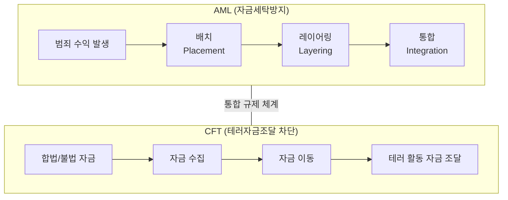
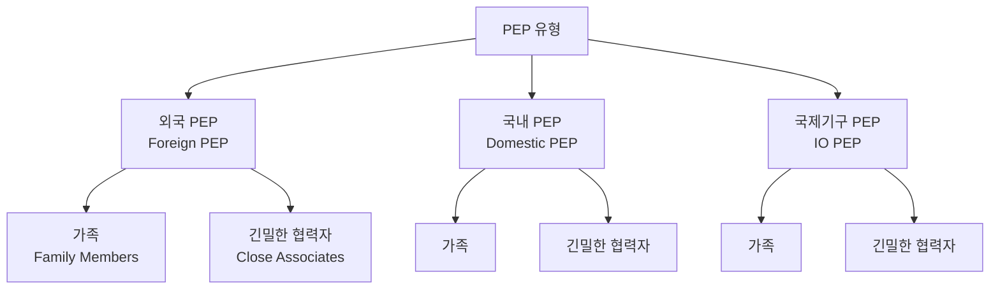
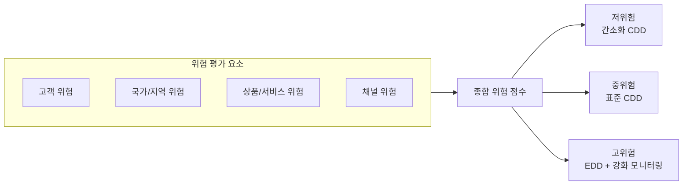

---
tags:
  - 규제
  - AML
  - KYC
---
# AML/KYC 핵심 개념

## AML vs CFT

**AML(Anti-Money Laundering)**은 자금세탁 방지를, **CFT(Combating the Financing of Terrorism)**는 테러자금 조달 차단을 의미한다. 두 개념은 별개의 범죄 유형을 다루지만, 규제 체계에서는 AML/CFT로 통합 운영된다.

AML은 범죄 수익을 합법적 자금으로 위장하는 행위(배치 → 레이어링 → 통합)를 탐지·차단하는 데 초점을 맞춘다. CFT는 합법·불법 자금이 테러 활동에 사용되는 것을 방지한다. CFT의 특수성은 소액 자금도 테러에 활용될 수 있어 탐지 임계값이 AML보다 낮다는 점이다.

!!! info "FATF 40+11 권고사항"
    FATF는 AML 40개 권고사항과 CFT 특별 권고사항(구 9개, 현재 통합)을 제시한다. 각국은 이를 기반으로 국내법을 제정하며, 상호평가(Mutual Evaluation)를 통해 이행 수준을 점검받는다.

---

## KYC / CDD / EDD

### KYC (Know Your Customer)

고객의 신원을 확인하고 거래 목적을 이해하는 전체 프로세스를 포괄하는 개념이다. KYC는 CDD와 EDD를 포함하는 상위 개념으로, 고객 온보딩부터 지속적 모니터링까지의 전 과정을 아우른다.

### CDD (Customer Due Diligence)

고객확인의무로, KYC의 핵심 실행 절차다. 다음 4가지 요소를 포함한다:

1. **신원 확인**: 신분증, 여권 등 공식 문서를 통한 본인 확인
2. **실소유자(Beneficial Owner) 파악**: 법인 고객의 경우 최종 실소유자 확인 (보통 25% 이상 지분 보유자)
3. **거래 목적 확인**: 계좌 개설 목적, 예상 거래 유형 파악
4. **지속적 모니터링**: 고객 거래 패턴의 지속적 점검

### EDD (Enhanced Due Diligence)

강화된 고객확인의무로, 고위험 고객에게 적용하는 심층 조사 절차다.

| 구분 | CDD | EDD |
|------|-----|-----|
| 대상 | 일반 고객 | 고위험 고객 (PEP, 고위험 국가, 복잡한 구조 등) |
| 신원 확인 | 기본 문서 확인 | 추가 독립적 검증 |
| 자금 출처 | 선택적 확인 | 필수 확인 (증빙 요구) |
| 모니터링 | 정기적 | 강화된 빈도, 상세 분석 |
| 승인 | 일반 절차 | 고위 경영진 승인 필요 |

!!! warning "EDD 적용 필수 상황"
    PEP 거래, FATF 비협조국가 관련 거래, 대응거래(Correspondent Banking), 비대면 거래, 복잡하거나 비정상적인 거래 시 EDD가 의무적으로 적용된다.

---

## STR / SAR

**STR(Suspicious Transaction Report)**은 의심거래보고로, 금융기관이 자금세탁이나 테러자금 조달 의심 거래를 금융정보분석원(FIU)에 보고하는 제도다. **SAR(Suspicious Activity Report)**은 미국에서 사용하는 유사 개념으로, 거래뿐 아니라 의심스러운 활동 전반을 보고 대상에 포함한다.

STR 보고 의무의 핵심 원칙:

- **주관적 판단**: 객관적 기준이 아닌, 금융기관 직원의 합리적 의심에 기반
- **비통지 원칙(Tipping-off 금지)**: 고객에게 STR 보고 사실을 알리는 것이 금지
- **면책 보호**: 선의의 보고에 대해 민·형사상 면책 부여
- **기한 준수**: 의심 인지 후 일정 기한 내 보고 (한국: 3영업일)

---

## CTR (Currency Transaction Report)

**CTR(고액현금거래보고)**은 일정 금액 이상의 현금 거래를 자동으로 FIU에 보고하는 제도다. STR이 주관적 판단에 기반하는 것과 달리, CTR은 객관적 금액 기준에 따른 의무 보고다.

| 국가 | 보고 기준액 | 보고 기관 |
|------|------------|----------|
| 한국 | 1,000만 원 이상 | KoFIU |
| 미국 | $10,000 이상 | FinCEN |
| EU | €10,000 이상 | 각국 FIU |

!!! tip "구조화 거래(Structuring) 주의"
    CTR 보고를 회피하기 위해 거래를 의도적으로 분할하는 행위(Structuring/Smurfing)는 그 자체로 범죄다. 금융기관은 구조화 패턴 탐지 시스템을 운영해야 한다.

---

## PEP (Politically Exposed Person)

**PEP(정치적 주요인물)**는 국가의 주요 공적 기능을 수행하거나 수행한 개인을 의미한다. PEP는 지위를 이용한 부패·자금세탁의 고위험군으로 분류되어 EDD 적용 대상이다.

PEP 해당 직위: 국가원수, 장관급 이상 정부 관리, 국회의원, 대법원 판사, 군 고위 장성, 국영기업 임원, 정당 고위 간부 등.

---

## 제재 스크리닝 (Sanctions Screening)

금융기관이 고객, 거래 상대방, 수익자를 국제 제재 목록과 대조하여 제재 대상자와의 거래를 차단하는 절차다. 주요 제재 목록:

- **UN 안보리 제재 목록**: 글로벌 필수 준수
- **OFAC SDN 목록** (미국): 미국 관할 거래 시 필수
- **EU 제재 목록**: EU 관할 거래 시 필수
- **한국 금융제재 대상자 목록**: 국내 필수 준수

!!! danger "제재 위반 리스크"
    제재 위반은 AML 위반보다 더 심각한 법적 결과를 초래한다. 미국 OFAC 제재 위반 시 건당 수백만 달러의 과징금과 형사 처벌이 가능하다.

---

## Transaction Monitoring (거래 모니터링)

고객의 거래를 실시간 또는 준실시간으로 분석하여 이상 거래를 탐지하는 시스템이다. 규칙 기반(Rule-based)과 AI/ML 기반 접근법이 있다.

| 접근법 | 장점 | 단점 |
|--------|------|------|
| 규칙 기반 | 투명성, 규제 설명 용이 | 높은 오탐률, 신종 패턴 미탐지 |
| AI/ML 기반 | 패턴 자동 학습, 낮은 오탐률 | 블랙박스 문제, 규제 설명 어려움 |
| 하이브리드 | 두 접근법의 장점 결합 | 구축 복잡성, 높은 비용 |

---

## Travel Rule

**Travel Rule**은 가상자산 이전 시 송신인과 수신인의 정보를 함께 전달해야 하는 규정이다. FATF 권고사항 16에 기반하며, 기존 은행의 전신송금 규정을 가상자산에 확대 적용한 것이다.

전달 필수 정보: 송신인 이름, 계좌번호(지갑 주소), 수신인 이름, 수신인 계좌번호. 한국은 2022년부터 100만 원 이상 가상자산 이전 시 Travel Rule을 적용한다.

---

## KYC 정보 이전 (Information Sharing)

VASP 간, 또는 금융기관-VASP 간 KYC 정보를 전달하는 메커니즘은 Travel Rule 이행의 핵심 인프라다. **어떤 데이터를, 어떤 프로토콜로, 어떤 법적 근거에 따라** 전송하는지가 실무의 핵심이다.

### IVMS101 표준 데이터 스키마

IVMS101(interVASP Messaging Standard)은 Travel Rule 정보 전달을 위한 국제 표준 데이터 포맷이다.

| 데이터 필드 | 송신인 | 수신인 |
|-----------|--------|--------|
| 이름 (성/명) | 필수 | 필수 |
| 계정 번호 / 지갑 주소 | 필수 | 필수 |
| 주소 또는 국적 또는 생년월일 | 1개 이상 필수 | 선택적 |
| 법인 식별자 (LEI) | 법인 시 필수 | 법인 시 필수 |

### 전송 프로토콜 비교

| 프로토콜 | 지역 | 방식 | 상호운용성 |
|---------|------|------|----------|
| **TRISA** | 글로벌 | mTLS 기반 P2P | IVMS101 호환 |
| **OpenVASP** | 유럽 중심 | 오픈소스 P2P | IVMS101 호환 |
| **Sygna Bridge** | 아시아 | 중앙 허브 | 자체 + IVMS101 |
| **VerifyVASP** | 한국 | 중앙 허브 | 한국 표준 |
| **CODE** | 한국 | 한국 VASP 간 | 한국 표준 |
| **TRUST** | 미국 | Coinbase 주도 P2P | IVMS101 호환 |

### 기관 간 KYC 공유: 증권사-VASP 연계

증권사와 VASP(가상자산거래소) 간 서비스 제휴 시 KYC 정보 이전의 허용 범위가 핵심 쟁점이다:

- **정보 이전 동의**: 개인정보보호법(PIPA)상 정보주체의 별도 동의 필요
- **최소 수집 원칙**: 서비스 제공에 필요한 최소한의 정보만 이전
- **목적 외 이용 금지**: 이전받은 KYC 정보를 다른 목적으로 활용 불가
- **보관 기한**: 특금법상 5년 보관 의무, PIPA상 목적 달성 시 파기
- **재검증 의무**: 이전받은 KYC를 그대로 신뢰할 수 있는지, 수신 기관의 자체 검증 필요 여부

!!! warning "개인정보보호법과의 충돌"
    Travel Rule은 KYC 정보 전송을 요구하지만, 개인정보보호법은 정보주체의 동의 없는 제3자 제공을 원칙적으로 금지한다. 한국에서는 특금법이 Travel Rule 이행의 법적 근거를 제공하지만, VASP 간 이전을 넘어 증권사-VASP 간 KYC 공유에는 별도의 법적 정비가 필요할 수 있다.

### 허가형 DeFi에서의 KYC 통합

기관급 DeFi(허가형 DeFi)에서는 KYC를 온체인 스마트 컨트랙트와 통합하는 방식이 등장하고 있다:

- **Aave Arc**: KYC를 통과한 기관만 접근 가능한 별도 풀 운영 (Fireblocks 인증)
- **Maple Finance 기관 풀**: 인가된 대출자만 참여, KYC 정보 오프체인 관리
- **온체인 KYC 레지스트리**: 화이트리스트 컨트랙트에 KYC 통과 주소 등록, 토큰 전송 시 자동 확인

---

## 위험기반접근법 (RBA, Risk-Based Approach)

**RBA**는 자금세탁·테러자금 조달 위험이 높은 영역에 더 많은 자원을 집중하고, 저위험 영역에는 간소화된 조치를 적용하는 원칙이다. FATF가 모든 AML/CFT 프로그램의 기본 원칙으로 권고한다.

!!! info "RBA 구현 시 고려사항"
    위험평가 모델은 정기적으로 검증·갱신해야 하며, 규제 환경 변화, 신규 자금세탁 유형, 기관의 비즈니스 변화를 반영해야 한다.

---

## 관련 문서

- [AML/KYC 개요](index.md) — 전체 개요 및 프로세스 흐름
- [제품 비교](products/index.md) — AML/KYC 솔루션 비교
- [트렌드](trends.md) — 최신 기술 및 규제 동향
- [레그테크 개념](../regtech/concepts.md) — RegTech와 AML의 관계
