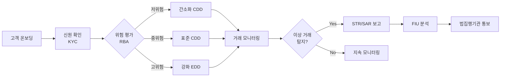

# AML/KYC 개요

## 정의

**AML/KYC(Anti-Money Laundering / Know Your Customer)**는 자금세탁 방지 및 고객 신원 확인을 위한 규제 체계로, 금융기관이 불법 자금 유입을 차단하고 테러자금 조달을 방지하기 위해 준수해야 하는 법적 의무 사항이다.

## 상세 설명

자금세탁(Money Laundering)은 범죄 수익의 출처를 은폐하여 합법적인 자금으로 위장하는 행위다. 전 세계적으로 연간 약 8,000억~2조 달러 규모의 자금이 세탁되는 것으로 추정되며, 이는 글로벌 GDP의 2~5%에 해당한다. AML은 이러한 자금세탁을 탐지하고 방지하기 위한 법률, 규정, 절차의 총체를 의미한다.

KYC는 AML 프로그램의 핵심 구성요소로, 금융기관이 고객의 신원을 확인하고 거래 목적을 파악하여 위험을 평가하는 프로세스다. 고객확인의무(CDD), 강화된 고객확인의무(EDD), 의심거래보고(STR), 고액현금거래보고(CTR) 등의 절차를 포함한다. 특히 정치적 주요인물(PEP)에 대해서는 강화된 모니터링이 적용된다.

한국에서는 **특정금융거래정보의 보고 및 이용 등에 관한 법률(특금법)**이 AML/KYC의 근간이 되며, 금융정보분석원(KoFIU)이 핵심 규제기관이다. 국제적으로는 **FATF(자금세탁방지 국제기구)**가 40개 권고사항을 통해 글로벌 AML 표준을 제시한다.

## 핵심 키워드

| 키워드 | 설명 |
|--------|------|
| **CDD** (Customer Due Diligence) | 고객확인의무. 신원 확인, 실소유자 파악, 거래 목적 확인 |
| **EDD** (Enhanced Due Diligence) | 강화된 고객확인. 고위험 고객에 대한 심층 조사 |
| **STR** (Suspicious Transaction Report) | 의심거래보고. 자금세탁 의심 거래를 FIU에 보고 |
| **CTR** (Currency Transaction Report) | 고액현금거래보고. 일정 금액 이상 현금 거래 자동 보고 |
| **PEP** (Politically Exposed Person) | 정치적 주요인물. 부패·자금세탁 고위험군 |
| **FATF** | 자금세탁방지 국제기구. 글로벌 AML 표준 수립 |
| **특금법** | 한국 AML 기본법. 가상자산사업자(VASP) 규제 포함 |

## AML/KYC 프로세스 흐름

## 핵심 포인트

!!! info "위험기반접근법(RBA)"
    모든 고객에게 동일한 수준의 확인을 적용하는 것이 아니라, 위험도에 따라 차등적으로 자원을 배분하는 접근법이다. FATF가 권고하는 핵심 원칙이다.

!!! warning "과태료 및 제재"
    AML 의무 위반 시 금융기관에 대한 과징금은 수십억~수천억 원에 달할 수 있다. 2012~2023년 글로벌 AML 과징금 누계는 500억 달러를 초과했다.

!!! tip "가상자산과 AML"
    2021년 특금법 개정으로 가상자산사업자(VASP)에도 AML/KYC 의무가 부과되었다. Travel Rule 적용으로 가상자산 이전 시 송수신인 정보 공유가 의무화되었다.

## 관련 개념

- [핵심 개념 상세](concepts.md) — CDD, EDD, STR, PEP 등 개념 심화
- [제품 비교](products/index.md) — Chainalysis, Jumio, Sumsub 등 솔루션 비교
- [트렌드](trends.md) — AI 기반 모니터링, DID, 크로스보더 협력
- [데이터 규제](../data-regulation/index.md) — 개인정보 보호와 AML의 교차점
- [레그테크](../regtech/index.md) — AML을 포함한 규제 기술 전반

## 실무 적용

1. **금융기관**: 고객 온보딩 시 KYC 절차 수립, 거래 모니터링 시스템 구축, STR/CTR 보고 체계 마련
2. **핀테크/가상자산**: VASP 신고, Travel Rule 대응, 실시간 트랜잭션 모니터링 도입
3. **컴플라이언스 담당자**: 위험평가 매트릭스 설계, 임직원 교육, 내부통제 정책 수립
4. **IT/개발팀**: AML 솔루션 연동(API), 데이터 파이프라인 구축, 알림 시스템 개발
