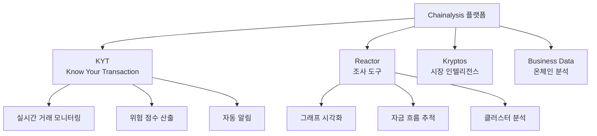

# Chainalysis

## 정의

**Chainalysis**는 블록체인 데이터 분석 플랫폼으로, 가상자산 거래의 추적·모니터링·조사를 위한 도구를 제공하는 글로벌 시장 점유율 1위의 블록체인 분석 기업이다.

## 상세 설명

2014년 설립된 Chainalysis는 비트코인 거래소 Mt. Gox 해킹 사건 조사를 계기로 성장했다. 현재 70개 이상 국가의 정부기관, 금융기관, 가상자산 사업자에 블록체인 분석 솔루션을 제공하며, 미국 IRS, FBI, DEA, Europol 등 주요 법집행기관이 고객이다.

Chainalysis의 핵심 경쟁력은 방대한 블록체인 데이터의 라벨링(Attribution)에 있다. 수십억 개의 지갑 주소를 실제 서비스(거래소, 다크넷 마켓, 믹서 등)와 매핑하여, 자금의 출처와 목적지를 추적할 수 있다. 이 데이터는 1,000개 이상의 가상자산을 커버하며, 전체 가상자산 경제 활동의 상당 부분을 가시화한다.

기업 가치는 2022년 기준 86억 달러로 평가되었으며, GIC, Accel, Paradigm 등으로부터 총 5억 달러 이상의 투자를 유치했다.

## 핵심 제품 라인업

### KYT (Know Your Transaction)

가상자산 사업자를 위한 실시간 트랜잭션 모니터링 솔루션이다.

| 기능 | 설명 |
|------|------|
| 실시간 모니터링 | 입출금 거래를 실시간으로 스크리닝 |
| 위험 점수 | 거래 상대방의 위험도를 0~10 스케일로 평가 |
| 카테고리 분류 | 다크넷, 랜섬웨어, 믹서, 제재 대상 등 자동 분류 |
| 알림 시스템 | 위험 기준 초과 시 자동 알림 및 에스컬레이션 |
| API 연동 | RESTful API로 기존 시스템과 통합 |

!!! info "KYT 활용 사례"
    국내 주요 가상자산 거래소(업비트, 빗썸 등)가 KYT를 사용하여 Travel Rule 대응 및 의심거래 탐지를 수행한다.

### Reactor

법집행기관과 조사관을 위한 블록체인 포렌식 도구다.

- **그래프 시각화**: 지갑 간 자금 흐름을 직관적 그래프로 표현
- **클러스터 분석**: 동일 주체가 관리하는 지갑 그룹 식별
- **크로스체인 추적**: 여러 블록체인에 걸친 자금 이동 추적
- **사례 관리**: 조사 내용을 팀 내 공유·협업

### Kryptos

가상자산 시장 인텔리전스 플랫폼으로, 온체인 데이터 기반의 시장 분석과 리서치를 제공한다.

## 강점

- **데이터 커버리지**: 1,000개 이상 가상자산, 수십억 라벨링된 주소
- **정부 신뢰도**: 70개국 이상 정부기관 고객, 법적 증거로 채택 가능
- **시장 지배력**: 블록체인 분석 시장 추정 점유율 50% 이상
- **지속적 업데이트**: 신규 프로토콜, DeFi, NFT 등 빠른 커버리지 확장
- **교육 프로그램**: Chainalysis Academy를 통한 블록체인 분석 인증 교육

## 약점

- **높은 가격**: 연간 구독료가 중소 사업자에게 부담 (연 $100K+)
- **전통 금융 한계**: 법정화폐 기반 KYC/AML 기능은 제공하지 않음
- **프라이버시 논란**: 블록체인의 탈중앙화 정신과 충돌한다는 비판
- **경쟁 심화**: Elliptic, TRM Labs, Crystal 등 경쟁사 성장

## 가격 정보

| 플랜 | 대상 | 예상 가격 |
|------|------|----------|
| KYT Starter | 소규모 VASP | 연 $50K~ |
| KYT Enterprise | 대형 거래소, 금융기관 | 연 $100K~500K+ |
| Reactor | 정부, 법집행기관 | 건별/연간 라이선스 |

!!! warning "가격은 거래량, 기능 범위에 따라 변동"
    공개된 정가는 없으며, 거래소의 거래량과 요구 기능에 따라 커스텀 견적이 제공된다.

## 관련 문서

- [AML/KYC 솔루션 비교](index.md) — 경쟁 솔루션과의 비교
- [AML/KYC 개요](../index.md) — AML/KYC 기본 개념
- [Chainalysis KYT (레그테크)](../../regtech/products/chainalysis-kyt.md) — RegTech 관점에서의 KYT 분석
- [트렌드](../trends.md) — AI 기반 블록체인 분석 동향
