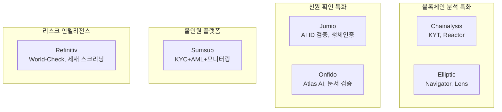

# AML/KYC 솔루션 비교

## 비교 요약

AML/KYC 시장의 주요 솔루션을 기능, 대상 고객, 강점 기준으로 비교한다. 각 솔루션은 블록체인 분석, 신원 확인, 올인원 컴플라이언스 등 서로 다른 영역에 특화되어 있다.

| 솔루션 | 핵심 영역 | 주요 고객 | AI 활용 | 블록체인 지원 | 글로벌 커버리지 | 가격대 |
|--------|----------|----------|---------|-------------|---------------|--------|
| **[Chainalysis](chainalysis.md)** | 블록체인 분석 | 정부, 거래소, 금융기관 | ★★★★☆ | ★★★★★ | ★★★★☆ | 높음 |
| **[Jumio](jumio.md)** | 신원 확인/생체인증 | 금융, 핀테크, 이커머스 | ★★★★★ | ★★☆☆☆ | ★★★★★ | 중~높음 |
| **[Sumsub](sumsub.md)** | 올인원 KYC/AML | 핀테크, 스타트업, 중소기업 | ★★★★☆ | ★★★☆☆ | ★★★★★ | 중간 |
| **Onfido** | AI ID 검증 | 금융, 모빌리티, 게임 | ★★★★★ | ★★☆☆☆ | ★★★★☆ | 중~높음 |
| **Refinitiv (LSEG)** | 리스크 인텔리전스 | 대형 금융기관, 기업 | ★★★★☆ | ★★☆☆☆ | ★★★★★ | 높음 |
| **Elliptic** | 블록체인 분석 | 거래소, 금융기관, 정부 | ★★★★☆ | ★★★★★ | ★★★★☆ | 높음 |

## 기능별 상세 비교

## 개별 솔루션 강점/약점

### Chainalysis

- **강점**: 블록체인 분석 시장 점유율 1위, 정부기관 신뢰도 최고, 1,000개 이상 가상자산 지원
- **약점**: 전통 금융 KYC 기능 부족, 높은 가격, 블록체인 외 영역 제한적
- **차별화**: Reactor 그래프 분석, 법집행기관 전용 도구

### Jumio

- **강점**: AI 기반 신원 확인 정확도 업계 최고 수준, 5,000+ 신분증 유형 지원, NFC 검증
- **약점**: AML 모니터링 기능 제한적, 블록체인 분석 미지원
- **차별화**: KYX Platform 통합, 생체인증 + 문서검증 + 사기탐지 결합

### Sumsub

- **강점**: 올인원 플랫폼으로 KYC/AML/트랜잭션 모니터링 통합, 220+ 국가 커버리지, 합리적 가격
- **약점**: 개별 영역의 전문성은 특화 솔루션 대비 부족, 엔터프라이즈 대규모 처리 한계
- **차별화**: No-code 워크플로우 빌더, 빠른 통합 속도

### Onfido

- **강점**: Atlas AI 엔진의 높은 문서 검증 정확도, 우수한 UX, Entrust 인수 후 시너지
- **약점**: AML 모니터링 기능 제한, 가격 대비 기능 범위 논란
- **차별화**: 2,500+ 문서 유형 AI 학습, 생체 활성도 탐지(Liveness Detection)

### Refinitiv (LSEG)

- **강점**: World-Check 데이터베이스(PEP, 제재, 범죄자 등 450만+ 프로필), 대형 금융기관 레퍼런스
- **약점**: 높은 비용, 복잡한 구축, 중소기업에 과도한 스펙
- **차별화**: Thomson Reuters 유산의 방대한 데이터, 규제 보고 통합

### Elliptic

- **강점**: 100개+ 블록체인 지원, 크로스체인 분석, 학술 기반(UCL 출신)
- **약점**: Chainalysis 대비 시장 점유율 낮음, 정부 고객 제한적
- **차별화**: Holistic Screening(블록체인+제재 통합), DeFi 프로토콜 분석

## 시나리오별 선택 가이드

!!! tip "가상자산 거래소"
    **Chainalysis KYT** + **Sumsub**(신원 확인) 조합 추천. 블록체인 트랜잭션 모니터링과 고객 온보딩을 모두 커버한다.

!!! tip "전통 금융기관"
    **Refinitiv World-Check** + **Jumio**(신원 확인) 조합 추천. 방대한 PEP/제재 데이터와 높은 수준의 ID 검증이 핵심이다.

!!! tip "스타트업/핀테크"
    **Sumsub** 단독 추천. 합리적 가격에 KYC/AML을 통합 제공하며, 빠른 구축이 가능하다.

!!! tip "DeFi/Web3 프로젝트"
    **Elliptic** + **Chainalysis** 추천. 크로스체인 분석과 DeFi 프로토콜 모니터링이 핵심이다.

## 관련 문서

- [AML/KYC 개요](../index.md) — 기본 개념 및 프로세스
- [핵심 개념](../concepts.md) — CDD, EDD, STR 등 개념 상세
- [레그테크 제품 비교](../../regtech/products/index.md) — RegTech 솔루션과의 연계
