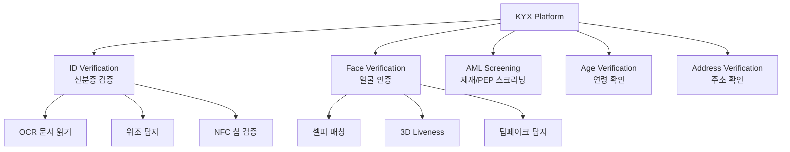

---
tags:
  - 규제
  - AML
  - KYC
---
# Jumio

## 정의

**Jumio**는 AI 기반 신원 확인 및 생체인증 플랫폼으로, 신분증 검증(ID Verification), 얼굴 인식, 사기 탐지를 통합 제공하는 디지털 신원 확인(Identity Verification) 시장의 선도 기업이다.

## 상세 설명

2010년 설립된 Jumio는 "인터넷 신뢰 구축"을 미션으로, 온라인 환경에서 실제 사람의 신원을 확인하는 기술을 개발해왔다. 초기 신용카드 사기 방지 솔루션에서 출발하여, 현재는 KYC 온보딩, AML 스크리닝, 지속적 모니터링까지 아우르는 종합 플랫폼 **KYX Platform**을 제공한다.

Jumio의 차별화 포인트는 AI와 사람 검토자(Human Review)를 결합한 하이브리드 접근법이다. AI가 1차 자동 검증을 수행하고, 판단이 어려운 케이스는 전문 검토자가 처리하여 정확도와 효율성을 동시에 확보한다. 5,000가지 이상의 신분증 유형을 200개 이상 국가에서 지원하며, NFC 칩 읽기, 생체 활성도 탐지(Liveness Detection) 등 최신 기술을 적용한다.

금융, 핀테크, 모빌리티, 이커머스, 통신, 게임 등 다양한 산업에서 사용되며, HSBC, MoneyGram, Revolut 등이 주요 고객이다. 2021년 Great Hill Partners의 인수 이후 적극적인 제품 확장을 추진하고 있다.

## 핵심 기능

### ID Verification (신분증 검증)

| 기능 | 설명 |
|------|------|
| 문서 캡처 | 스마트폰 카메라로 신분증 촬영, 자동 크롭/보정 |
| OCR 추출 | AI 기반 텍스트 인식, 이름/생년월일/번호 자동 추출 |
| 위조 탐지 | 홀로그램, 마이크로프린트, 폰트 일관성 등 200+ 보안 요소 검사 |
| NFC 검증 | ePassport, eID 칩 데이터 직접 읽기 (가장 높은 보안 수준) |
| 데이터 검증 | 정부 데이터베이스와 대조 확인 (지원 국가) |

### Face Verification (얼굴 인증)

- **셀피 매칭**: 신분증 사진과 실시간 셀피를 AI로 비교
- **3D Liveness Detection**: ISO 30107-3 인증, 사진/영상 공격 차단
- **딥페이크 탐지**: 생성형 AI로 만든 가짜 얼굴 탐지
- **수동적 활성도**: 사용자가 별도 동작 없이 자동으로 활성도 확인

### AML Screening

- PEP, 제재 목록, 범죄자, 부정적 미디어 스크리닝
- 200개 이상 국가의 워치리스트 커버
- 지속적 모니터링(Ongoing Monitoring) 지원

## 강점

- **검증 정확도**: AI + Human Review 하이브리드로 업계 최고 수준 정확도 달성
- **문서 커버리지**: 5,000+ 신분증 유형, 200+ 국가 지원
- **NFC 기술**: ePassport 칩 데이터 검증으로 최고 보안 수준 제공
- **딥페이크 대응**: 생성형 AI 공격에 대한 선제적 방어 기술
- **SDK 품질**: iOS/Android/Web SDK의 높은 완성도, 커스터마이징 가능

!!! tip "Jumio의 차별화: Informed AI"
    Jumio는 "Informed AI"라는 접근법을 사용한다. 10년 이상 축적된 수십억 건의 검증 데이터로 AI를 학습시키고, 사람 검토자의 피드백으로 지속 개선하는 선순환 구조다.

## 약점

- **AML 모니터링 한계**: 거래 모니터링(Transaction Monitoring) 기능은 전문 솔루션 대비 부족
- **블록체인 미지원**: 가상자산 트랜잭션 분석 기능 없음
- **가격**: 중소 스타트업에게는 높은 편
- **처리 시간**: Human Review 포함 시 평균 5~15분 소요 (자동화 대비 느림)
- **통합 복잡성**: 풀 기능 활용 시 SDK 통합 작업량이 상당

## 가격 정보

| 플랜 | 검증 건수 | 기능 | 예상 단가 |
|------|----------|------|----------|
| Starter | ~1,000건/월 | ID + Face 기본 | 건당 $2~4 |
| Growth | ~10,000건/월 | ID + Face + AML | 건당 $1.5~3 |
| Enterprise | 10,000건+/월 | 전체 KYX 플랫폼 | 커스텀 견적 |

## 경쟁사 비교

| 항목 | Jumio | Onfido | Sumsub |
|------|-------|--------|--------|
| AI 정확도 | ★★★★★ | ★★★★★ | ★★★★☆ |
| 문서 커버리지 | 5,000+ | 2,500+ | 14,000+ |
| NFC 지원 | O | O | O |
| AML 스크리닝 | O | 제한적 | O |
| 거래 모니터링 | X | X | O |
| 가격 경쟁력 | 중~높음 | 중~높음 | 중간 |

## 관련 문서

- [AML/KYC 솔루션 비교](index.md) — 전체 솔루션 비교표
- [Sumsub](sumsub.md) — 올인원 대안 솔루션
- [AML/KYC 개요](../index.md) — KYC 프로세스 이해
- [데이터 규제](../../data-regulation/index.md) — 생체인증 데이터의 개인정보 보호 이슈
