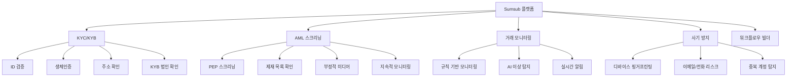

---
tags:
  - 규제
  - AML
  - KYC
---
# Sumsub

## 정의

**Sumsub**은 KYC, AML, 사기 방지, 거래 모니터링을 하나의 플랫폼에 통합한 올인원 컴플라이언스 솔루션으로, 220개 이상 국가와 14,000가지 이상의 문서 유형을 지원하는 글로벌 검증 플랫폼이다.

## 상세 설명

2015년 설립된 Sumsub(Sum and Substance)은 "하나의 플랫폼으로 모든 컴플라이언스를 해결한다"는 비전 아래 성장한 RegTech 기업이다. 본사는 영국에 있으며, 전 세계 2,500개 이상의 기업 고객을 보유하고 있다.

Sumsub의 핵심 차별화는 **올인원 접근법**이다. 경쟁사들이 신원 확인, AML 스크리닝, 거래 모니터링을 별도 제품으로 제공하는 반면, Sumsub은 이 모든 기능을 단일 플랫폼에서 통합 제공한다. 이를 통해 기업은 여러 벤더를 관리할 필요 없이 하나의 대시보드에서 전체 컴플라이언스를 운영할 수 있다.

또한 **No-code 워크플로우 빌더**를 제공하여, 개발자 없이도 검증 흐름을 설계하고 조정할 수 있다. 이는 빠르게 변화하는 규제 환경에 유연하게 대응해야 하는 핀테크와 스타트업에게 큰 장점이다. 평균 통합 시간이 2~3일로 경쟁사 대비 빠른 것도 강점으로 꼽힌다.

## 핵심 기능

### KYC (고객 확인)

| 기능 | 세부 |
|------|------|
| ID 검증 | 14,000+ 문서 유형, 220+ 국가, AI 자동 검증 |
| 생체인증 | Liveness Detection, 셀피 매칭, 딥페이크 탐지 |
| 주소 확인 | 공과금 청구서, 은행 명세서 등 PoA 문서 검증 |
| KYB | 법인 확인, 실소유자 구조 파악, UBO 식별 |
| 연령 확인 | 문서 기반 + 비문서 기반(AI 얼굴 추정) |

### AML 스크리닝

- **PEP/제재 스크리닝**: 글로벌 PEP, UN/EU/OFAC 제재 목록 실시간 대조
- **부정적 미디어 모니터링**: 고객 관련 부정적 뉴스 자동 수집·분석
- **지속적 모니터링**: 초기 스크리닝 후 변경 사항 자동 알림
- **케이스 관리**: 알림 검토, 에스컬레이션, 감사 추적 통합

### 거래 모니터링

- 규칙 기반 + AI 기반 하이브리드 모니터링
- 사전 정의된 규칙 템플릿 제공 (자금세탁, 구조화 거래 등)
- 커스텀 규칙 생성 가능
- 실시간 알림 및 케이스 자동 생성

### No-code 워크플로우 빌더

!!! tip "No-code의 힘"
    드래그앤드롭으로 검증 흐름을 설계할 수 있다. 예: "한국 고객 → ID 검증 → 셀피 → AML 스크리닝 → 자동 승인/거부" 흐름을 코드 없이 구성 가능. 규제 변경 시 즉시 워크플로우를 수정할 수 있다.

## 강점

- **올인원 플랫폼**: KYC + AML + 거래 모니터링 + 사기 방지를 단일 솔루션으로 제공
- **글로벌 커버리지**: 220+ 국가, 14,000+ 문서 유형 지원 (업계 최다)
- **빠른 통합**: 평균 2~3일 내 기본 통합 완료, No-code 빌더로 즉시 운영
- **합리적 가격**: 스타트업부터 엔터프라이즈까지 유연한 가격 체계
- **자동화율**: 평균 95% 이상의 자동 검증률로 운영 비용 절감

## 약점

- **개별 전문성**: 신원 확인은 Jumio, 블록체인 분석은 Chainalysis 대비 깊이 부족
- **대규모 처리**: 월 100만 건 이상의 대규모 처리 시 성능 이슈 보고
- **커스터마이징 한계**: No-code의 편의성 반면, 복잡한 비즈니스 로직 구현에는 제약
- **데이터 품질**: AML 데이터베이스가 Refinitiv World-Check 대비 규모가 작음
- **엔터프라이즈 기능**: 대형 금융기관의 복잡한 요구사항 대응에 한계

## 가격 정보

| 플랜 | 검증 건수 | 포함 기능 | 가격 |
|------|----------|----------|------|
| Starter | ~500건/월 | KYC 기본 | 월 $199~ |
| Growth | ~2,000건/월 | KYC + AML | 월 $499~ |
| Business | ~10,000건/월 | 전체 기능 | 월 $1,499~ |
| Enterprise | 커스텀 | 전체 + 전용 지원 | 커스텀 견적 |

!!! info "Pay-per-verification 모델"
    기본 월정액에 포함된 건수 초과 시 건당 과금이 적용된다. 대량 사용 시 볼륨 할인이 가능하다.

## 관련 문서

- [AML/KYC 솔루션 비교](index.md) — 경쟁 솔루션과의 비교
- [Jumio](jumio.md) — 신원 확인 특화 경쟁사
- [Chainalysis](chainalysis.md) — 블록체인 분석 특화 경쟁사
- [레그테크 Sumsub](../../regtech/products/sumsub.md) — RegTech 관점에서의 Sumsub 분석
- [트렌드](../trends.md) — 올인원 플랫폼 통합 트렌드
