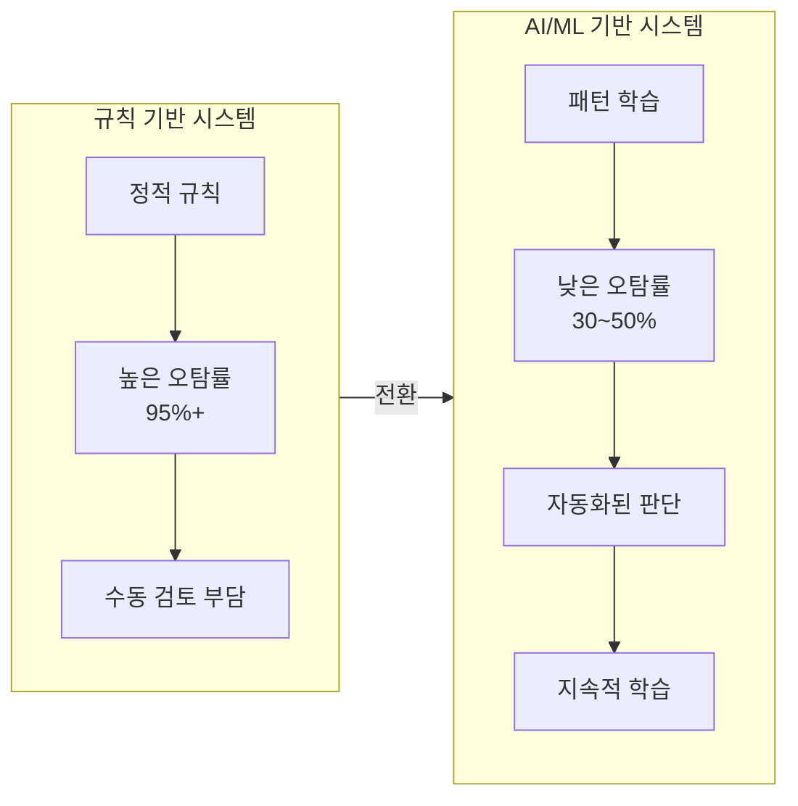
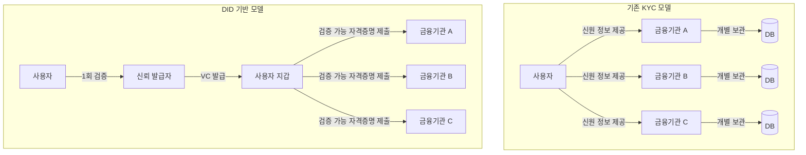
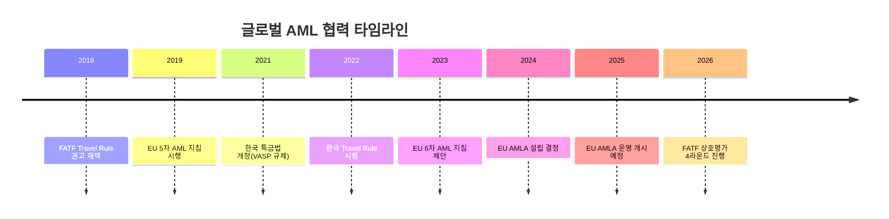

---
tags:
  - 규제
  - AML
  - KYC
---
# AML/KYC 트렌드

## 개요

AML/KYC 분야는 AI 기술 발전, 가상자산 확산, 글로벌 규제 강화에 의해 빠르게 변화하고 있다. 기존의 규칙 기반 접근법에서 AI/ML 기반 지능형 시스템으로의 전환, 탈중앙화 신원(DID)의 부상, 크로스보더 협력 강화가 주요 흐름이다.

---

## 1. AI 기반 모니터링

### 현황

전통적인 규칙 기반 거래 모니터링 시스템은 95% 이상의 오탐률(False Positive)을 기록하며, 컴플라이언스 인력의 대부분이 오탐 처리에 소모된다. AI/ML 기반 시스템은 이 오탐률을 50~70%까지 줄일 수 있어, 업계의 핵심 전환 동력이 되고 있다.

### 핵심 기술

| 기술 | 적용 분야 | 효과 |
|------|----------|------|
| 자연어 처리(NLP) | 부정적 미디어 스크리닝, SAR 자동 작성 | 스크리닝 시간 80% 단축 |
| 그래프 신경망(GNN) | 네트워크 분석, 공모 탐지 | 은닉된 관계 패턴 발견 |
| 이상치 탐지 | 비정상 거래 패턴 식별 | 신종 자금세탁 유형 탐지 |
| 설명 가능 AI(XAI) | 모델 판단 근거 제시 | 규제 당국 설명 의무 충족 |

!!! warning "AI 도입의 규제 허들"
    AI 기반 AML 시스템의 최대 과제는 규제 당국에 대한 **설명 가능성(Explainability)**이다. "왜 이 거래가 의심스러운가"를 AI가 명확히 설명할 수 없으면, 규제 검사에서 문제가 된다.

---

## 2. 실시간 거래 분석

### 현황

배치 처리(일 단위 또는 시간 단위)에서 실시간 분석으로의 전환이 가속화되고 있다. 특히 즉시 결제 시스템(한국의 핀테크 결제, FedNow 등)의 확산으로 실시간 AML 분석은 선택이 아닌 필수가 되었다.

### 기술 요소

- **스트리밍 아키텍처**: Apache Kafka, Flink 기반의 실시간 데이터 처리
- **인메모리 컴퓨팅**: Redis, Hazelcast를 활용한 밀리초 단위 의사결정
- **마이크로서비스**: 개별 검증 단계를 독립 서비스로 분리하여 확장성 확보
- **엣지 컴퓨팅**: 데이터 발생 지점에서 1차 분석 수행

!!! info "실시간 분석의 비즈니스 가치"
    실시간 거래 분석은 의심 거래를 자금 이전 전에 차단할 수 있어, 사후 회수보다 비용이 100배 이상 저렴하다.

---

## 3. 탈중앙화 신원 (DID)

### 현황

**DID(Decentralized Identity)**는 사용자가 자신의 신원 데이터를 직접 소유·관리하는 패러다임이다. 기존 KYC가 금융기관이 고객 데이터를 수집·보관하는 모델인 반면, DID는 사용자가 검증 가능한 자격증명(Verifiable Credentials)을 발급받아 필요시 제출하는 모델이다.

### KYC에 대한 영향

- **반복 KYC 제거**: 한 번 검증받으면 여러 기관에서 재사용 가능
- **데이터 최소화**: 필요한 정보만 선택적 공개(Zero-Knowledge Proof)
- **개인정보 보호**: 사용자가 데이터 통제권 보유
- **비용 절감**: 금융기관의 KYC 비용 60~80% 절감 가능

!!! tip "한국의 DID 현황"
    한국은 이니셜(Initial), 라온시큐어, 아이콘루프 등이 DID 기반 신원 확인 서비스를 제공하고 있다. 2024년 분산ID 관련 법제화 논의가 진행 중이며, 공공기관 DID 파일럿이 확대되고 있다.

---

## 4. 규제 기술 통합 (RegTech Integration)

### 현황

AML/KYC는 더 이상 독립된 컴플라이언스 영역이 아니라, 전체 규제 기술(RegTech) 생태계의 일부로 통합되고 있다. ESG 컴플라이언스, 데이터 규제, 사이버보안과의 통합이 핵심 트렌드다.

### 통합 영역

| 통합 대상 | AML/KYC와의 교차점 |
|----------|-------------------|
| [데이터 규제](../data-regulation/index.md) | KYC 데이터의 개인정보 보호(GDPR), 동의 관리 |
| [레그테크](../regtech/index.md) | 규제 보고 자동화, 컴플라이언스 대시보드 통합 |
| ESG | 제재 스크리닝과 ESG 리스크 통합 평가 |
| 사이버보안 | 사기 탐지와 사이버 위협 인텔리전스 공유 |

!!! info "API 경제와 AML"
    Open Banking/Finance API를 통해 AML 데이터가 기관 간 공유되는 모델이 확산 중이다. 이는 중복 검증을 줄이되 개인정보 보호와의 균형이 과제다.

---

## 5. 크로스보더 AML 협력

### 현황

자금세탁은 본질적으로 국경을 초월하지만, AML 규제는 국가별로 분절되어 있다. 이 갭을 메우기 위한 국제 협력이 강화되고 있다.

### 주요 이니셔티브

- **FATF Travel Rule 글로벌 이행**: VASP 간 송수신인 정보 공유 의무화 확대
- **EU AML 패키지**: 2024년 채택된 EU 단일 AML 기관(AMLA) 설립, EU 전역 통일 규제
- **Egmont Group**: 166개국 FIU 간 정보 교환 네트워크 강화
- **SWIFT KYC Registry**: 금융기관 간 KYC 정보 공유 플랫폼

### 과제

!!! warning "규제 차익(Regulatory Arbitrage)"
    국가 간 AML 규제 수준 차이를 이용하여 규제가 느슨한 곳에서 자금세탁을 시도하는 행위가 증가하고 있다. 이를 방지하기 위해 규제의 글로벌 조화가 핵심 과제다.

---

## 실무 시사점

1. **AI 도입 전략**: 규칙 기반 시스템을 즉시 폐기하지 말고, AI를 보조 레이어로 추가하는 하이브리드 접근이 현실적
2. **DID 대비**: DID 기반 KYC가 보편화되면 기존 KYC 프로세스의 대대적 변경이 필요하므로, 지금부터 파일럿 참여 권장
3. **실시간 전환**: 즉시 결제 대응을 위해 실시간 분석 인프라 투자 우선순위를 높일 것
4. **통합 관점**: AML을 독립 시스템이 아닌, 전사 컴플라이언스 플랫폼의 일부로 설계
5. **크로스보더 대응**: Travel Rule, EU AMLA 등 국제 규제 변화에 선제적 대응 필요

## 관련 문서

- [AML/KYC 개요](index.md) — 기본 개념 및 프로세스
- [핵심 개념](concepts.md) — 개념 상세
- [제품 비교](products/index.md) — 솔루션별 AI/실시간 분석 역량 비교
- [레그테크 트렌드](../regtech/trends.md) — 규제 기술 전반의 트렌드
- [데이터 규제 트렌드](../data-regulation/trends.md) — AI와 개인정보의 교차점
