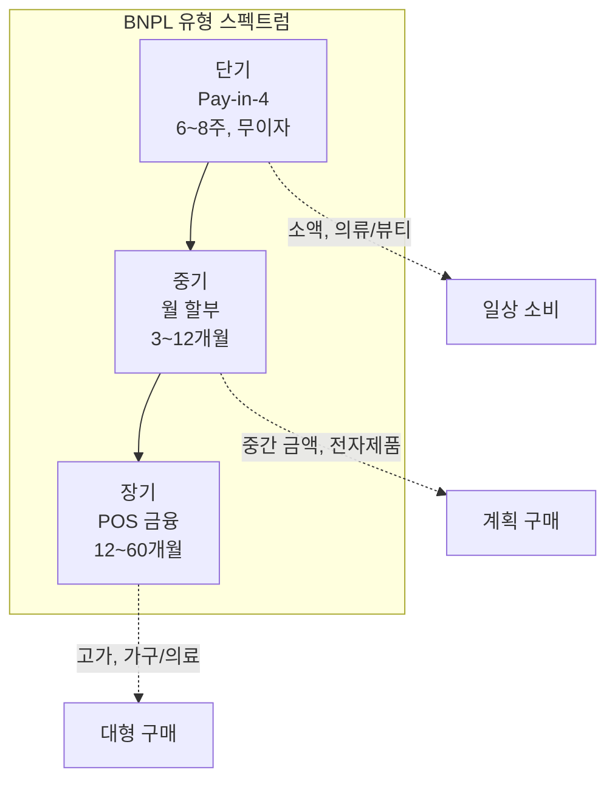
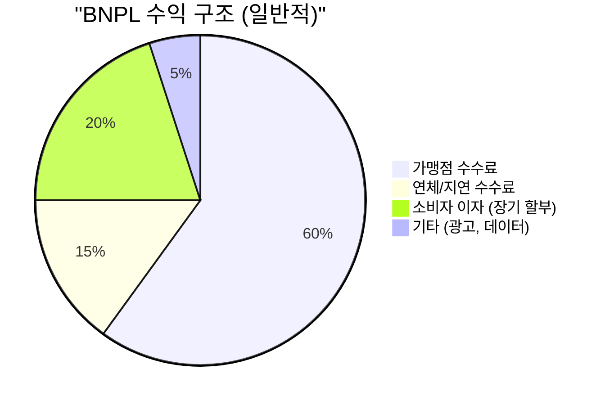

# BNPL 핵심 개념

## BNPL 유형 분류

BNPL은 단일 제품이 아닌 다양한 분할결제 모델의 총칭이다. 핵심 유형은 다음과 같다.

| 유형 | 기간 | 이자 | 금액 범위 | 대표 제품 |
|------|------|------|-----------|-----------|
| **Pay-in-4** | 6~8주 (2주 간격 4회) | 무이자 | $50~$1,000 | Afterpay, Klarna |
| **월 할부 (Installment)** | 3~36개월 | 0~36% APR | $200~$17,500 | Affirm, Klarna |
| **Pay Later (청구서)** | 14~30일 | 무이자 | 소액 | Klarna Pay Later |
| **POS 금융** | 6~60개월 | 0~30% APR | 고가 | Affirm, Citizens Pay |

!!! tip "핵심 구분 기준"
    - **무이자 모델**: 가맹점 수수료가 유일한 수익원 (Pay-in-4)
    - **유이자 모델**: 소비자 이자 + 가맹점 수수료 (장기 할부)
    - **하이브리드**: 일정 기간 무이자 후 이자 부과

---

## Pay-in-4 모델

BNPL의 가장 대표적이고 혁신적인 모델이다. 구매 금액을 4회에 걸쳐 2주 간격으로 균등 분할하며, 소비자에게 이자를 부과하지 않는다.

**작동 방식:**

1. 소비자가 체크아웃 시 BNPL 선택
2. 첫 번째 결제(25%) 즉시 지불
3. 2주 후 두 번째 결제(25%)
4. 4주 후 세 번째 결제(25%)
5. 6주 후 네 번째 결제(25%)

!!! warning "연체 시"
    연체 수수료는 제공자마다 다르다. Afterpay는 $8~$68, Klarna는 최근 연체 수수료를 폐지하고 서비스 이용 제한으로 전환했다. 연체 정보가 신용 기록에 반영되는 추세가 강화되고 있다.

---

## 소비자 신용평가

BNPL의 신용평가는 전통적인 FICO/신용평점 기반과 근본적으로 다르다.

| 구분 | 전통 신용평가 | BNPL 신용평가 |
|------|--------------|---------------|
| 데이터 | 신용 기록, 부채 비율 | 실시간 거래 데이터, 행동 패턴 |
| 심사 시간 | 수일~수주 | 수 초 |
| Hard Pull | 대부분 O | 대부분 X (Soft Pull) |
| 거절률 | 높음 | 상대적으로 낮음 |
| AI 활용 | 제한적 | 핵심 |

BNPL 제공자들은 머신러닝 기반의 실시간 신용평가 모델을 사용한다. 거래 패턴, 기기 정보, 이전 BNPL 사용 이력, 계좌 잔액 등을 종합적으로 분석하여 수 초 내에 승인/거절을 결정한다.

---

## 연체율과 리스크

BNPL의 구조적 리스크는 **연체율(Delinquency Rate)**이다. 2022~2023년 금리 인상기에 BNPL 연체율이 급증했다.

!!! danger "연체 현황 (2024년 기준 추정)"
    - 글로벌 BNPL 연체율: 3~5% (30일 이상 연체 기준)
    - 전통 신용카드 연체율: 2~3%
    - BNPL 이용자의 다중 이용(stacking): 주요 리스크 요인
    - 젊은 세대의 과도한 BNPL 의존 문제 대두

**다중 이용(Stacking)** 문제가 특히 심각하다. 소비자가 여러 BNPL 서비스를 동시에 이용하면 총 부채가 눈에 보이지 않게 누적된다. BNPL 거래가 전통 신용 기록에 반영되지 않았기 때문에 발생한 문제로, 현재 각국에서 BNPL 보고 의무화를 추진 중이다.

---

## 가맹점 수수료 (Merchant Discount Rate)

가맹점 수수료는 BNPL의 핵심 수익원이다.

| BNPL 제공자 | 가맹점 수수료율 | 비고 |
|-------------|----------------|------|
| Afterpay | 4~6% + 고정비 | Pay-in-4 전용 |
| Klarna | 3~6% | 유형별 상이 |
| Affirm | 5~8% | 장기 할부 포함 |
| 신용카드 | 1.5~3% | 비교 참고 |

가맹점이 신용카드보다 높은 수수료를 감수하는 이유는 **전환율 상승(+20~30%)**과 **평균 주문금액(AOV) 증가(+30~50%)**라는 가치 때문이다.

---

## 규제 동향

전 세계적으로 BNPL을 신용 상품으로 규제하는 방향으로 수렴하고 있다.

| 국가/지역 | 규제 현황 | 핵심 내용 |
|-----------|-----------|-----------|
| **영국** | 규제 진행 중 (FCA) | BNPL을 규제 대상 신용으로 분류 |
| **호주** | 2024년 법안 통과 | BNPL에 대출 규제 적용 |
| **EU** | 소비자신용지침 개정 | BNPL 포함 범위 확대 |
| **미국** | CFPB 해석 지침 | BNPL을 "카드" 유사 상품으로 해석 |
| **한국** | 금융위 감독 강화 | 후불결제 한도 관리, 연체 관리 강화 |

!!! info "규제의 방향"
    규제의 공통 방향은 **투명성 강화**, **적합성 심사 의무화**, **신용 보고 의무화**이다. 이는 BNPL 제공자의 비용을 높이지만, 장기적으로 시장의 건전성을 강화할 것으로 예상된다.

## 관련 문서

- [BNPL 개요](index.md)
- [제품 비교](products/index.md) -- Klarna, Afterpay, Affirm 등 비교
- [트렌드](trends.md) -- 규제 강화, AI 신용평가, B2B BNPL
- [오픈뱅킹 개념](../open-banking/concepts.md) -- BNPL의 오픈뱅킹 데이터 활용
