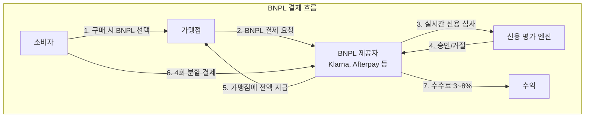

---
tags:
  - 결제
  - BNPL
---
# BNPL (Buy Now Pay Later) 개요

## 정의

**BNPL(Buy Now Pay Later)**은 소비자가 구매 시점에 결제를 나누어 할 수 있는 단기 소비자 금융 서비스로, 전통적인 신용카드 할부와 달리 무이자 분할결제를 핵심 가치로 제공한다.

## 상세 설명

BNPL은 2010년대 후반부터 글로벌 결제 시장을 급격히 변화시킨 핀테크 혁신이다. 전통적인 신용카드 할부가 높은 이자율과 복잡한 심사 과정을 수반하는 반면, BNPL은 간소화된 신용 심사와 무이자 분할결제를 통해 MZ세대를 중심으로 폭발적으로 성장했다. 대표적인 모델인 "Pay-in-4"는 총 금액을 4회에 걸쳐 2주 간격으로 나누어 결제하며, 소비자에게는 이자가 부과되지 않는다.

수익 모델의 핵심은 **가맹점 수수료(Merchant Discount Rate)**이다. BNPL 제공자는 소비자 대신 가맹점에 전액을 즉시 지급하고, 가맹점으로부터 거래액의 3~8%를 수수료로 받는다. 가맹점 입장에서는 전환율(Conversion Rate) 상승과 평균 주문금액(AOV) 증가라는 가치를 얻는다.

그러나 2022년 이후 금리 인상, 연체율 상승, 규제 강화로 BNPL 업계는 구조적 전환기를 맞고 있다. Klarna는 수년간의 적자 끝에 AI 기반 비용 절감으로 흑자 전환에 성공했고, Afterpay는 Block(Square)에 인수되어 결제 생태계의 일부가 되었다.

## 핵심 포인트

!!! info "왜 중요한가"
    1. **MZ세대 소비 패턴 변화**: 신용카드 기피, 즉각적 만족과 투명한 비용 선호
    2. **이커머스 전환율 향상**: BNPL 도입 시 전환율 20~30% 증가 보고
    3. **신용 접근성 확대**: 전통 신용 심사를 통과하지 못하는 소비자층에 금융 접근 제공
    4. **글로벌 시장 규모**: 2025년 기준 글로벌 BNPL 시장 $500B+ 추정
    5. **규제의 새로운 전장**: 소비자 보호와 금융 혁신의 균형점을 찾는 글로벌 과제

## 핵심 키워드

| 키워드 | 설명 |
|--------|------|
| **후불결제** | 구매 후 나중에 결제하는 방식의 한국어 표현 |
| **무이자 할부** | BNPL의 핵심 가치, 소비자에게 이자 미부과 |
| **Pay-in-4** | 4회 균등 분할, BNPL의 가장 일반적인 모델 |
| **가맹점 수수료** | BNPL 수익의 핵심, 거래액의 3~8% |
| **신용평가** | BNPL 특화 실시간 심사, 전통 신용평점과 다름 |
| **규제 강화** | 전 세계적으로 BNPL을 신용 상품으로 규제하는 추세 |

## 관련 문서

- [핵심 개념](concepts.md) -- BNPL 유형, 신용평가, 규제 동향 상세
- [제품 비교](products/index.md) -- Klarna, Afterpay, Affirm, 네이버페이 등 비교
- [트렌드](trends.md) -- 규제 강화, AI 신용평가, B2B BNPL
- [임베디드 금융](../embedded-finance/index.md) -- BNPL의 임베디드 금융 모델
- [오픈뱅킹](../open-banking/index.md) -- BNPL의 오픈뱅킹 데이터 활용
