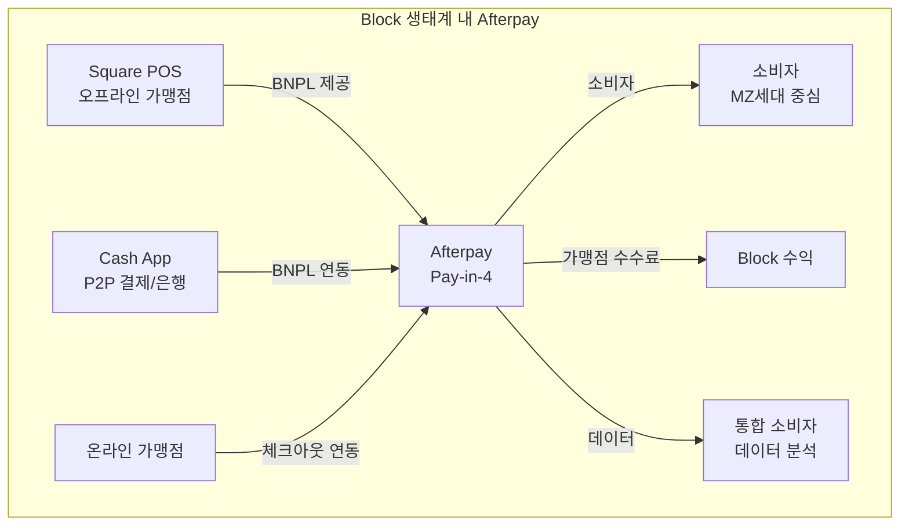
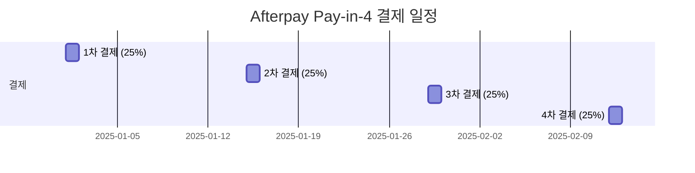

---
tags:
  - 결제
  - BNPL
---
# Afterpay

## 기본 정보

| 항목 | 내용 |
|------|------|
| **설립** | 2014년, 호주 시드니 |
| **인수** | 2022년 Block(구 Square)에 $29B 인수 |
| **유형** | BNPL (Pay-in-4 전문) |
| **주요 시장** | 미국, 호주, 영국, 캐나다, 뉴질랜드 |
| **이용자** | 2천만+ 활성 사용자 |
| **가맹점** | 100,000+ |
| **브랜드** | 호주/뉴질랜드: Afterpay, 유럽: Clearpay |

## 정의

Afterpay는 Pay-in-4(4회 무이자 분할결제) 모델을 대중화한 **BNPL 선구자**로, Block(Square) 인수 후 통합 결제 생태계의 핵심 요소로 자리잡고 있다.

## 상세 설명

Afterpay는 BNPL을 MZ세대의 주류 결제 수단으로 만든 장본인이다. 2014년 호주에서 "신용카드 없이 분할결제"라는 단순한 가치 제안으로 시작해, 호주에서 폭발적으로 성장한 후 미국, 영국으로 진출했다. 핵심 모델은 **Pay-in-4**: 구매 금액을 4회에 걸쳐 2주 간격으로 나누어 결제하며, 소비자에게 이자가 없다.

2022년 Block(구 Square)이 $29B에 인수하면서 Afterpay의 전략적 위치가 근본적으로 변했다. 단독 BNPL 기업에서 **Block 결제 생태계(Square POS + Cash App + Afterpay)**의 핵심 축으로 전환된 것이다. 이제 Square 가맹점은 오프라인에서도 Afterpay를 제공할 수 있고, Cash App 사용자는 Afterpay를 통해 분할결제할 수 있다.

## 핵심 특징

!!! info "Afterpay의 5대 강점"
    1. **Pay-in-4 순수 모델**: 장기 할부 없이 무이자 분할에 집중
    2. **Block 생태계 통합**: Square + Cash App과의 시너지
    3. **오프라인 확장**: Square POS를 통한 매장 내 BNPL
    4. **MZ세대 브랜드**: 강력한 브랜드 로열티와 앱 커뮤니티
    5. **연체 수수료 상한**: 총 주문금액의 25%를 넘지 않는 연체 수수료

## Pay-in-4 모델 상세

| 항목 | 내용 |
|------|------|
| 분할 횟수 | 4회 |
| 결제 간격 | 2주 |
| 소비자 이자 | 0% |
| 최소 금액 | $1 |
| 최대 금액 | $2,000 (이용 실적에 따라 증가) |
| 연체 수수료 | $8/회 (최대 주문액 25%) |

## 가격 (가맹점 기준)

| 항목 | 비용 |
|------|------|
| 거래 수수료 | 4~6% + $0.30 |
| 월 이용료 | 없음 |
| 셋업 비용 | 없음 |
| 정산 주기 | 익영업일 (가맹점에 즉시 지급) |

## 장점

- Pay-in-4 모델의 단순함과 명확함
- Block 인수로 안정적 재무 기반 확보
- Square POS를 통한 오프라인 BNPL 유일한 실현
- Cash App 4천만 사용자와의 크로스셀 기회
- 가맹점 즉시 정산 (리스크 Afterpay 부담)

## 단점

- Pay-in-4 단일 모델로 고가 상품/장기 할부 불가
- 가맹점 수수료가 신용카드 대비 높음 (4~6%)
- Block 내 독립성 약화, 전략적 자율성 제한
- 미국 외 시장 성장 둔화
- 호주 규제 강화로 본국 시장 압박

## 실무 적용

!!! example "Afterpay 도입 적합 시나리오"
    - **패션/뷰티 이커머스**: MZ세대 타겟, 전환율 극대화
    - **Square POS 사용 매장**: 오프라인 BNPL 즉시 도입
    - **중저가 상품**: $50~$500 범위의 충동구매 유도
    - **미국/호주 시장**: Afterpay 브랜드 인지도 활용

## 관련 문서

- [제품 비교](index.md)
- [BNPL 개요](../index.md)
- [Klarna](klarna.md) -- 글로벌 경쟁사 비교
- [네이버페이 후결제](naverpay.md) -- 한국 시장 비교
