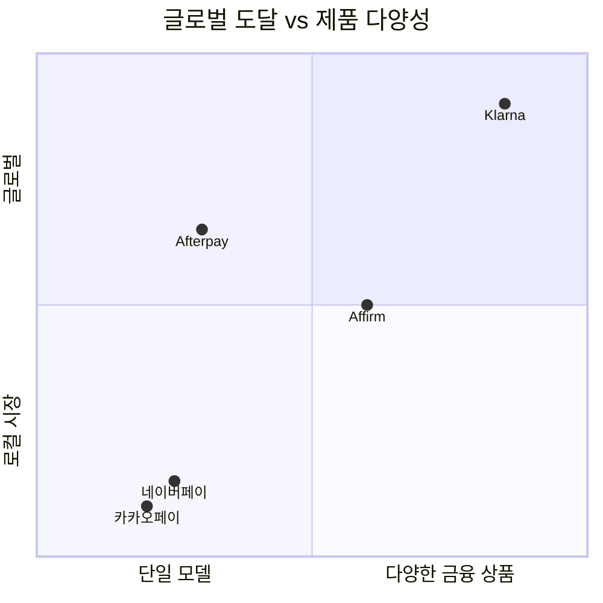

---
tags:
  - 결제
  - BNPL
search:
  boost: 1.5
---
# BNPL 제품 비교

## 비교 요약

| 제품 | 본사 | 주요 시장 | 핵심 모델 | 가맹점 수 | 차별화 |
|------|------|-----------|-----------|-----------|--------|
| **[Klarna](klarna.md)** | 스웨덴 | 글로벌 (45개국) | Pay-in-4, 할부, Pay Later | 500K+ | AI 쇼핑 어시스턴트, 글로벌 1위 |
| **[Afterpay](afterpay.md)** | 호주 (Block 인수) | 미국, 호주, 영국, 캐나다 | Pay-in-4 전문 | 100K+ | Block/Square 생태계 통합 |
| **Affirm** | 미국 | 미국, 캐나다 | 장기 할부 (0~36% APR) | 250K+ | 고가 상품 분할, 숨은 수수료 없음 |
| **[네이버페이 후결제](naverpay.md)** | 한국 | 한국 | 결제 후 다음달 일괄 | 네이버 생태계 | 네이버 쇼핑/멤버십 연동 |
| **카카오페이 후결제** | 한국 | 한국 | 결제 후 일정 기간 내 상환 | 카카오 생태계 | 카카오톡 기반 간편 결제 |

## 개별 제품 강점 / 약점 / 차별화

### Klarna

- **강점**: 글로벌 최대 BNPL, 45개국 진출, AI 쇼핑 어시스턴트로 진화
- **약점**: 장기간 적자 후 비용 절감 중, 규제 리스크 노출 큼
- **차별화**: BNPL을 넘어 AI 기반 쇼핑 플랫폼으로 전환

### Afterpay

- **강점**: Pay-in-4의 원조, Block/Square 결제 생태계 통합
- **약점**: Pay-in-4 단일 모델 의존, 장기 할부 미지원
- **차별화**: Cash App + Square POS와의 오프라인/온라인 통합

### Affirm

- **강점**: 고가 상품 장기 할부 특화, Amazon 파트너십, 투명한 가격
- **약점**: 유이자 모델 비중 높아 소비자 부담, 미국 중심
- **차별화**: "숨은 수수료 없음(No hidden fees)" 브랜드 포지셔닝

### 네이버페이 후결제

- **강점**: 네이버 쇼핑 생태계 밀착, 높은 전환율, 멤버십 연동
- **약점**: 한국 한정, 네이버 플랫폼 의존, 신용평가 제한적
- **차별화**: 국내 최대 이커머스 플랫폼 내 심리스 후결제

### 카카오페이 후결제

- **강점**: 카카오톡 기반 압도적 도달률, 간편한 UX
- **약점**: 한국 한정, 후결제 규모 제한적, 이커머스 전환율 네이버 대비 낮음
- **차별화**: 4천만+ 카카오톡 사용자 기반의 소셜 결제

## 시나리오별 선택 가이드

!!! tip "가맹점 관점: 어떤 BNPL을 도입해야 하나?"

    **"글로벌 이커머스, 다양한 결제 옵션이 필요하다"**
    → **Klarna** -- 45개국 지원, 다양한 결제 모델

    **"미국 시장, 오프라인+온라인 통합 결제"**
    → **Afterpay** -- Square POS + Cash App 생태계

    **"고가 상품 (가구, 전자제품, 의료) 장기 할부"**
    → **Affirm** -- $17,500까지, 36개월 할부

    **"한국 이커머스, 네이버 쇼핑에서 매출 극대화"**
    → **네이버페이 후결제** -- 네이버 생태계 최적화

    **"한국 시장, 폭넓은 사용자 기반 활용"**
    → **카카오페이 후결제** -- 카카오톡 사용자 도달

!!! warning "소비자 관점: BNPL 사용 시 주의사항"
    - 여러 BNPL 동시 이용(stacking) 자제
    - 총 분할결제 잔액을 월 소득의 10% 이내로 관리
    - 연체 시 신용점수 영향 가능성 인지
    - 무이자라도 과소비 유발 위험 경계

## 관련 문서

- [BNPL 개요](../index.md)
- [핵심 개념](../concepts.md)
- [트렌드](../trends.md)
- [임베디드 금융 제품 비교](../../embedded-finance/products/index.md)
