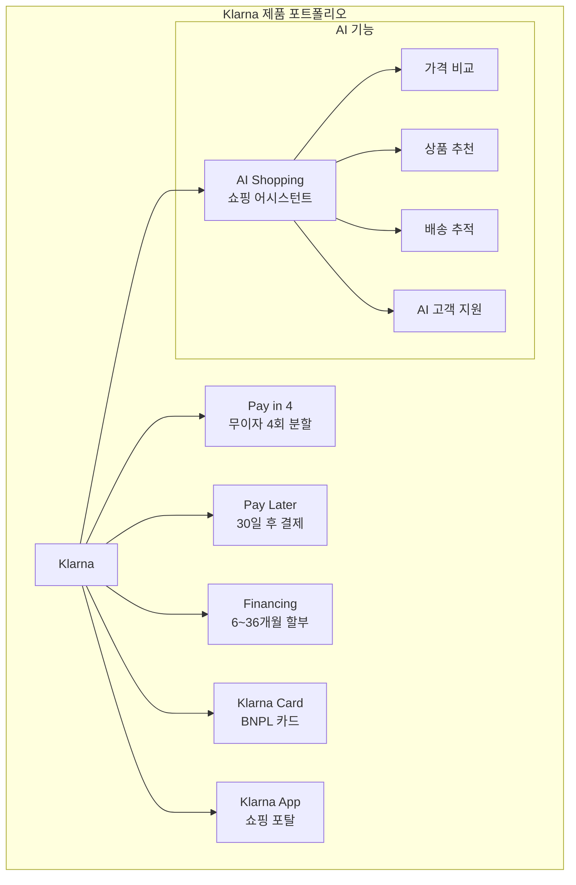

# Klarna

## 기본 정보

| 항목 | 내용 |
|------|------|
| **설립** | 2005년, 스웨덴 스톡홀름 |
| **유형** | BNPL / AI 쇼핑 플랫폼 |
| **주요 시장** | 45개국 (유럽, 미국, 호주 등) |
| **이용자** | 1억 5천만+ 활성 사용자 |
| **가맹점** | 500,000+ |
| **기업가치** | ~$6.7B (2024, 하락 후 회복 중) |
| **IPO** | 2025년 미국 IPO 추진 |

## 정의

Klarna는 스웨덴에서 시작한 **글로벌 최대 BNPL 서비스**이자, AI 쇼핑 어시스턴트로 진화 중인 핀테크 플랫폼이다.

## 상세 설명

Klarna는 BNPL의 역사 그 자체이다. 2005년 스웨덴에서 "결제를 더 간단하게"라는 미션으로 출발하여, 유럽을 석권한 후 미국, 호주 등 글로벌 시장으로 확장했다. 전성기인 2021년에는 기업가치가 $45.6B에 달했으나, 2022년 금리 인상과 핀테크 거품 붕괴로 $6.7B까지 급락하는 극적인 하락을 경험했다.

이후 Klarna는 대규모 구조조정을 단행했다. AI를 전면에 내세워 고객 서비스 인력의 상당 부분을 AI 챗봇으로 대체하고, 쇼핑 어시스턴트, 가격 비교, 배송 추적 등을 통합한 "AI 쇼핑 플랫폼"으로 포지셔닝을 전환했다. 이 전략은 성과를 내어 2024년 흑자 전환에 성공했고, 2025년 미국 IPO를 추진 중이다.

## 핵심 특징

!!! info "Klarna의 5대 강점"
    1. **글로벌 최대 규모**: 45개국, 1.5억 사용자, 50만 가맹점
    2. **다양한 결제 모델**: Pay-in-4, Pay Later, 장기 할부 등 전 스펙트럼
    3. **AI 쇼핑 플랫폼**: OpenAI 파트너십, AI 어시스턴트로 쇼핑 경험 혁신
    4. **Klarna Card**: 물리 카드로 오프라인까지 BNPL 확장
    5. **은행 라이선스 보유**: 스웨덴 은행 라이선스로 예금 수신 가능

## 가격 (가맹점 기준)

| 결제 유형 | 가맹점 수수료 | 소비자 비용 |
|-----------|--------------|-------------|
| Pay in 4 | 3~6% + 고정비 | 무이자 |
| Pay Later (30일) | 3~5% | 무이자 |
| Financing (장기) | 3~5% | 0~24.99% APR |

## 장점

- 글로벌 최대 BNPL 브랜드 인지도
- 스웨덴 은행 라이선스로 규제 안정성 확보
- AI 투자로 비용 구조 개선, 흑자 전환 달성
- 가맹점과 소비자 양면 네트워크 효과
- 쇼핑 앱으로서의 트래픽 발생 (가맹점에 추가 가치)

## 단점

- 2022년 기업가치 85% 하락이라는 신뢰 손상
- 유럽 중심 (미국 시장에서 Affirm/Afterpay와 경쟁)
- AI 대체에 따른 고객 서비스 품질 우려
- 규제 환경 변화에 따른 비용 증가 예상
- 연체율 관리가 수익성의 핵심 변수

## 실무 적용

!!! example "Klarna 활용 시나리오"
    - **글로벌 이커머스**: 다국가 결제 지원으로 해외 매출 확대
    - **패션/뷰티**: Pay-in-4로 전환율 20~30% 향상
    - **마켓플레이스**: Klarna App에서의 트래픽 유입
    - **오프라인 리테일**: Klarna Card로 오프라인 BNPL 지원

## 관련 문서

- [제품 비교](index.md)
- [BNPL 개요](../index.md)
- [Afterpay](afterpay.md) -- 주요 경쟁사 비교
- [BNPL 트렌드](../trends.md) -- AI 활용, 규제 동향
