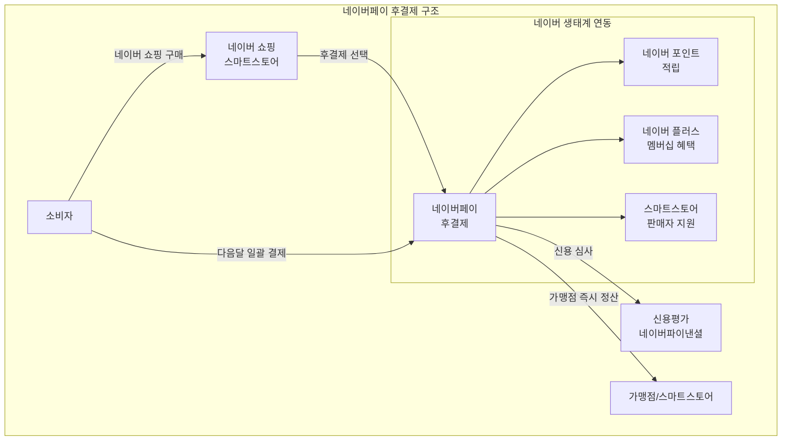

---
tags:
  - 결제
  - BNPL
---
# 네이버페이 후결제

## 기본 정보

| 항목 | 내용 |
|------|------|
| **운영사** | 네이버파이낸셜 (네이버 자회사) |
| **출시** | 2019년 |
| **유형** | 후불결제 (한국형 BNPL) |
| **주요 시장** | 한국 |
| **이용 조건** | 네이버 ID, 본인 인증, 신용평가 통과 |
| **결제 한도** | 최대 30만원 (신용에 따라 상이) |
| **상환** | 다음 달 일괄 결제 |

## 정의

네이버페이 후결제는 네이버 쇼핑 생태계에서 구매 시점에 결제 없이 상품을 받고, **다음 달에 일괄 결제**하는 한국형 BNPL 서비스이다.

## 상세 설명

네이버페이 후결제는 글로벌 BNPL과 다른 한국 시장의 특수성을 반영한다. 한국은 이미 신용카드 무이자 할부 문화가 정착되어 있어, "Pay-in-4" 같은 모델보다는 **"이번 달 구매, 다음 달 결제"**라는 단순한 모델이 적합했다. 네이버의 강점인 쇼핑 검색 트래픽과 결합하여, 구매 결정 순간에 결제 부담을 제거하는 전략이다.

네이버페이 후결제의 핵심 경쟁력은 **네이버 생태계 통합**에 있다. 네이버 쇼핑, 네이버 스마트스토어, 네이버 멤버십(네이버 플러스)과 긴밀하게 연동되어, 후결제 사용 시 네이버 포인트 적립, 멤버십 할인 등의 추가 혜택이 제공된다. 이는 단순한 결제 수단을 넘어 네이버 이커머스 생태계의 락인(Lock-in) 도구로 기능한다.

## 핵심 특징

!!! info "네이버페이 후결제의 5대 특징"
    1. **다음달 일괄 결제**: Pay-in-4가 아닌 한국형 "후불" 모델
    2. **네이버 생태계 통합**: 쇼핑, 포인트, 멤버십과 유기적 연동
    3. **간편한 심사**: 네이버 활동 데이터 기반 빠른 신용 평가
    4. **스마트스토어 최적화**: 네이버 자체 커머스 플랫폼 연동
    5. **포인트 적립 혜택**: 후결제 사용 시에도 네이버 포인트 적립

## 이용 구조

| 항목 | 내용 |
|------|------|
| 결제 한도 | 최대 30만원 (개인 신용에 따라 차등) |
| 상환 방식 | 다음 달 지정일 일괄 자동 결제 |
| 이자 | 없음 (무이자) |
| 수수료 (소비자) | 없음 |
| 연체 시 | 서비스 이용 제한, 연체 이자 발생 가능 |
| 신용 영향 | 연체 시 신용점수 하락 가능 |

## 장점

- 네이버 쇼핑 이용자에게 자연스러운 결제 경험
- 한국 시장 특성에 맞는 "다음달 결제" 모델
- 네이버 플러스 멤버십과의 시너지 (추가 할인/적립)
- 스마트스토어 판매자에게 추가 전환율 제공
- 네이버 데이터 기반 정교한 신용평가

## 단점

- 결제 한도가 30만원으로 낮음 (고가 상품 불가)
- 네이버 생태계 내에서만 의미 있는 서비스
- 글로벌 확장성 없음
- 한국의 기존 신용카드 무이자 할부 대비 차별화 약함
- 별도 분할결제 기능 미약 (일괄 후불만 지원)

## 한국 BNPL 시장에서의 위치

!!! note "한국 BNPL 시장의 특수성"
    한국은 글로벌 BNPL 시장과 구조적으로 다르다:

    - **신용카드 보급률 90%+**: 이미 무이자 할부 인프라가 존재
    - **후불결제 = BNPL**: 카드 없이 후불로 결제하는 개념
    - **플랫폼 경쟁**: 네이버 vs 카카오 vs 토스의 슈퍼앱 경쟁
    - **규제**: 금융위원회의 후불결제 한도 관리 강화

    이런 환경에서 네이버페이 후결제는 "신용카드 대체"보다는 "네이버 쇼핑 전환율 극대화 도구"로서의 가치가 더 크다.

## 실무 적용

!!! example "네이버페이 후결제 활용"
    - **스마트스토어 판매자**: 후결제 지원으로 구매 전환율 향상
    - **MZ세대 타겟**: 신용카드 미보유 젊은 소비자층 확보
    - **소액 반복 구매**: 일상 소비에서의 결제 편의성 제공

## 관련 문서

- [제품 비교](index.md)
- [BNPL 개요](../index.md)
- [Klarna](klarna.md) -- 글로벌 BNPL 비교
- [Afterpay](afterpay.md) -- Pay-in-4 모델 비교
- [BNPL 트렌드](../trends.md)
