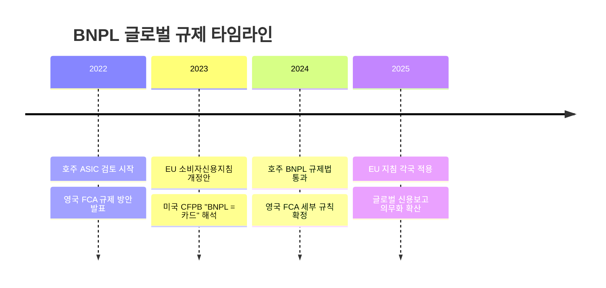
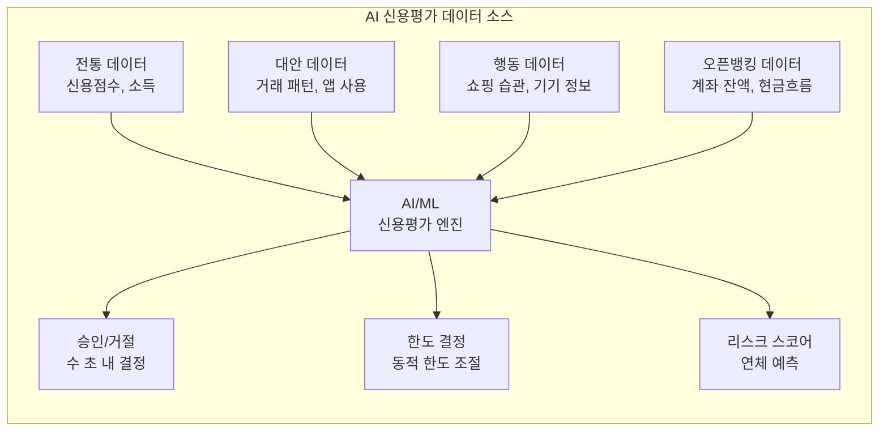

# BNPL 트렌드

## 규제 강화: 글로벌 수렴

BNPL의 "규제 사각지대" 시대가 끝나고 있다. 전 세계적으로 BNPL을 신용 상품으로 분류하고 기존 대출 규제를 적용하는 방향으로 수렴 중이다.

!!! warning "규제 강화의 영향"
    1. **적합성 심사 의무화**: 소비자의 상환 능력을 사전에 검증해야 함
    2. **신용 보고 의무화**: BNPL 이용 내역이 신용 기록에 반영
    3. **광고 규제**: "무이자" 등 표현에 대한 제한 강화
    4. **분쟁 해결 의무**: 소비자 보호 절차 구비 필수
    5. **라이선스 요건**: 일부 국가에서 대출업 라이선스 필요

규제 강화는 BNPL 제공자의 비용을 높이지만, 시장의 건전성을 강화하고 책임있는 대출 문화를 촉진한다. 규제를 선제적으로 준수한 Klarna, Affirm 등은 오히려 경쟁 우위를 확보할 수 있다.

---

## 수익성 문제와 구조 전환

BNPL 업계는 "성장에서 수익성으로"의 패러다임 전환을 겪고 있다.

| 지표 | 2021 (전성기) | 2024 (현재) |
|------|---------------|-------------|
| 시장 분위기 | 폭발적 성장, 적자 무관 | 수익성 증명 필수 |
| Klarna 가치 | $45.6B | ~$6.7B (회복 중) |
| 연체율 | 2~3% | 3~5% |
| 자본 조달 | 용이 | 긴축 |
| 전략 | 점유율 확장 | 비용 절감, 수익 다변화 |

주요 수익성 개선 전략:

- **AI 비용 절감**: Klarna의 AI 고객 서비스 (인력 50%+ 대체)
- **광고 수익**: 쇼핑 앱 내 가맹점 광고 플랫폼
- **유이자 상품 확대**: 장기 할부 등 이자 수익 비중 증가
- **B2B BNPL**: 기업 간 결제로 영역 확장

---

## AI 신용평가

AI/ML 기반 신용평가는 BNPL의 핵심 경쟁력이자 미래 방향이다.

!!! tip "AI 신용평가의 장점"
    - **속도**: 수 초 내 심사 완료 (기존 수일~수주)
    - **정확성**: 다변량 데이터로 기존 FICO보다 정교한 예측
    - **포용성**: 신용 기록이 없는 "Thin-file" 고객도 평가 가능
    - **동적 조절**: 사용 패턴에 따라 한도를 실시간 조정

오픈뱅킹 데이터와의 결합이 특히 주목된다. 계좌 잔액, 현금 흐름 패턴, 급여 입금 주기 등을 AI가 분석하면 전통 신용평점보다 정확한 상환 능력 예측이 가능하다.

---

## 슈퍼앱 통합

아시아 시장을 중심으로 BNPL이 슈퍼앱의 핵심 기능으로 통합되는 추세이다.

| 슈퍼앱 | BNPL/후결제 기능 | 시장 |
|--------|-----------------|------|
| 토스 | 토스 후불결제 | 한국 |
| 카카오페이 | 카카오페이 후결제 | 한국 |
| 네이버페이 | 네이버페이 후결제 | 한국 |
| GrabPay | PayLater by Grab | 동남아 |
| Gojek/GoPay | GoPayLater | 인도네시아 |
| MercadoPago | Mercado Credito | 라틴아메리카 |

슈퍼앱 내 BNPL의 장점은 **기존 사용자 베이스와 거래 데이터 활용**이다. 별도의 사용자 확보 비용 없이 수천만 사용자에게 즉시 제공할 수 있고, 앱 내 거래 데이터로 정교한 신용평가가 가능하다.

---

## B2B BNPL

소비자(B2C)를 넘어 기업 간(B2B) 결제로 BNPL이 확장되고 있다.

B2B 거래는 전통적으로 인보이스 기반 30~90일 결제 조건(Net Terms)을 사용한다. B2B BNPL은 이를 디지털화하고 자동화한다.

!!! info "B2B BNPL 주요 플레이어"
    - **Billie**: 유럽 B2B BNPL, Klarna의 B2B 버전
    - **Resolve**: 미국 B2B Net Terms 자동화
    - **Two**: 노르웨이, B2B 체크아웃 + 후불결제
    - **Hokodo**: 영국, B2B 결제 보호 + BNPL

B2B BNPL 시장은 B2C보다 거래 규모가 크고 마진이 높아, BNPL의 수익성 문제를 해결할 수 있는 유망 영역으로 평가된다.

---

## 향후 전망

!!! tip "2025-2027 주요 전망"
    1. **규제 정상화**: BNPL이 공식 신용 상품으로 자리잡으며 시장 재편
    2. **AI 주도 혁신**: 신용평가, 고객 서비스, 사기 탐지 전 영역에서 AI 활용
    3. **수익 모델 다변화**: 광고, B2B, 데이터 서비스 등 새로운 수익원 개척
    4. **오픈뱅킹 결합**: A2A 결제와 BNPL의 결합으로 카드 네트워크 우회
    5. **글로벌 통합**: M&A를 통한 시장 집중 (소수 대형 플레이어 생존)

## 관련 문서

- [BNPL 개요](index.md)
- [핵심 개념](concepts.md)
- [제품 비교](products/index.md)
- [오픈뱅킹 트렌드](../open-banking/trends.md) -- 오픈뱅킹 + BNPL 결합
- [임베디드 금융 트렌드](../embedded-finance/trends.md) -- BNPL의 임베디드 모델
