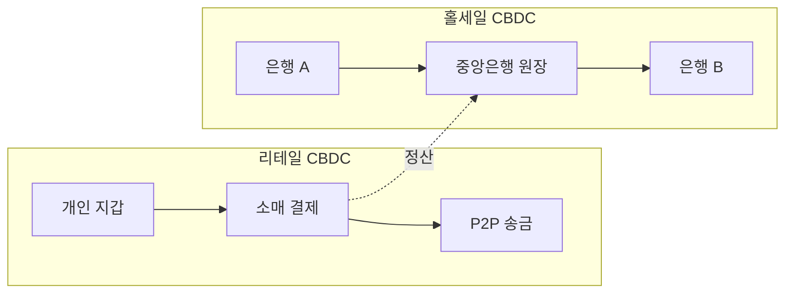
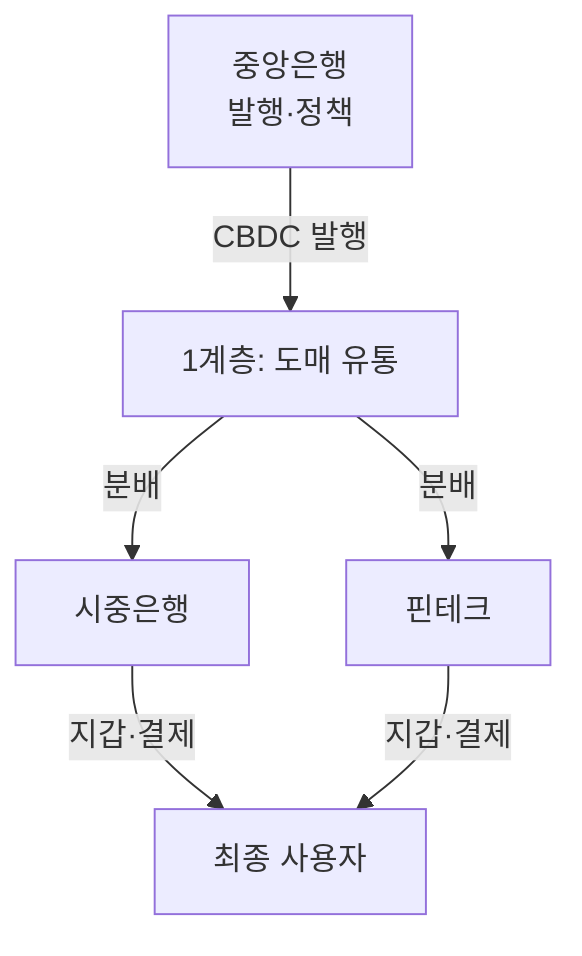
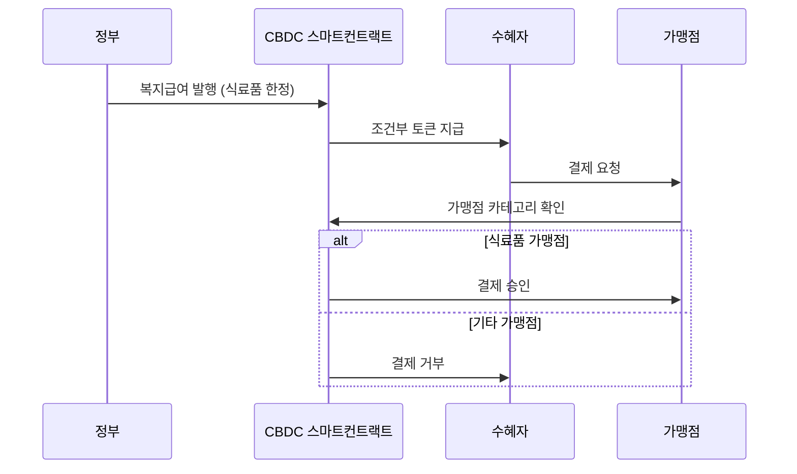
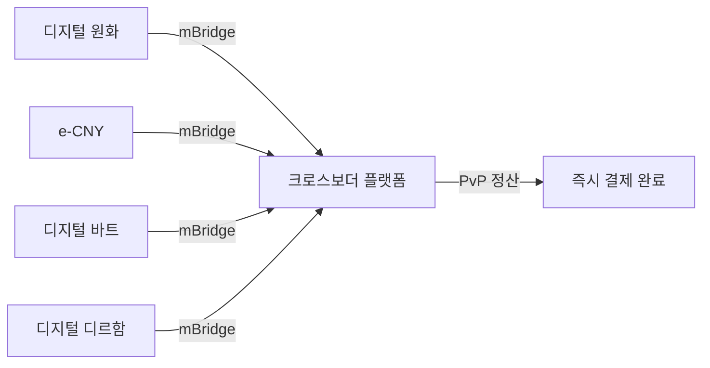
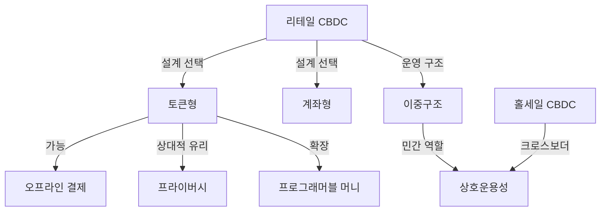

# CBDC 핵심 개념

CBDC를 이해하기 위한 핵심 개념을 구조적으로 정리한다. 각 개념은 독립적이면서도 상호 연결되어 CBDC 설계의 트레이드오프를 형성한다.

---

## 리테일 CBDC vs 홀세일 CBDC

**리테일 CBDC**는 일반 국민과 기업이 일상 결제에 사용하는 디지털화폐이고, **홀세일 CBDC**는 금융기관 간 대규모 결제·정산에 특화된 디지털화폐다.

리테일 CBDC는 현금의 디지털 대체재로서 금융 포용, 결제 효율성, 통화정책 전달력 강화를 목표로 한다. 홀세일 CBDC는 기존 RTGS(실시간총액결제) 시스템을 개선하여 크로스보더 정산 속도와 비용을 혁신하려 한다. 대부분의 국가가 리테일 CBDC에 집중하지만, BIS의 mBridge 프로젝트처럼 홀세일 CBDC도 활발히 연구되고 있다.

!!! tip "실무 포인트"
    리테일 CBDC 설계 시 초당 수만 건의 트랜잭션 처리 능력이 필요하며, 홀세일 CBDC는 건당 금액이 크므로 최종성(finality)과 원자적 결제(atomic settlement)가 핵심이다.

---

## 이중구조 모델 (Two-tier Model)

**이중구조 모델**은 중앙은행이 CBDC를 발행(1계층)하고, 시중은행·핀테크가 유통·서비스(2계층)를 담당하는 운영 구조다.

중앙은행이 모든 국민에게 직접 계좌를 제공하는 단일구조(one-tier)는 기존 금융 시스템을 붕괴시킬 수 있다. 이중구조는 중앙은행의 역할을 발행·정책에 한정하고, 고객 대면(KYC, 지갑 운영, 부가 서비스)은 민간에 위임하여 기존 금융 생태계와의 공존을 보장한다. e-CNY, Digital Euro, 디지털 원화 모두 이중구조를 채택하고 있다.

---

## 토큰형 vs 계좌형

**토큰형(Token-based)**은 디지털 토큰 자체에 가치가 내재되어 소유자가 곧 권리자인 반면, **계좌형(Account-based)**은 중앙 원장의 계좌 잔액으로 가치를 관리한다.

| 구분 | 토큰형 | 계좌형 |
|------|--------|--------|
| 인증 대상 | 토큰(객체) | 계좌 소유자(신원) |
| 프라이버시 | 상대적으로 높음 | 상대적으로 낮음 |
| 오프라인 가능성 | 용이 | 어려움 |
| 유사 비유 | 현금, 선불카드 | 은행 예금 |
| 채택 사례 | e-CNY(하이브리드), Sand Dollar | Digital Euro(검토 중) |

!!! warning "하이브리드 접근"
    실제로 대부분의 CBDC는 순수 토큰형이나 순수 계좌형이 아닌 하이브리드 형태를 채택한다. e-CNY는 토큰 기반이면서도 중앙 원장에서 이중지불을 방지하는 구조다.

---

## 프로그래머블 머니

**프로그래머블 머니(Programmable Money)**는 스마트 컨트랙트 또는 내장 로직을 통해 특정 조건 충족 시 자동으로 지급·회수·제한이 실행되는 화폐다.

복지 보조금을 특정 품목에만 사용하도록 제한하거나, 무역 대금을 선적 서류 확인 후 자동 지급하는 것이 대표적 사례다. 그러나 과도한 프로그래밍은 화폐의 대체 가능성(fungibility)을 훼손하고, 국가의 지출 통제 수단으로 오용될 수 있어 신중한 설계가 필요하다.

---

## 오프라인 결제

**오프라인 결제**는 인터넷 연결 없이도 CBDC 거래를 수행할 수 있는 기능으로, 현금의 핵심 특성인 "어디서나 사용 가능"을 디지털 환경에서 재현한다.

자연재해, 통신 장애, 농촌 지역 등 네트워크 접근이 불안정한 환경에서 금융 포용을 보장하기 위해 필수적이다. NFC, Bluetooth, 보안 칩(SE) 등을 활용하며, 이중지불 방지를 위한 하드웨어 기반 보안이 핵심 과제다. e-CNY와 Sand Dollar이 오프라인 결제 기능을 적극 시범하고 있다.

!!! note "기술적 과제"
    오프라인 상태에서 이중지불을 방지하려면 탬퍼 방지(tamper-proof) 하드웨어 지갑이 필수다. 거래 한도 설정, 오프라인 유지 기간 제한, 온라인 복귀 시 동기화 등의 보완 메커니즘이 함께 설계되어야 한다.

---

## 프라이버시

CBDC의 **프라이버시**는 거래 정보를 누가, 어느 범위까지 열람할 수 있는지를 결정하는 설계 원칙으로, 현금 수준의 익명성과 AML/CFT 규제 준수 사이의 균형이 핵심이다.

완전한 익명성은 자금세탁·테러자금 조달에 악용될 수 있고, 완전한 투명성은 국가 감시 도구로 전락할 수 있다. 대부분의 CBDC는 소액 거래에 높은 프라이버시를, 고액 거래에 KYC 기반 투명성을 적용하는 계층적 프라이버시(tiered privacy) 모델을 채택한다. ECB의 Digital Euro는 "현금 수준의 오프라인 프라이버시"를 설계 원칙으로 명시하고 있다.

| 프라이버시 수준 | 거래 유형 | 요구 사항 |
|----------------|----------|----------|
| 완전 익명 | 소액 오프라인 | 지갑만 필요, KYC 없음 |
| 의사 익명 | 일반 온라인 거래 | 기본 KYC, 거래 내역 비공개 |
| 완전 투명 | 고액·의심 거래 | 강화 KYC, 규제기관 열람 가능 |

---

## 상호운용성 (Interoperability)

**상호운용성**은 서로 다른 CBDC 시스템, 기존 결제 인프라, 그리고 다른 국가의 CBDC 간에 원활하게 가치를 교환할 수 있는 능력이다.

국내적으로는 기존 은행 시스템·카드 네트워크와의 연동이, 국제적으로는 크로스보더 결제를 위한 CBDC 간 호환이 필수다. BIS의 mBridge 프로젝트는 다수 국가의 CBDC를 단일 플랫폼에서 교환하는 모델을 시범 중이며, SWIFT도 CBDC 연결 실험을 진행하고 있다.

!!! info "관련 개념"
    상호운용성은 [STO의 크로스체인 결제](../sto/concepts.md)와 [DeFi의 크로스체인 브릿지](../defi/concepts.md)와도 밀접하게 연결된다. CBDC가 DeFi 프로토콜과 상호운용될 수 있을지는 향후 중요한 연구 주제다.

---

## 개념 간 관계

## 관련 문서

- [CBDC 개요](index.md)
- [주요 CBDC 프로젝트 비교](products/index.md)
- [글로벌 트렌드](trends.md)
