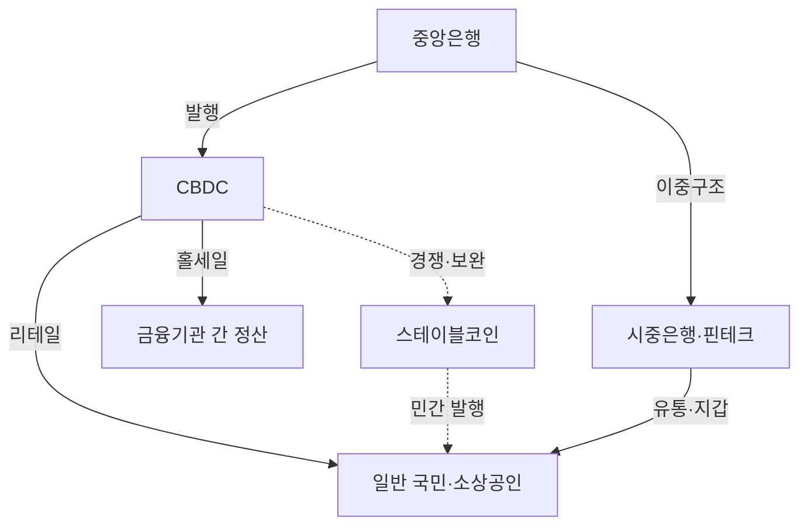
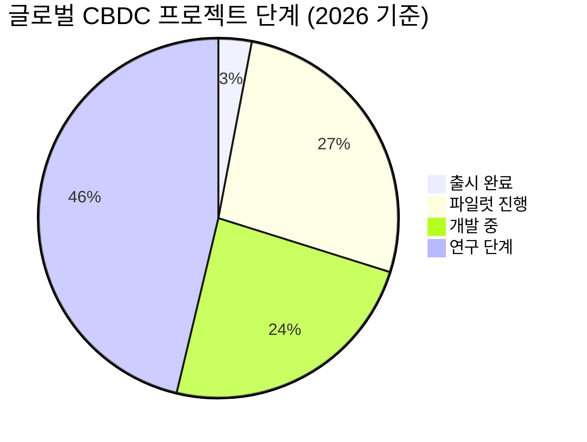

# CBDC (중앙은행 디지털화폐)

**CBDC(Central Bank Digital Currency)**는 중앙은행이 직접 발행하고 보증하는 법정 디지털화폐로, 기존 현금의 디지털 대체재이자 통화 주권을 디지털 시대에 확장하는 수단이다.

## 왜 중요한가

전 세계 130여 개국이 CBDC를 연구 또는 시범 운영 중이며, 이는 화폐 시스템의 가장 큰 구조적 전환을 의미한다. 현금 사용 감소, 민간 스테이블코인의 부상, 그리고 금융 포용(financial inclusion) 요구가 중앙은행을 디지털화폐 발행으로 이끌고 있다. CBDC는 결제 효율성 향상, 통화정책 전달력 강화, 자금세탁 방지(AML) 등 다층적 목표를 동시에 추구한다.

특히 스테이블코인이 민간 주도의 디지털 달러로 급성장하면서, 중앙은행은 통화 주권 유지를 위해 CBDC 개발을 가속화하고 있다. 그러나 프라이버시 침해 우려, 기존 금융 시스템과의 공존, 기술적 확장성 등 해결해야 할 과제도 산적해 있다.

## 핵심 키워드

| 키워드 | 설명 |
|--------|------|
| **리테일 CBDC** | 일반 국민이 직접 사용하는 소액 결제용 디지털화폐 |
| **홀세일 CBDC** | 금융기관 간 대규모 결제·정산에 사용되는 디지털화폐 |
| **이중구조(Two-tier)** | 중앙은행이 발행하고 시중은행이 유통하는 2계층 모델 |
| **프로그래머블 머니** | 스마트 컨트랙트로 조건부 지급·자동 실행이 가능한 화폐 |
| **스테이블코인과 차이** | CBDC는 중앙은행 부채, 스테이블코인은 민간 발행·담보 기반 |

!!! info "CBDC vs 스테이블코인"
    CBDC는 중앙은행의 직접 부채(direct liability)로 신용 리스크가 없다. 반면 스테이블코인은 발행사의 담보 건전성에 의존하며, 규제 불확실성이 크다. 둘은 경쟁이 아닌 공존 구조로 진화할 가능성이 높다.

## CBDC 도입 현황 스냅샷

## 이 섹션의 구성

| 문서 | 내용 |
|------|------|
| [핵심 개념](concepts.md) | 리테일/홀세일, 이중구조, 토큰형/계좌형, 프라이버시 등 |
| [주요 CBDC 비교](products/index.md) | 디지털 원화, e-CNY, Digital Euro 등 6개 프로젝트 비교 |
| [글로벌 트렌드](trends.md) | 크로스보더 CBDC, 프라이버시 논쟁, 금융 포용 |

## 관련 도메인

- [토큰증권 (STO)](../sto/index.md) — CBDC 인프라 위에서 증권 결제 가능성
- [DeFi 프로토콜](../defi/index.md) — CBDC와 탈중앙화 금융의 접점

## 실무 적용

- **핀테크 기업**: CBDC 지갑·결제 인프라 구축 기회 탐색
- **금융기관**: 이중구조 모델에서의 유통·수탁 역할 설계
- **정책 담당자**: 프라이버시-규제 균형 설계, 크로스보더 정산 표준 참여
- **개발자**: 프로그래머블 머니 API, 오프라인 결제 프로토콜 연구
