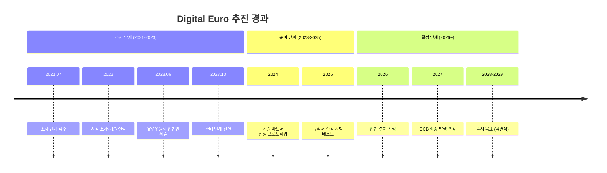
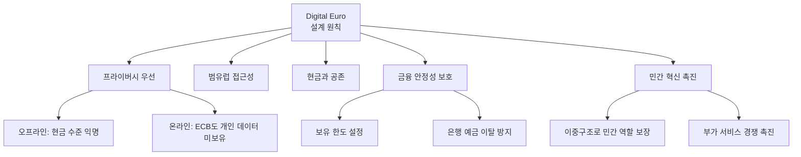

# Digital Euro

**Digital Euro**는 유럽중앙은행(ECB)이 유로존 19개국을 대상으로 준비 중인 CBDC로, "현금 수준의 프라이버시"를 핵심 설계 원칙으로 내세우며 세계에서 가장 프라이버시 친화적인 CBDC를 목표로 한다.

## 배경과 목적

유로존은 미국 빅테크(Apple Pay, Google Pay)와 중국 결제 플랫폼의 유럽 시장 침투, 그리고 현금 사용률 감소에 대응하기 위해 Digital Euro를 추진하고 있다. 핵심 목표는 유럽의 결제 주권(payment sovereignty) 확보와 범유럽 단일 디지털 결제 수단 제공이다.

ECB는 2021년 조사 단계를 시작했고, 2023년 준비 단계(preparation phase)에 진입했다. 유럽 의회와 이사회의 입법 과정이 병행되고 있으며, 최종 발행 결정은 법적 프레임워크 확정 이후에 내려진다. 가장 낙관적 시나리오로도 2028~2029년 출시가 예상된다.

## 준비 단계 타임라인

## 설계 원칙

ECB는 Digital Euro의 설계 원칙을 명확히 공표했으며, 프라이버시가 최우선이다.

| 원칙 | 구체 내용 |
|------|----------|
| **프라이버시** | 오프라인 거래는 현금과 동일한 익명성. 온라인도 ECB가 개인 거래 데이터에 접근하지 않는 구조 |
| **보편적 접근** | 유로존 모든 시민·기업이 무료로 기본 서비스 이용 가능 |
| **현금 공존** | Digital Euro는 현금을 대체하지 않으며 보완 수단 |
| **금융 안정** | 개인당 보유 한도(약 3,000유로 검토)로 은행 예금 이탈 방지 |
| **민간 혁신** | 시중은행·결제기관이 유통·부가서비스 담당 |

!!! tip "프라이버시 차별화"
    Digital Euro는 e-CNY의 "관리형 익명"과 명확히 차별화된다. ECB는 설계 단계에서부터 중앙은행 자체도 개인 거래 데이터에 접근할 수 없는 구조를 약속하고 있으며, 이는 유럽의 GDPR 전통과 일맥상통한다.

## 보유 한도와 금융 안정

Digital Euro의 가장 논쟁적인 설계 요소는 개인당 보유 한도(holding limit)다. 금리 위기 시 은행 예금이 Digital Euro로 대규모 이동하는 "디지털 뱅크런"을 방지하기 위해 약 3,000유로의 보유 한도가 검토되고 있다.

한도를 초과하는 금액은 자동으로 연결 은행 계좌로 이체("워터폴 기능")되어, 사용자 경험을 해치지 않으면서도 금융 안정을 보호한다.

!!! warning "한도 논쟁"
    3,000유로 한도는 일상 결제에는 충분하지만, Digital Euro를 가치 저장 수단으로 사용하기 어렵게 만든다. 은행권은 한도를 낮추길 원하고, 소비자 단체는 높이길 원하는 등 이해관계가 상충한다.

## 기술 설계

ECB는 기술 중립(technology-neutral) 원칙을 표방하며, DLT와 중앙 집중형 원장 모두를 고려하고 있다. 2024년 기술 파트너 선정 과정에서 Amazon, Nexi, Worldline 등이 프로토타입 개발에 참여했다.

| 항목 | 현재 검토 상황 |
|------|-------------|
| 원장 기술 | DLT 및 중앙 집중형 모두 검토 |
| 오프라인 결제 | 보안 칩 기반 설계 목표 |
| 결제 수단 | QR코드, NFC, 온라인 결제 |
| 보유 한도 | 약 3,000유로 (조정 가능) |
| 이자 | 무이자 |
| 수수료 | 개인 기본 사용 무료 |

## 강점과 약점

**강점**:
- 세계에서 가장 프라이버시 친화적인 CBDC 설계
- 범유럽 단일 디지털 결제 수단으로서의 잠재력
- GDPR·소비자 보호 전통에 부합하는 규제 프레임워크
- 입법 기반의 투명한 추진 과정

**약점**:
- 19개국 합의 필요로 의사결정 느림
- 출시 시점 불확실 (최소 2028~2029)
- 보유 한도로 인한 기능 제약
- 기존 SEPA·카드 결제와의 차별화 미흡 우려

## 관련 문서

- [CBDC 개요](../index.md) | [핵심 개념](../concepts.md)
- [주요 CBDC 비교](index.md)
- [디지털 원화](digital-won.md) | [e-CNY](e-cny.md)
- [글로벌 트렌드 — 프라이버시 논쟁](../trends.md)
