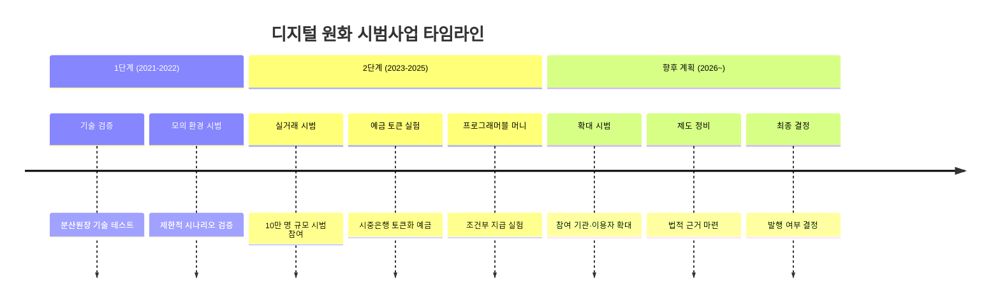
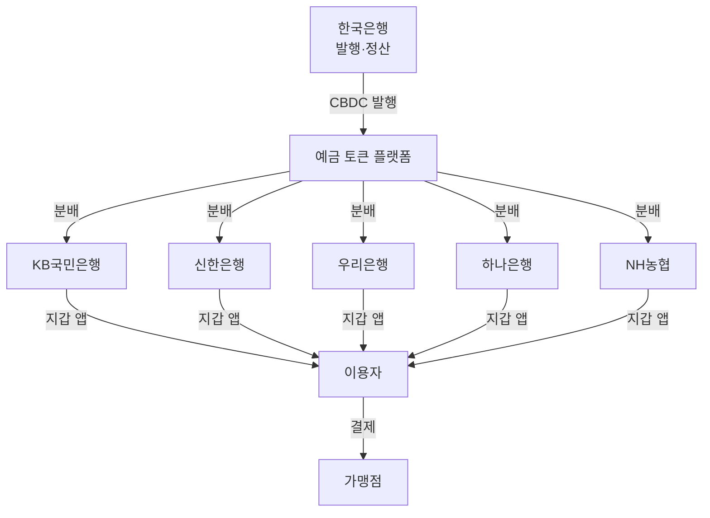

# 디지털 원화

**디지털 원화**는 한국은행이 발행을 검토 중인 대한민국의 CBDC로, 이중구조 모델 기반의 토큰형 설계를 채택하고 예금 토큰·프로그래머블 머니 실험에 집중하고 있다.

## 배경과 목적

한국은 세계적으로 높은 디지털 결제 비율(현금 비중 약 5% 미만)을 보유하고 있어 CBDC 도입의 긴급성이 다른 국가 대비 낮은 편이다. 그럼에도 한국은행은 미래 결제 환경 변화에 대비하고, 민간 스테이블코인·빅테크 결제 독점에 대한 통화 주권 방어, 프로그래머블 머니를 통한 정책 집행 효율화를 목표로 CBDC 연구를 지속하고 있다.

특히 한국은 예금 토큰(deposit token) 모델에 주목하고 있다. 이는 시중은행의 예금을 토큰화하여 CBDC와 공존시키는 방식으로, 기존 금융 시스템의 급격한 변화를 방지하면서도 토큰 경제의 이점을 취하려는 전략이다.

## 시범사업 구조

## 설계 구조

| 설계 항목 | 선택 |
|----------|------|
| 운영 구조 | 이중구조 (한국은행 + 시중은행) |
| 토큰 유형 | 토큰형 (예금 토큰 병행) |
| 합의 메커니즘 | 허가형 블록체인 |
| 프라이버시 | 계층적 (소액 간편, 고액 KYC) |
| 오프라인 결제 | 시범 예정 (NFC 기반) |
| 프로그래머블 | 조건부 지급, 시간 제한 등 실험 |

!!! warning "예금 토큰 vs CBDC"
    예금 토큰은 시중은행의 부채(예금)를 토큰화한 것으로, 중앙은행 부채인 CBDC와는 법적 성격이 다르다. 한국은행은 두 가지를 동시에 실험하면서 최적의 조합을 모색하고 있다.

## 참여 기관

- **한국은행**: 총괄 기획, 발행·정산 시스템 운영
- **5대 시중은행**: KB, 신한, 우리, 하나, NH — 지갑 운영, 유통
- **금융결제원**: 기술 인프라 지원
- **한국조폐공사**: 보안 칩·하드웨어 지갑 연구
- **핀테크 기업**: 결제 연동, 부가 서비스 개발

## 핵심 특징

1. **예금 토큰 모델**: 시중은행 예금의 토큰화로 기존 금융 시스템과 자연스러운 공존
2. **프로그래머블 머니 실험**: 복지 바우처, 지역화폐, 조건부 보조금 등 정책 활용
3. **높은 디지털 인프라**: 카카오페이·네이버페이 등 기존 결제 플랫폼과의 연계 가능성
4. **점진적 접근**: 발행 의무가 아닌 선택적 준비 — 시장 상황에 따라 유연하게 결정

!!! info "관련 프로젝트"
    한국은행은 BIS Innovation Hub과 크로스보더 CBDC 실험에도 참여하고 있으며, [mBridge 프로젝트](../trends.md)와의 연계 가능성도 검토 중이다.

## 관련 문서

- [CBDC 개요](../index.md) | [핵심 개념](../concepts.md)
- [주요 CBDC 비교](index.md)
- [e-CNY](e-cny.md) | [Digital Euro](digital-euro.md)
