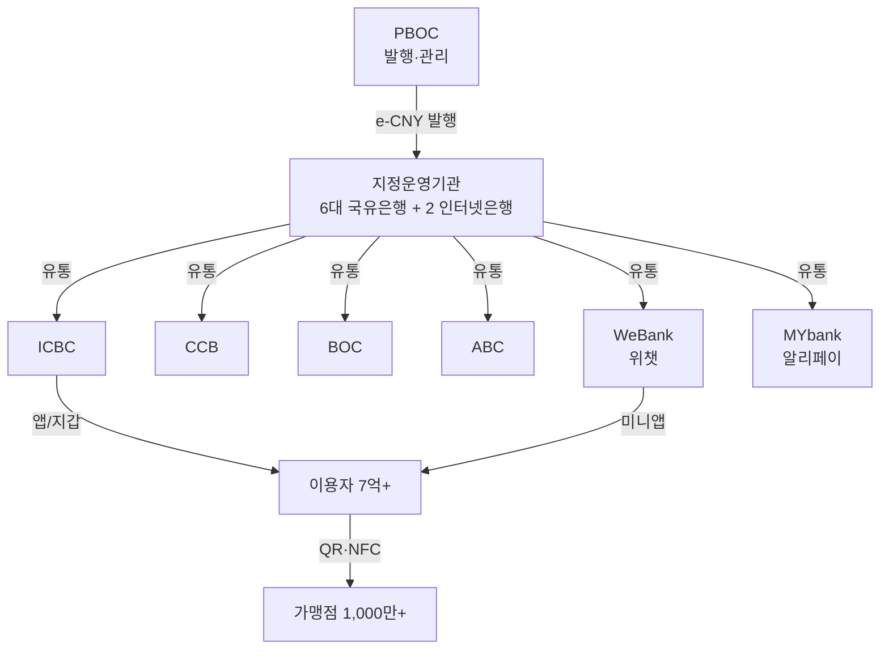
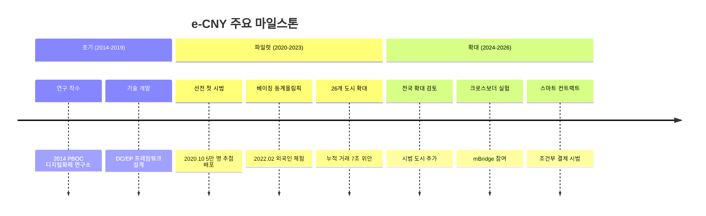

# e-CNY (디지털 위안)

**e-CNY**는 중국 인민은행(PBOC)이 발행하는 CBDC로, 세계 최대 규모의 파일럿을 운영하며 리테일 CBDC의 사실상 글로벌 벤치마크 역할을 하고 있다.

## 배경과 목적

중국은 2014년부터 디지털 위안 연구를 시작했으며, 알리페이·위챗페이 등 민간 결제 플랫폼의 지배력에 대응하고 통화 주권을 확보하기 위해 e-CNY 개발을 추진했다. 위안화 국제화 전략의 일환이기도 하며, 크로스보더 결제에서 달러 의존도를 낮추려는 지정학적 목표도 포함된다.

2020년 선전을 시작으로 26개 이상의 도시에서 파일럿을 운영 중이며, 누적 거래액은 수조 위안에 달한다. 그러나 자발적 채택률은 기대보다 낮아 "정부 주도 보급 vs 시장 수요" 간의 괴리가 과제로 남아 있다.

## 설계 구조

| 설계 항목 | 선택 |
|----------|------|
| 운영 구조 | 이중구조 (PBOC + 지정운영기관) |
| 토큰 유형 | 하이브리드 (토큰 기반 + 중앙 원장) |
| 합의 메커니즘 | 중앙 집중형 (기술 중립) |
| 프라이버시 | 관리형 익명 (可控匿名) |
| 오프라인 결제 | NFC 기반 하드웨어 지갑 지원 |
| 프로그래머블 | 스마트 컨트랙트 제한적 적용 |
| 이자 | 무이자 (M0 대체) |

## 세계 최대 규모 파일럿

!!! tip "채택 현황"
    2025년 기준 누적 거래액 약 7조 위안(약 1,400조 원), 개인 지갑 약 2.6억 개가 개설되었다. 그러나 전체 모바일 결제 시장에서의 비중은 여전히 0.2% 미만으로, 알리페이·위챗페이의 지배력은 견고하다.

## 관리형 익명 (可控匿名)

e-CNY의 프라이버시 모델은 "관리 가능한 익명성(可控匿名)"으로 요약된다. 일반 사용자 간 거래는 상호 익명이지만, PBOC는 필요 시(AML/CFT) 거래 내역에 접근할 수 있다.

| 지갑 등급 | KYC 수준 | 거래 한도 | 프라이버시 |
|----------|---------|----------|----------|
| 4등급 | 전화번호만 | 일 2,000위안 | 높음 |
| 3등급 | 신분증 연계 | 일 5,000위안 | 중간 |
| 2등급 | 은행 계좌 연계 | 일 50,000위안 | 낮음 |
| 1등급 | 대면 인증 | 무제한 | 최저 |

!!! warning "프라이버시 우려"
    중국 정부의 광범위한 데이터 접근 권한에 대한 국제적 우려가 있다. "관리형 익명"이라는 표현 자체가 완전한 프라이버시를 보장하지 않음을 시사하며, 이는 e-CNY의 국제적 수용에 장벽이 될 수 있다.

## 오프라인 결제

e-CNY는 NFC 기반 하드웨어 지갑을 통한 오프라인 결제를 지원하는 몇 안 되는 CBDC 중 하나다. SIM 카드형, 카드형, 팔찌형 등 다양한 폼팩터의 하드웨어 지갑이 출시되었으며, 농촌 지역과 고령층의 금융 포용을 위한 핵심 수단으로 활용된다.

## 강점과 약점

**강점**:
- 세계 최대 파일럿 규모로 실증 데이터 축적
- 오프라인 결제·하드웨어 지갑 선도
- 기존 알리페이·위챗페이 생태계와 연동
- 크로스보더(mBridge) 적극 참여

**약점**:
- 자발적 채택률 저조 — 인센티브 없이는 사용 동기 부족
- 프라이버시 모델에 대한 국제적 불신
- 위안화 자본 통제와의 모순 (국제화 목표와 충돌)
- 프로그래머블 기능 제한적

## 관련 문서

- [CBDC 개요](../index.md) | [핵심 개념](../concepts.md)
- [주요 CBDC 비교](index.md)
- [디지털 원화](digital-won.md) | [Digital Euro](digital-euro.md)
- [글로벌 트렌드 — mBridge](../trends.md)
