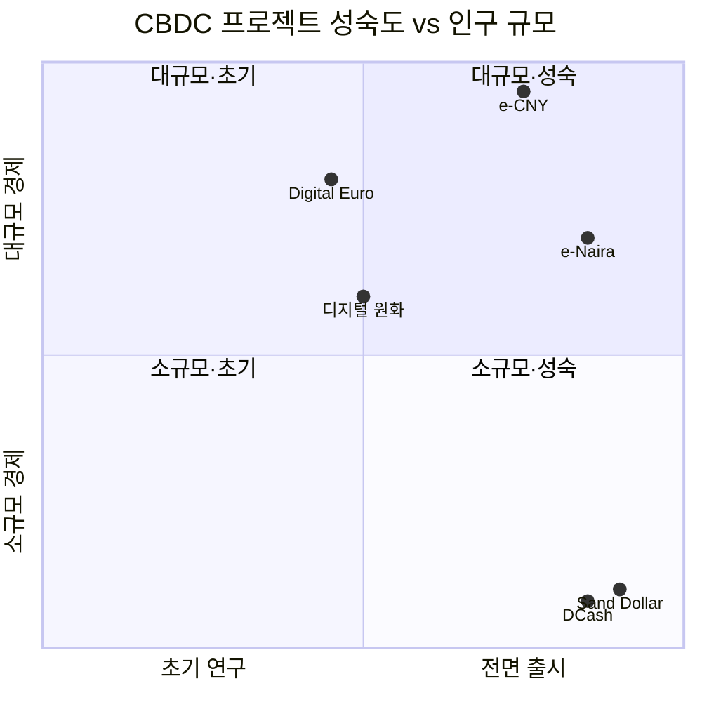

---
tags:
  - 디지털자산
  - CBDC
---
# 주요 CBDC 프로젝트 비교

전 세계 주요 CBDC 프로젝트를 비교 분석한다. 각 프로젝트는 경제 규모, 정책 목표, 기술 선택에 따라 서로 다른 설계를 채택하고 있다.

---

## 비교 요약

| 항목 | 디지털 원화 | e-CNY | Digital Euro | Sand Dollar | e-Naira | DCash |
|------|-----------|-------|-------------|-------------|---------|-------|
| **국가** | 한국 | 중국 | 유로존 (19개국) | 바하마 | 나이지리아 | 동카리브 (8개국) |
| **발행 기관** | 한국은행 | PBOC | ECB | CBOB | CBN | ECCB |
| **단계** | 시범사업 2단계 | 대규모 파일럿 | 준비 단계 | 출시 완료 | 출시 완료 | 출시 완료 |
| **유형** | 리테일 | 리테일 | 리테일 | 리테일 | 리테일 | 리테일 |
| **구조** | 이중구조 | 이중구조 | 이중구조 | 이중구조 | 이중구조 | 이중구조 |
| **토큰/계좌** | 토큰형 | 하이브리드 | 검토 중 | 토큰형 | 계좌형 | 토큰형 |
| **오프라인** | 시범 예정 | 지원 (NFC) | 설계 목표 | 제한적 | 미지원 | 미지원 |
| **프로그래머블** | 시범 예정 | 제한적 | 미정 | 미지원 | 미지원 | 미지원 |
| **프라이버시** | 계층적 | 관리형 익명 | 현금 수준 목표 | 계층적 | 기본 KYC | 기본 KYC |
| **기술 기반** | 블록체인 기반 | 허가형 DLT | 미확정 | 허가형 DLT | Hyperledger | Hyperledger |
| **인구 규모** | 5,200만 | 14억 | 3.4억 | 40만 | 2.2억 | 60만 |

!!! info "비교 기준"
    비교 항목은 2026년 4월 기준 공개 정보에 근거한다. CBDC 프로젝트는 설계가 지속적으로 변경되므로 최신 발표를 교차 확인하는 것을 권장한다.

---

## 프로젝트별 포지셔닝

---

## 개별 프로젝트 요약

### 디지털 원화 (한국)
한국은행 주도의 CBDC로, 2단계 시범사업을 통해 예금 토큰·프로그래머블 머니를 실험 중이다. 기존 금융 인프라와의 연계에 중점을 둔다.

**강점**: 높은 디지털 결제 인프라, 금융기관 참여 다수
**약점**: 현금 사용률이 이미 낮아 도입 동기가 약할 수 있음

→ [디지털 원화 상세](digital-won.md)

### e-CNY (중국)
세계 최대 규모의 CBDC 파일럿으로, 26개 도시에서 수억 명이 시범 사용 중이다. 위안화 국제화 전략과 연계된다.

**강점**: 압도적 시범 규모, 오프라인 결제 선도
**약점**: 프라이버시 우려, 자발적 채택 부진

→ [e-CNY 상세](e-cny.md)

### Digital Euro (유로존)
ECB가 주도하는 유로존 단일 디지털화폐로, 현금 수준의 프라이버시를 설계 원칙으로 내세운다. 입법 과정이 진행 중이다.

**강점**: 프라이버시 중심 설계, 범유럽 단일 결제 수단
**약점**: 19개국 합의 필요, 출시 시점 불확실

→ [Digital Euro 상세](digital-euro.md)

### Sand Dollar (바하마)
2020년 세계 최초로 전면 출시된 CBDC로, 섬나라 특성상 금융 포용을 핵심 목표로 한다.

**강점**: 최초 출시 경험, 금융 포용 효과 검증
**약점**: 소규모 경제, 채택률 아직 낮음

### e-Naira (나이지리아)
아프리카 최대 경제국의 CBDC로, 2021년 출시 후 금융 포용과 해외 송금 효율화를 추구한다.

**강점**: 거대 인구 기반, 해외 송금 수요 높음
**약점**: 현금 인출 제한 정책과 맞물려 반발 발생

### DCash (동카리브)
동카리브 중앙은행(ECCB)이 8개 도서국을 대상으로 발행한 지역 CBDC다.

**강점**: 다국가 단일 CBDC 최초 사례
**약점**: 2022년 기술 장애로 2개월 중단, 채택률 저조

---

## 시나리오별 선택 가이드

| 시나리오 | 참고 프로젝트 | 이유 |
|---------|-------------|------|
| 대규모 경제, 빠른 실행 | e-CNY | 세계 최대 파일럿 경험 |
| 프라이버시 중시 설계 | Digital Euro | 현금 수준 익명성 목표 |
| 금융 포용 우선 | Sand Dollar, e-Naira | 금융 접근성 개선 실증 |
| 기존 인프라 연계 | 디지털 원화 | 예금 토큰 모델 실험 |
| 다국가 연합 | DCash | 지역 통화 통합 경험 |

---

## 관련 문서

- [CBDC 개요](../index.md)
- [핵심 개념](../concepts.md)
- [글로벌 트렌드](../trends.md)
