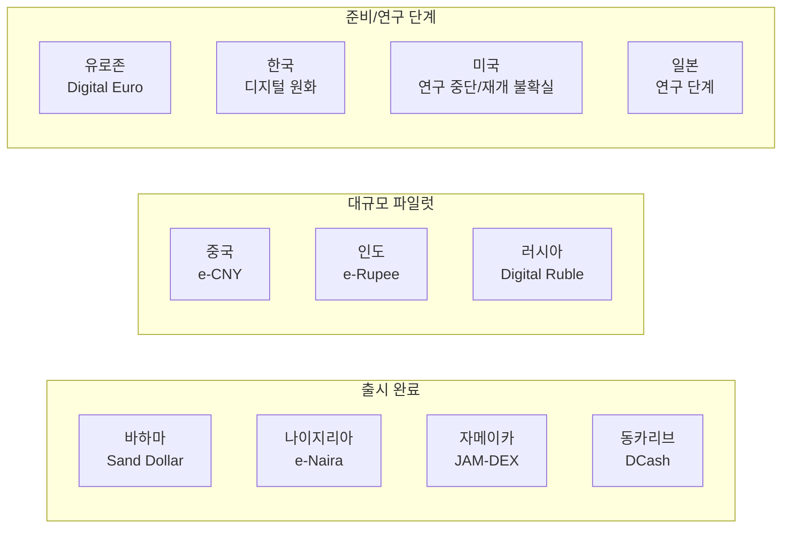
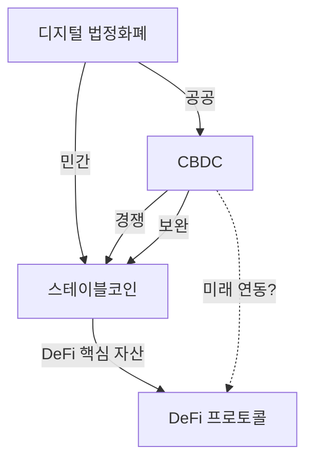
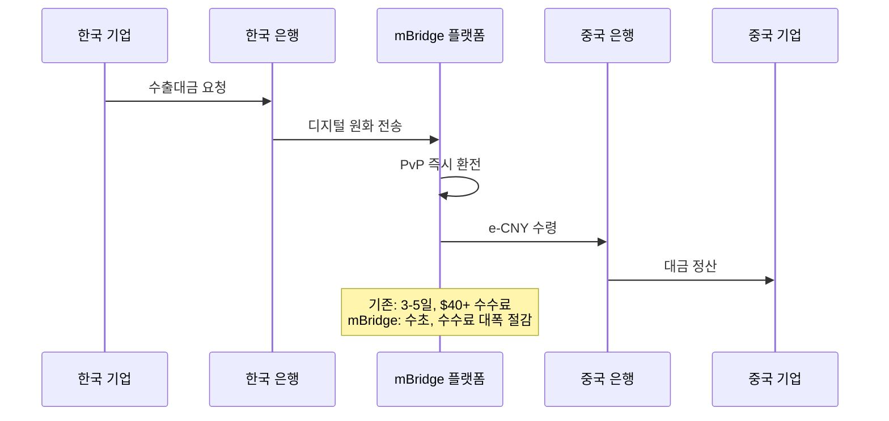
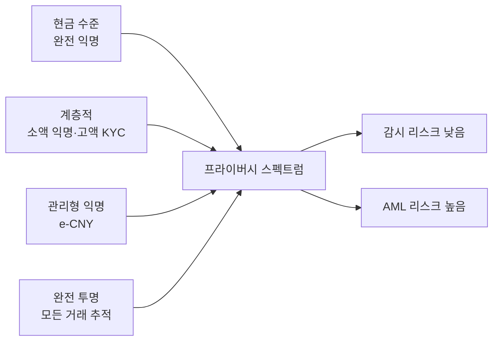

---
tags:
  - 디지털자산
  - CBDC
---
# CBDC 글로벌 트렌드

CBDC를 둘러싼 글로벌 동향을 5가지 핵심 축으로 정리한다. 기술, 정책, 지정학이 교차하는 CBDC 생태계의 현재와 미래를 조망한다.

---

## 1. 글로벌 도입 현황

2026년 현재 130개 이상의 국가가 CBDC를 연구 또는 개발 중이며, GDP 기준 세계 경제의 98%를 커버한다. 바하마(Sand Dollar), 나이지리아(e-Naira), 자메이카(JAM-DEX), 동카리브(DCash) 등이 이미 출시했으며, 중국(e-CNY)이 세계 최대 파일럿을 운영하고 있다.

!!! info "미국의 입장"
    미국은 CBDC에 대해 가장 신중한 태도를 보이고 있다. 연방준비제도(Fed)는 기술 연구를 진행했으나, 정치적으로 "디지털 달러"에 반대하는 의견이 강하며, 스테이블코인 규제를 우선하는 방향으로 선회했다. 이는 글로벌 CBDC 경쟁에서 미국의 부재라는 특이한 상황을 만들고 있다.

---

## 2. CBDC vs 스테이블코인

CBDC와 스테이블코인은 "디지털 법정화폐"라는 유사한 목표를 추구하지만, 발행 주체·법적 성격·신뢰 구조가 근본적으로 다르다.

| 비교 항목 | CBDC | 스테이블코인 |
|----------|------|------------|
| 발행 주체 | 중앙은행 | 민간 기업 (Tether, Circle 등) |
| 법적 성격 | 법화, 중앙은행 부채 | 민간 발행 토큰, 법화 아님 |
| 신용 리스크 | 없음 (국가 보증) | 발행사·담보 의존 |
| 규제 | 중앙은행법 | 증권법·송금업법 (관할권별 상이) |
| 프로그래머블 | 제한적·신중 | 완전 프로그래머블 (ERC-20 등) |
| DeFi 연동 | 사실상 불가 (현재) | 핵심 유동성 수단 |
| 시가총액 | N/A | ~$200B (USDT+USDC) |

!!! warning "공존 시나리오"
    단기적으로 CBDC와 스테이블코인은 공존할 가능성이 높다. CBDC가 국내 소매 결제를 담당하고, 스테이블코인이 크로스보더·DeFi 영역에서 활용되는 역할 분담이 예상된다. 그러나 [MiCA(유럽)](../sto/trends.md) 등 스테이블코인 규제 강화로 경쟁 구도는 유동적이다.

---

## 3. 크로스보더 CBDC — mBridge

**mBridge**는 BIS Innovation Hub 주도로 중국(PBOC), 홍콩(HKMA), 태국(BOT), UAE(CBUAE), 사우디아라비아(SAMA)가 참여하는 크로스보더 CBDC 플랫폼이다. 기존 환거래은행(correspondent banking) 시스템의 비효율을 해결하고자 한다.

**mBridge의 성과와 과제**:
- 2024년 MVP(Minimum Viable Product) 단계 도달
- 실거래 시범에서 수초 내 크로스보더 정산 실증
- 그러나 BIS가 프로젝트에서 철수하며 거버넌스 불확실성 발생
- 중국 주도라는 인식으로 서방 국가 참여 제한적

!!! note "대안 프로젝트"
    mBridge 외에도 SWIFT의 CBDC 연결 실험, 싱가포르의 Project Ubin+, 유럽의 Project Icebreaker 등 다양한 크로스보더 CBDC 실험이 진행 중이다. [상호운용성 개념](concepts.md)도 참고하라.

---

## 4. 프라이버시 논쟁

CBDC 프라이버시는 기술적 선택을 넘어 정치·사회적 논쟁으로 확대되고 있다.

**프라이버시 옹호 측**:
- 현금의 익명성은 시민 자유의 핵심
- 국가가 모든 거래를 추적할 수 있는 인프라는 감시 도구
- [Digital Euro](products/digital-euro.md)처럼 "현금 수준 프라이버시"가 설계 원칙이어야

**규제 강화 측**:
- 자금세탁·테러자금 조달 방지(AML/CFT)는 법적 의무
- 완전 익명 CBDC는 현금보다 더 위험할 수 있음 (규모·속도 차이)
- [e-CNY](products/e-cny.md)의 "관리형 익명"이 현실적 타협점

---

## 5. 금융 포용

CBDC의 가장 강력한 정당성 중 하나는 **금융 포용(financial inclusion)**이다. 전 세계 약 14억 명이 은행 계좌 없이 살아가며, CBDC는 이들에게 디지털 금융 서비스 접근을 제공할 수 있다.

**성공 사례**:
- **Sand Dollar(바하마)**: 섬 지역 주민의 금융 접근성 개선
- **e-Naira(나이지리아)**: NIN(국가신원번호)만으로 기본 지갑 개설 가능

**과제**:
- 스마트폰 보급률이 낮은 지역에서의 기술 장벽
- 디지털 리터러시 부족
- 오프라인 결제 기술의 성숙도
- 기존 모바일 머니(M-Pesa 등)와의 경쟁

!!! tip "실무 시사점"
    금융 포용을 위한 CBDC 설계 시 하드웨어 지갑, USSD(피처폰) 기반 접근, 최소 KYC 계층(소액 한정 익명 지갑) 등이 핵심 요소다. [오프라인 결제](concepts.md)와 [계층적 프라이버시](concepts.md)가 직결된다.

---

## 향후 전망

1. **크로스보더가 킬러 유스케이스**: 국내 리테일보다 크로스보더 정산에서 CBDC의 가치가 먼저 입증될 가능성
2. **CBDC-스테이블코인 공존 프레임워크**: 규제를 통해 역할 분담이 명확해질 전망
3. **프로그래머블 머니 확대**: 복지·무역·공급망 분야에서 조건부 지급 실용화
4. **지정학적 경쟁 심화**: 달러 vs 위안 디지털 통화 패권 경쟁
5. **프라이버시 기술 발전**: 영지식증명(ZKP) 등을 활용한 프라이버시-규제 양립 기술

## 관련 문서

- [CBDC 개요](index.md) | [핵심 개념](concepts.md)
- [주요 CBDC 비교](products/index.md)
- [STO 트렌드](../sto/trends.md) | [DeFi 트렌드](../defi/trends.md)
