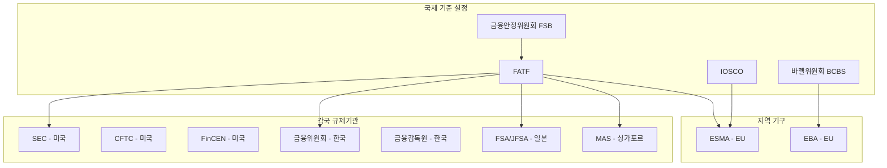

---
tags:
  - 디지털자산
  - 규제
  - 가상자산
---
# 가상자산 관련 기관

> 마지막 검토: 2025년 5월

## 개요

가상자산 규제는 국제기구, 각국 규제기관, 자율규제기구가 다층적으로 관여한다. 이 문서에서는 가상자산 규제에 핵심적인 역할을 하는 주요 기관을 정리한다.

## 기관 계층 구조

---

## 국제 기구

### FATF (Financial Action Task Force)

| 항목 | 내용 |
|------|------|
| **정식명칭** | Financial Action Task Force / Groupe d'action financiere (GAFI) |
| **설립** | 1989년, G7 주도 |
| **본부** | 파리 (OECD 사무국 내) |
| **회원** | 39개 회원국/기구 (한국 포함) |
| **역할** | 자금세탁·테러자금조달 방지를 위한 국제 기준 설정 |
| **웹사이트** | [fatf-gafi.org](https://www.fatf-gafi.org) |

#### 가상자산 관련 주요 활동

- **2019년**: 가상자산 및 VASP에 대한 권고안 개정 (Recommendation 15), Travel Rule 확장 적용 지침 발표
- **2021년**: "Updated Guidance for a Risk-Based Approach to Virtual Assets and VASPs" — P2P 거래, DeFi, 스테이블코인, NFT 등에 대한 가이던스 추가
- **상호평가(Mutual Evaluation)**: 회원국의 가상자산 규제 이행 현황을 평가하며, 미이행 시 회색목록(Grey List) 등재 가능

#### FATF의 영향력

FATF 권고안은 법적 구속력이 없으나, 상호평가를 통해 사실상의 구속력을 가진다. 회색/블랙리스트 등재는 해당국 금융 시스템에 심각한 영향을 미치므로, 대부분의 국가가 권고안을 국내법에 반영한다.

---

### 바젤은행감독위원회 (BCBS)

| 항목 | 내용 |
|------|------|
| **정식명칭** | Basel Committee on Banking Supervision |
| **설립** | 1974년 |
| **본부** | 바젤, 스위스 (BIS 내) |
| **회원** | 28개국 중앙은행·감독기관 |
| **역할** | 은행 건전성 감독에 관한 국제 기준 설정 |
| **웹사이트** | [bis.org/bcbs](https://www.bis.org/bcbs) |

#### 가상자산 관련 주요 활동

- **2022년 12월**: 은행의 가상자산 익스포저에 대한 건전성 기준 확정
- Group 1(토큰화 자산, 안정적 스테이블코인) vs Group 2(BTC 등) 차등 자본 요건
- Group 2b 자산에 1,250% 위험가중치 — 실질적 전액 자본 적립
- **2025년 1월 1일** 시행 목표 (관할권별 국내법 전환 속도 상이)

→ 상세: [규제 프레임워크 - 바젤](frameworks.md)

---

### IOSCO (International Organization of Securities Commissions)

| 항목 | 내용 |
|------|------|
| **정식명칭** | International Organization of Securities Commissions |
| **설립** | 1983년 |
| **회원** | 130개국 이상의 증권감독기관 |
| **역할** | 증권 규제의 국제 기준 설정 |
| **웹사이트** | [iosco.org](https://www.iosco.org) |

#### 가상자산 관련 주요 활동

- **2023년 11월**: 가상자산 및 디지털 자산 시장에 대한 18개 정책 권고안
- **2023년**: DeFi에 대한 9개 정책 권고안
- "Same Activity, Same Risk, Same Regulation" 원칙 강조
- 가상자산 거래 플랫폼, 시장조작, 이해충돌 등에 대한 기준 제시

---

### 금융안정위원회 (FSB)

| 항목 | 내용 |
|------|------|
| **정식명칭** | Financial Stability Board |
| **설립** | 2009년 (FSF 후신) |
| **본부** | 바젤, 스위스 (BIS 내) |
| **역할** | 글로벌 금융 시스템 안정성 모니터링, 정책 조율 |
| **웹사이트** | [fsb.org](https://www.fsb.org) |

#### 가상자산 관련 주요 활동

- **2023년 7월**: 가상자산 활동 및 시장에 대한 고수준 권고안
- **2023년 7월**: 글로벌 스테이블코인에 대한 고수준 권고안 (개정)
- FATF, IOSCO, BCBS 등 각 기구의 가상자산 규제를 조율하는 우산 역할

---

## 미국

### SEC (Securities and Exchange Commission)

| 항목 | 내용 |
|------|------|
| **설립** | 1934년 |
| **역할** | 증권 시장 규제·감독, 투자자 보호 |
| **가상자산 관할** | 증권에 해당하는 가상자산 (Howey Test 적용) |
| **주요 활동** | 미등록 증권 공모/거래 단속, 거래소 등록 요구 |
| **집행 사례** | Ripple, Coinbase, Binance, Terraform Labs 등 다수 소송 |
| **웹사이트** | [sec.gov](https://www.sec.gov) |

#### 조직 내 가상자산 담당

- **Crypto Assets and Cyber Unit** (구 Crypto Task Force): 가상자산 관련 집행 전담
- 2025년 새 위원장 하에서 조직 및 접근 방식 변화 중

→ 상세: [미국 규제](by-country/usa.md)

---

### CFTC (Commodity Futures Trading Commission)

| 항목 | 내용 |
|------|------|
| **설립** | 1974년 |
| **역할** | 상품 선물·옵션·스왑 시장 규제 |
| **가상자산 관할** | 상품(commodity)에 해당하는 가상자산 (BTC, ETH 등) |
| **주요 활동** | 가상자산 파생상품 시장 감독, 사기·조작 단속 |
| **한계** | 현물 시장(spot market) 직접 규제 권한 부재 — 의회 입법 필요 |
| **웹사이트** | [cftc.gov](https://www.cftc.gov) |

---

### FinCEN (Financial Crimes Enforcement Network)

| 항목 | 내용 |
|------|------|
| **소속** | 미국 재무부(Treasury) 산하 |
| **역할** | AML/CFT 규제, BSA(Bank Secrecy Act) 집행 |
| **가상자산 관할** | VASP를 MSB(Money Services Business)로 분류, AML 의무 부과 |
| **주요 활동** | MSB 등록, SAR/CTR 보고 감독, Travel Rule 적용 |
| **웹사이트** | [fincen.gov](https://www.fincen.gov) |

---

## 한국

### 금융위원회 (FSC)

| 항목 | 내용 |
|------|------|
| **정식명칭** | Financial Services Commission |
| **설립** | 2008년 (금융감독위원회 개편) |
| **역할** | 금융 정책 수립, 법령 제·개정, 금융 산업 감독 총괄 |
| **가상자산 관련** | 가상자산 정책 방향 설정, 특금법/이용자보호법 등 법률 주관 |
| **산하 기관** | 금융정보분석원(FIU) — VASP 신고 수리, AML 감독 |
| **웹사이트** | [fsc.go.kr](https://www.fsc.go.kr) |

### 금융감독원 (FSS)

| 항목 | 내용 |
|------|------|
| **정식명칭** | Financial Supervisory Service |
| **역할** | 금융기관 검사·감독 실행 기관 |
| **가상자산 관련** | 이용자보호법에 따른 VASP 직접 검사·감독·제재 |
| **가상자산감독국** | 2024년 신설, 전담 조직으로 VASP 검사·감독 수행 |
| **주요 활동** | 정기/수시 검사, 시정명령, 과징금, 불공정거래 조사 |
| **웹사이트** | [fss.or.kr](https://www.fss.or.kr) |

### 금융정보분석원 (KoFIU)

| 항목 | 내용 |
|------|------|
| **소속** | 금융위원회 산하 |
| **역할** | VASP 신고 수리, AML/CFT 감독, 의심거래 분석 |
| **주요 활동** | VASP 신고·갱신 심사, 미신고 사업자 단속, STR/CTR 수집·분석 |

→ 상세: [한국 규제](by-country/korea.md)

---

## EU

### ESMA (European Securities and Markets Authority)

| 항목 | 내용 |
|------|------|
| **설립** | 2011년 |
| **본부** | 파리 |
| **역할** | EU 증권시장 감독 조율, 기술표준 제정 |
| **MiCA 관련** | CASP 감독 기준·기술표준 제정, NCA 간 조율, CASP 등록부 관리 |
| **웹사이트** | [esma.europa.eu](https://www.esma.europa.eu) |

### EBA (European Banking Authority)

| 항목 | 내용 |
|------|------|
| **설립** | 2011년 |
| **본부** | 파리 |
| **역할** | EU 은행 감독 조율, 건전성 기준 |
| **MiCA 관련** | Significant ART/EMT 직접 감독, AML 관련 기술표준 |
| **웹사이트** | [eba.europa.eu](https://www.eba.europa.eu) |

### 주요 회원국 NCA (National Competent Authority)

| 국가 | NCA | 특이사항 |
|------|-----|----------|
| **프랑스** | AMF (Autorite des marches financiers) | MiCA 이전부터 DASP 등록 제도 운영 |
| **독일** | BaFin (Bundesanstalt fur Finanzdienstleistungsaufsicht) | 가상자산 수탁 라이선스 선제적 도입 |
| **아일랜드** | CBI (Central Bank of Ireland) | 글로벌 가상자산 기업 EU 거점 |
| **네덜란드** | AFM (Autoriteit Financiele Markten) | 조기 VASP 등록 제도 시행 |

→ 상세: [EU 규제](by-country/eu.md)

---

## 일본

### FSA / JFSA (Financial Services Agency)

| 항목 | 내용 |
|------|------|
| **정식명칭** | Japan Financial Services Agency (금융청) |
| **설립** | 2000년 |
| **역할** | 일본 금융 시스템 전반 감독 |
| **가상자산 관련** | 가상자산교환업자 등록·감독, 자금결제법/금융상품거래법 관할 |
| **주요 활동** | 등록 심사, 정기 검사, 이용자 보호 조치, FATF 권고안 이행 |
| **특이사항** | 2014년 Mt.Gox 사건 이후 선제적으로 규제 도입, 2017년 자금결제법 개정 |
| **웹사이트** | [fsa.go.jp](https://www.fsa.go.jp) |

#### 일본 규제의 특징

- 가상자산을 **"암호자산(暗号資産)"**으로 공식 명칭 변경 (2019)
- 가상자산교환업자 등록제 (사전 등록 후 영업)
- JVCEA(일본가상화폐교환업협회) — 자율규제기구 인정
- 고객 자산 분리보관, 콜드월렛 의무
- Travel Rule 이행 (2023년 6월, TRUST 프로토콜)

---

## 싱가포르

### MAS (Monetary Authority of Singapore)

| 항목 | 내용 |
|------|------|
| **정식명칭** | Monetary Authority of Singapore |
| **설립** | 1971년 |
| **역할** | 싱가포르 중앙은행 + 금융감독기관 (통합 기관) |
| **가상자산 관련** | Payment Services Act (PSA)에 따른 DPT(Digital Payment Token) 서비스 라이선스 |
| **주요 활동** | DPT 서비스 라이선스 발급, AML 감독, 소비자 보호 가이드라인 |
| **특이사항** | 가상자산 소매 마케팅 제한(2022), 스테이블코인 프레임워크(2023) |
| **웹사이트** | [mas.gov.sg](https://www.mas.gov.sg) |

#### 싱가포르 규제의 특징

- 혁신 친화적이면서도 소비자 보호를 강조하는 균형 잡힌 접근
- DPT 라이선스: Major Payment Institution / Standard Payment Institution
- 2022년부터 가상자산의 일반 대중 대상 마케팅·광고 제한
- 2023년 스테이블코인 프레임워크: 단일 화폐 페깅(SCS) 스테이블코인에 대한 규제

---

## 기관 비교 요약

| 기관 | 관할 범위 | 가상자산 접근 | 주요 도구 |
|------|-----------|---------------|-----------|
| **FATF** | 글로벌 AML/CFT | 권고안·가이던스 | 상호평가, 회색/블랙리스트 |
| **SEC** | 미국 증권 | 집행 중심 → 입법 전환 | 소송, 등록 명령 |
| **CFTC** | 미국 상품 | 현물시장 권한 확대 추진 | 파생상품 감독, 사기 단속 |
| **금융위/FIU** | 한국 AML | 신고제 운영 | 신고 수리/반려, 제재 |
| **금감원** | 한국 감독 | 직접 검사·감독 | 검사, 시정명령, 과징금 |
| **ESMA** | EU 증권시장 | MiCA 기술표준 제정 | 기준 설정, NCA 조율 |
| **JFSA** | 일본 금융 | 등록제·선제적 규제 | 등록 심사, 검사 |
| **MAS** | 싱가포르 전체 | 균형 잡힌 접근 | 라이선스, 가이드라인 |

---

→ [개요로 돌아가기](index.md) | [규제 프레임워크](frameworks.md) | [국가별 현황](by-country/index.md)
