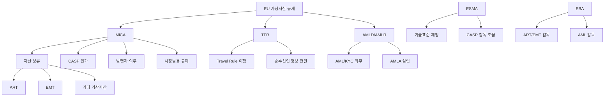
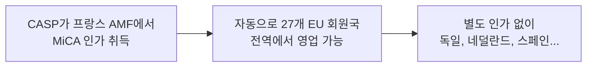
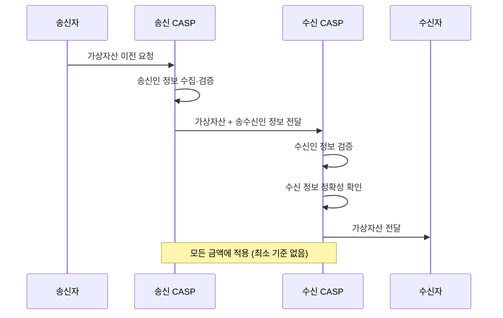

# EU 가상자산 규제

> 마지막 검토: 2025년 5월

## 개요

EU는 **MiCA(Markets in Crypto-Assets Regulation)**를 통해 세계 최초로 포괄적인 가상자산 규제 프레임워크를 수립했다. 27개 회원국에 직접 적용되는 단일 규제로, 미국의 분산된 체계와 대조적으로 법적 확실성과 통일성을 제공한다. MiCA와 함께 **TFR(Transfer of Funds Regulation)** 개정안이 Travel Rule을 구체화하며, **AMLD(Anti-Money Laundering Directive)** 체계도 가상자산 영역으로 확장되었다.

## EU 가상자산 규제 체계

---

## 1. MiCA 시행 현황

### 시행 일정

| 시점 | 내용 |
|------|------|
| **2023년 6월 29일** | MiCA 공식 관보 게재 및 발효 |
| **2024년 6월 30일** | Title III (ART), Title IV (EMT) 시행 — 스테이블코인 규정 우선 적용 |
| **2024년 12월 30일** | 나머지 전체 규정 시행 (CASP 인가, 시장남용, 기타 가상자산) |
| **2025년 H1** | 기존 사업자 전환기간 (grandfathering, 회원국별 최대 18개월) |
| **2025~2026년** | ESMA/EBA 기술표준(RTS/ITS) 후속 제정 |

### 기존 사업자 전환

- MiCA 시행 전 회원국 법률에 따라 영업 중이던 사업자는 **전환 기간(최대 18개월)** 동안 기존 인가로 영업 가능
- 전환 기간은 회원국이 자율 결정 (0~18개월)
- 전환 기간 중 MiCA 인가 신청 필요

| 회원국 | 전환 기간 |
|--------|-----------|
| **프랑스** | 18개월 (2026년 6월까지) |
| **독일** | 12개월 (2025년 12월까지) |
| **아일랜드** | 12개월 |
| **네덜란드** | 6개월 |
| **이탈리아** | 검토 중 |

---

## 2. 주요 규정 내용

### 자산 분류

MiCA는 가상자산을 3가지로 분류한다:

| 분류 | 정의 | 규제 강도 |
|------|------|-----------|
| **ART (Asset-Referenced Token)** | 여러 자산(법정화폐, 상품 등)의 가치를 참조하여 안정적 가치를 유지하려는 토큰 | 높음 |
| **EMT (E-Money Token)** | 단일 법정화폐의 가치를 참조하는 토큰 (예: USDC, EURC) | 높음 (전자화폐 규제 적용) |
| **기타 가상자산** | ART/EMT에 해당하지 않는 모든 가상자산 (예: BTC, ETH, 유틸리티 토큰) | 중간 |

!!! note "적용 제외 대상"
    다음은 MiCA 적용 대상에서 제외된다:

    - 금융상품(MiFID II 적용 대상)으로 분류되는 토큰
    - 전자화폐(EMD 적용)
    - 예금, 구조화예금
    - 증권화 상품
    - **NFT** (진정한 고유 토큰, 대체 불가능한 경우 — 단, 사실상 대체 가능하면 적용 가능)
    - **완전히 탈중앙화된 DeFi** (중개자 없는 경우 — 기준 불명확, 후속 논의 예정)

### CASP 인가

CASP(Crypto-Asset Service Provider)는 다음 서비스를 제공하는 법인이다:

- 가상자산 수탁(custody) 및 관리
- 거래 플랫폼 운영
- 가상자산과 법정화폐 또는 다른 가상자산의 교환
- 주문 집행
- 가상자산 배치(placement)
- 가상자산 이전 서비스
- 가상자산 관련 자문
- 포트폴리오 관리

#### 인가 요건

| 항목 | 내용 |
|------|------|
| **법인 설립** | EU 회원국 내 등록 법인 |
| **건전성 요건** | 서비스 유형별 최소 자기자본 (EUR 50,000 ~ EUR 150,000) |
| **거버넌스** | 경영진 적격성, 내부통제 체계, 이해충돌 방지 정책 |
| **고객 자산 보호** | 분리보관, 보험/보증 |
| **불만 처리** | 고객 불만 처리 절차 |
| **아웃소싱** | 핵심 기능 아웃소싱 시 NCA 사전 통지 |

#### 패스포팅 (Passporting)

MiCA의 가장 큰 장점 중 하나:

- 1개 회원국 인가 = EU 전역 영업권
- 타 회원국 NCA에 사전 통지만 필요
- 기존에 국가마다 별도 인가가 필요했던 것과 비교하면 획기적

### 스테이블코인 규제 (ART/EMT)

#### EMT (E-Money Token)

- **발행자 자격**: 인가된 신용기관(은행) 또는 전자화폐기관만 발행 가능
- **준비자산**: 발행량의 100%를 안전 자산으로 보유
- **상환권**: 보유자는 언제든 액면가로 상환 청구 가능
- **Significant EMT**: 대규모 EMT는 EBA의 직접 감독, 추가 요건 적용

#### ART (Asset-Referenced Token)

- **백서 및 NCA 승인**: 발행 전 백서 작성, 해당국 NCA의 승인 필요
- **준비자산**: 100% 이상, 분리보관, 수탁기관 지정
- **이해충돌 방지**: 준비자산 운용에 대한 엄격한 규제
- **Significant ART**: 대규모 ART(기준: 보유자 수 1,000만 이상, 발행액 50억 유로 이상 등)는 EBA 직접 감독

!!! warning "Tether(USDT) 관련 이슈"
    MiCA 시행으로 EU 역내에서 규정을 충족하지 못하는 스테이블코인의 유통이 제한될 수 있다. 실제로 일부 EU 거래소에서 USDT 상장폐지가 발생했으며, Tether의 MiCA 대응이 주목받고 있다.

### 시장남용 규제

MiCA Title VI는 전통 금융의 MAR(Market Abuse Regulation)과 유사한 가상자산 시장남용 규제를 도입:

| 금지 행위 | 내용 |
|-----------|------|
| **내부자거래** | 미공개 중요정보를 이용한 거래 |
| **미공개정보 불법공개** | 정당한 사유 없는 내부정보 전달 |
| **시장조작** | 허위 거래, 워시트레이딩, 가격 조작 |

- 위반 시 행정 제재(과징금 등)
- 형사 처벌은 회원국 재량

---

## 3. ESMA 역할

### ESMA (European Securities and Markets Authority)

| 항목 | 내용 |
|------|------|
| **기본 역할** | EU 증권시장 감독 조율 기구 |
| **MiCA 관련 역할** | 기술표준(RTS/ITS) 제정, 가이드라인 발행, NCA 간 조율 |
| **직접 감독** | Significant CASP에 대한 직접 감독 권한 (향후 논의) |
| **등록부** | EU 전역 CASP 공개 등록부 관리 |

### 기술표준 제정 현황

ESMA는 MiCA 이행을 위한 다수의 기술표준을 제정 중이다:

- CASP 인가 절차 및 요건 세부 사항
- 백서 표준 양식
- 불만 처리 절차
- 이해충돌 관리
- 시장남용 탐지·보고 체계

---

## 4. 국가별 적용 차이

MiCA는 직접 적용 규정(Regulation)이므로 회원국 입법 전환 없이 적용되지만, 일부 영역에서 회원국 재량이 존재한다:

| 영역 | 회원국 재량 |
|------|-------------|
| **전환 기간** | 0~18개월 범위 내 자율 결정 |
| **형사 처벌** | 시장남용에 대한 형사 처벌 도입 여부 |
| **기존 라이선스** | 전환기간 중 기존 국내 라이선스의 효력 인정 범위 |
| **간이 절차** | 기존 인가 사업자의 MiCA 전환 시 간이 절차 허용 여부 |

### 주요 회원국 현황

| 국가 | 특이사항 |
|------|----------|
| **프랑스** | AMF의 DASP(Digital Asset Service Provider) 등록 제도가 MiCA 이전부터 존재. 18개월 전환 기간 |
| **독일** | BaFin이 이미 가상자산 수탁 라이선스 제도 운영. 12개월 전환 기간 |
| **아일랜드** | 많은 글로벌 가상자산 기업의 EU 거점. CBI가 감독 |
| **몰타** | 2018년부터 Virtual Financial Assets Act 운영. MiCA로 전환 |
| **리투아니아** | 비교적 간이한 등록 절차로 다수 VASP 유치. MiCA 전환 시 기준 강화 |

---

## 5. Transfer of Funds Regulation (TFR)

### 개요

TFR은 기존 자금이체 규정을 개정하여 가상자산 이전에도 **Travel Rule**을 의무화한 EU 규정이다. MiCA와 함께 2023년 6월 발효, 2024년 12월 30일 시행.

### 핵심 내용

| 항목 | 내용 |
|------|------|
| **적용 대상** | 모든 가상자산 이전 (금액 무관, 최소 기준 없음) |
| **전달 정보** | 송신인: 이름, 계좌번호, 주소/ID번호/생년월일/출생지. 수신인: 이름, 계좌번호 |
| **CASP 의무** | 정보 수집·검증·전달·보관 |
| **Unhosted Wallet** | 1,000 유로 초과 시 상대방(unhosted wallet 소유자) 신원 확인 |

### EU TFR의 특징

EU의 TFR은 FATF 권고안보다 엄격하다:

- **최소 기준 없음**: FATF는 USD/EUR 1,000 이상에 Travel Rule 적용을 권고하지만, EU는 모든 금액에 적용
- **Unhosted Wallet 규제**: 1,000 유로 초과 시 자기수탁 지갑 소유자의 신원도 확인
- **검증 의무**: 수신 CASP도 정보의 정확성을 검증해야 함

!!! warning "Unhosted Wallet 규제 논쟁"
    EU의 unhosted wallet 규제는 프라이버시 옹호자들로부터 강한 반발을 받았다. 자기수탁(self-custody)에 대한 규제가 블록체인의 근본 원칙과 충돌한다는 주장과, AML 관점에서 규제 사각지대를 없애야 한다는 주장이 대립하고 있다.

---

## 6. AMLD / AMLR 체계

### 현행 AMLD (Anti-Money Laundering Directive)

- AMLD5 (2020)부터 가상자산 사업자를 AML 의무 대상에 포함
- KYC, STR(의심거래보고), 기록 보관 의무

### AML 패키지 개혁 (2024~)

EU는 AML 체계를 대폭 개혁 중:

- **AMLR (AML Regulation)**: 지침(Directive)에서 직접 적용 규정(Regulation)으로 전환하여 회원국 간 통일성 강화
- **AMLA (Anti-Money Laundering Authority)**: 프랑크푸르트에 EU 차원의 AML 전담 감독기구 설립
- 가상자산 영역은 AMLA의 주요 감독 대상

---

## 요약 및 평가

| 강점 | 약점/과제 |
|------|-----------|
| 세계 최초 포괄적 규제 — 법적 확실성 제공 | DeFi, NFT 등 혁신 영역 규제 미비 |
| 패스포팅으로 단일 시장 형성 | 회원국별 전환 속도 차이 |
| 스테이블코인에 대한 명확한 규제 | 글로벌 사업자의 컴플라이언스 비용 |
| Travel Rule 강화 (TFR) | Unhosted wallet 규제의 실효성 논쟁 |
| 글로벌 규제 벤치마크 역할 | ESMA 기술표준 제정 지연 가능성 |

MiCA는 전 세계 가상자산 규제의 **골드 스탠다드**로 평가받으며, 다른 관할권(영국, 홍콩, 일본 등)의 규제 설계에도 영향을 미치고 있다.

---

→ [국가별 현황 개요](index.md) | [한국](korea.md) | [미국](usa.md) | [개요로 돌아가기](../index.md)
