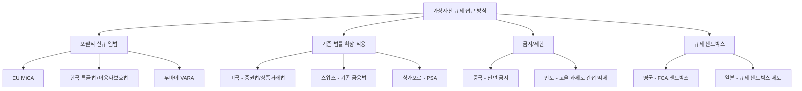

---
tags:
  - 디지털자산
  - 규제
  - 가상자산
---
# 국가별 가상자산 규제 현황

> 마지막 검토: 2025년 5월

## 개요

가상자산 규제는 국가마다 접근 방식, 규제 강도, 적용 범위가 크게 다르다. 일부 국가는 포괄적인 법률 체계를 갖추었고, 일부는 기존 금융법의 확장 적용에 의존하며, 일부는 아직 명확한 프레임워크를 마련하지 못했다.

이 문서에서는 주요국의 규제를 비교하고, 각국 상세 분석 문서로의 링크를 제공한다.

## 주요국 규제 비교표

| 국가/지역 | 규제 기관 | 핵심 법률 | 라이선스/등록 요건 | VASP 등록 | 과세 | 규제 성숙도 |
|-----------|-----------|-----------|-------------------|-----------|------|-------------|
| **한국** | 금융위원회, 금융감독원, FIU | 특정금융정보법, 가상자산이용자보호법 | VASP 신고제 (FIU) | 의무 | 2027년 시행 예정 (250만원 공제, 20%) | ★★★★☆ |
| **미국** | SEC, CFTC, FinCEN, OCC, 주정부 | 증권법, 상품거래법, BSA, 주별 법률 | 사안별 판단 (MSB, 브로커딜러, BitLicense 등) | FinCEN MSB 등록 | 자본이득세 적용 (단기 최대 37%, 장기 최대 20%) | ★★★☆☆ |
| **EU** | ESMA, EBA, 각국 NCA | MiCA, TFR, AMLD | CASP 인가 (패스포팅 가능) | MiCA 기반 인가 | 회원국별 상이 | ★★★★★ |
| **일본** | FSA (JFSA) | 자금결제법, 금융상품거래법 | 가상자산교환업자 등록 | 의무 | 잡소득 (최대 55%), 분리과세 논의 중 | ★★★★☆ |
| **싱가포르** | MAS | Payment Services Act (PSA) | Digital Payment Token 라이선스 | 의무 | 소득세 과세, 자본이득세 없음 | ★★★★☆ |
| **영국** | FCA | Financial Services and Markets Act 2023 | FCA 등록/인가 | 의무 | 자본이득세 적용 | ★★★☆☆ |
| **홍콩** | SFC, HKMA | AMLO 개정안 | VATP 라이선스 | 의무 | 자본이득세 없음 (사업소득 과세) | ★★★☆☆ |
| **스위스** | FINMA | 기존 금융법 적용 | 활동 유형별 라이선스 | 활동별 판단 | 재산세 + 소득세 (사안별) | ★★★★☆ |
| **UAE (두바이)** | VARA, ADGM, DFSA | Virtual Asset Regulation Law | VARA 라이선스 | 의무 | 소득세 없음 | ★★★☆☆ |

## 규제 접근 방식 분류



## 규제 성숙도 스펙트럼

규제 성숙도는 다음 기준으로 평가한다:

1. **법적 확실성**: 명확한 법률·가이드라인 존재 여부
2. **포괄성**: 거래소, 스테이블코인, DeFi, NFT 등 폭넓은 커버리지
3. **집행력**: 실제 단속·제재 사례
4. **국제 정합성**: FATF 권고안 등 글로벌 기준 부합도
5. **산업 발전**: 규제가 혁신을 촉진하는지 억제하는지

```
금지          규제 부재       부분 규제       포괄 규제       최적 균형
|-------------|-------------|-------------|-------------|
중국         인도(변동)     미국          한국/일본       EU(MiCA)
              일부 아프리카   영국          싱가포르
```

## 공통 규제 요소

거의 모든 관할권에서 공통적으로 요구하는 사항:

| 요소 | 내용 |
|------|------|
| **KYC/CDD** | 고객확인의무, 강화된 고객확인(EDD) |
| **AML/CFT** | 자금세탁방지 프로그램 운영, 의심거래보고 |
| **Travel Rule** | FATF 권고 제16조 이행 |
| **기록 보관** | 거래 기록 5~10년 보관 |
| **규제 기관 보고** | 정기/수시 보고 의무 |

## 주요 차이점

### 자산 분류

가상자산의 법적 성격 분류는 국가마다 크게 다르다:

- **증권으로 분류**: 미국(사안별), 일부 유럽 국가
- **지급수단으로 분류**: 일본(자금결제법), 스위스(일부)
- **별도 자산 유형**: EU(MiCA), 한국(특금법)
- **재산으로 분류**: 영국

### 과세 접근

- **자본이득세**: 미국, 영국, 호주
- **소득세(잡소득)**: 일본
- **분리과세**: 한국(예정)
- **비과세**: UAE, 싱가포르(자본이득), 홍콩(자본이득)

### DeFi 규제

- **적극적 규제 시도**: 미국 SEC
- **원칙적 적용 제외**: EU MiCA (후속 논의 예정)
- **미정**: 대부분의 국가

!!! note "규제 차익거래(Regulatory Arbitrage)"
    국가 간 규제 차이로 인해 사업자가 규제가 느슨한 관할권으로 이동하는 규제 차익거래가 발생할 수 있다. 이는 글로벌 규제 수렴 논의의 주요 동인이다.

## 상세 분석 문서

- [한국 상세](korea.md) — 특금법, VASP 신고제, 이용자보호법, 과세
- [미국 상세](usa.md) — SEC vs CFTC, Howey Test, 주별 라이선스
- [EU 상세](eu.md) — MiCA, CASP 인가, TFR

---

→ [개요로 돌아가기](../index.md) | [규제 프레임워크](../frameworks.md) | [관련 기관](../authorities.md)
