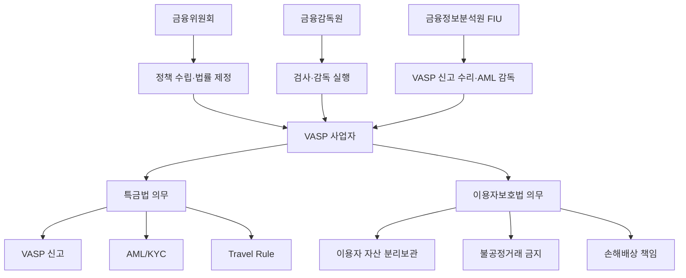
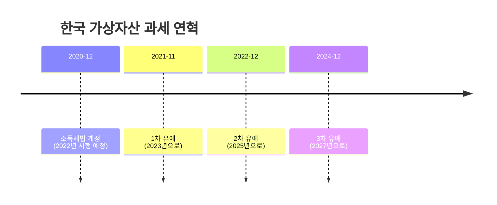
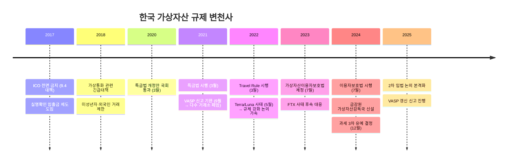

---
tags:
  - 디지털자산
  - 규제
  - 가상자산
---
# 한국 가상자산 규제

> 마지막 검토: 2025년 5월

## 개요

한국은 세계적으로 가상자산 거래가 가장 활발한 시장 중 하나로, 규제 체계도 비교적 빠르게 발전해왔다. 2021년 **특정금융정보법(특금법)** 개정으로 VASP 신고제를 도입하고, 2024년 **가상자산이용자보호법** 시행으로 투자자 보호 체계를 강화했다.

## 규제 체계 구조

---

## 1. 특정금융정보법 (특금법)

### 배경

2020년 3월 개정, 2021년 3월 시행. 가상자산사업자(VASP)를 금융법 체계에 편입시킨 최초의 법률이다.

### 핵심 내용

| 항목 | 내용 |
|------|------|
| **VASP 정의** | 가상자산의 매도·매수, 교환, 이전, 보관·관리, 중개·알선을 영업으로 하는 자 |
| **신고 의무** | FIU에 신고 후 수리를 받아야 영업 가능 |
| **신고 요건** | ISMS 인증, 실명확인 입출금 계정(실명계좌), 대표자·임원 결격사유 없음 |
| **AML 의무** | 고객확인(KYC), 의심거래보고(STR), 고액거래보고(CTR) |
| **Travel Rule** | 100만원 이상 가상자산 이전 시 송수신인 정보 전달 (2022년 시행) |

### VASP 신고제 현황

2025년 기준 주요 현황:

- **신고 수리**: 약 35개 사업자 (원화마켓 운영 5개: 업비트, 빗썸, 코인원, 코빗, 고팍스)
- **신고 반려/미신고 폐업**: 다수의 소규모 거래소가 실명계좌 확보 실패로 폐업
- **갱신 제도**: 3년마다 갱신 신고 필요

!!! warning "실명계좌 확보 이슈"
    한국의 VASP 신고제에서 가장 큰 진입장벽은 은행으로부터 실명확인 입출금 계정을 확보하는 것이다. 은행들의 리스크 회피로 인해 대형 거래소 외에는 원화 입출금 서비스 제공이 사실상 불가능한 과점 구조가 형성되었다.

---

## 2. 가상자산 이용자보호법

### 배경

2023년 7월 제정, **2024년 7월 19일 시행**. 특금법이 AML에 초점을 맞춘 반면, 이용자보호법은 투자자 보호와 시장 질서에 초점을 둔다.

### 핵심 내용

| 항목 | 내용 |
|------|------|
| **이용자 자산 분리보관** | 고객 예치금은 은행에 별도 예치, 고객 가상자산은 자기 자산과 분리 |
| **예치금 이자 지급** | 고객 예치금에 대한 이자 지급 의무 (시행령으로 구체화) |
| **콜드월렛 보관** | 고객 가상자산의 80% 이상을 콜드월렛(인터넷 미연결)에 보관 |
| **보험/공제 가입** | 해킹 등에 대비한 보험 또는 공제 가입 의무 |
| **불공정거래 금지** | 미공개정보 이용, 시세조종, 부정거래 금지 및 형사처벌 |
| **손해배상 책임** | VASP의 고의·과실로 인한 이용자 손해에 대한 배상 책임 (입증책임 전환) |
| **금감원 감독·검사** | 금융감독원이 VASP에 대한 검사·제재 권한 보유 |

### 시행 효과

- 거래소의 자산 보관·관리 체계 대폭 강화
- 시세조종 등 불공정거래에 대한 형사처벌 근거 마련
- 금감원의 직접 감독 체계 구축
- 소규모 거래소의 컴플라이언스 비용 부담 증가

---

## 3. 가상자산 과세

### 현재 상태 (2025년 기준)

한국의 가상자산 과세는 여러 차례 유예를 거쳐 **2027년 1월 1일** 시행 예정이다.

### 과세 체계

| 항목 | 내용 |
|------|------|
| **과세 대상** | 가상자산 양도·대여 소득 |
| **세율** | 20% (지방세 포함 22%) |
| **기본 공제** | 연 250만원 |
| **소득 분류** | 기타소득 |
| **신고 방식** | 종합소득세 신고 (매년 5월) |
| **취득가액 산정** | 실제 취득가액, 의제취득가액 (시행일 시가 중 큰 금액) |

### 과세 유예 경과

!!! note "유예 배경"
    투자자 보호 법제(이용자보호법) 정비, 거래소 인프라 준비, 과세 인프라 구축 등을 이유로 반복 유예되었다. 과세 시 형평성(주식 양도세와의 균형), 해외 이전 우려 등이 논쟁점이다.

---

## 4. 금융위원회 / 금융감독원 역할

### 금융위원회 (FSC)

| 항목 | 내용 |
|------|------|
| **역할** | 가상자산 관련 정책 수립, 법률 제·개정 주도 |
| **주요 활동** | 가상자산 관련 법안 마련, 규제 방향 설정 |
| **산하 기관** | 금융정보분석원(FIU) — VASP 신고 수리, AML 감독 |

### 금융감독원 (FSS)

| 항목 | 내용 |
|------|------|
| **역할** | VASP에 대한 직접 검사·감독 (이용자보호법 이후) |
| **주요 활동** | 정기/수시 검사, 시정명령, 과징금 부과, 불공정거래 조사 |
| **가상자산 감독국** | 2024년 신설, 전담 조직으로 감독 수행 |

→ 기관 상세: [관련 기관](../authorities.md)

---

## 5. 주요 이슈

### 실명계좌 (은행 연계)

- 원화 입출금을 위해 은행의 실명확인 입출금 계정 필수
- 5대 원화거래소만 실명계좌 보유 → 과점 구조 고착화
- 은행의 가상자산 사업자 리스크 관리 기준이 사실상 시장 진입 장벽

### Travel Rule 이행

- 2022년 3월부터 시행 (100만원 이상)
- VerifyVASP, CODE 등 국내 솔루션 활용
- 해외 VASP와의 정보 교환 체계 구축이 과제
- 개인지갑(Unhosted Wallet)으로의 이전 시 적용 한계

### 가상자산 2차 입법 논의

이용자보호법 이후, 추가적인 규제 영역에 대한 논의가 진행 중:

- 스테이블코인 별도 규제
- 토큰증권(STO) 법제화
- 가상자산 거래소 인가제 전환 (신고제 → 인가제)
- DeFi, NFT 규제 방향

---

## 6. 타임라인 (규제 변천사)

---

## 요약

한국의 가상자산 규제는 **AML 중심(특금법) → 투자자 보호(이용자보호법) → 시장 규율(2차 입법)** 순서로 발전하고 있다. 실명계좌 제도라는 고유한 구조적 특성이 있으며, 글로벌 기준 대비 비교적 엄격한 규제 환경을 갖추고 있다.

!!! warning "사업 시 유의사항"
    한국에서 가상자산 관련 사업을 영위하려면 반드시 FIU 신고 수리를 받아야 하며, 미신고 영업은 5년 이하 징역 또는 5,000만원 이하 벌금에 해당한다.

---

→ [국가별 현황 개요](index.md) | [미국](usa.md) | [EU](eu.md) | [개요로 돌아가기](../index.md)
