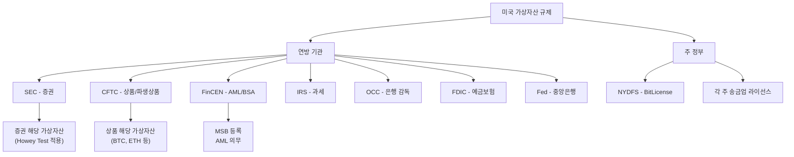
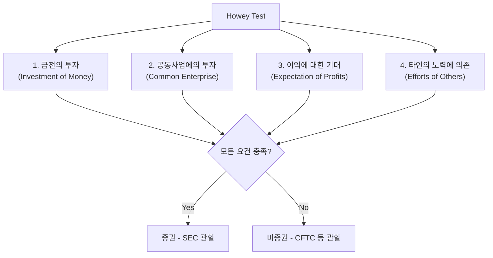
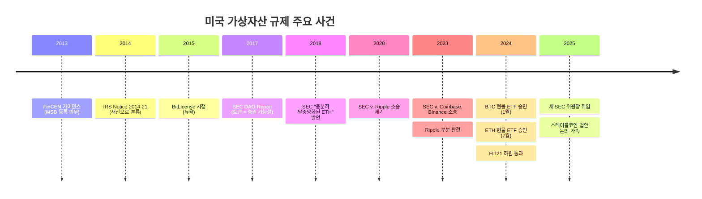

# 미국 가상자산 규제

> 마지막 검토: 2025년 5월

## 개요

미국의 가상자산 규제는 **단일 법률이 아닌 기존 연방법과 주법의 패치워크**로 구성되어 있다. SEC(증권), CFTC(상품), FinCEN(AML), IRS(세금), OCC(은행) 등 여러 기관이 각자의 관할에서 규제를 적용하며, 50개 주마다 별도의 라이선스 요건이 존재한다. 이러한 분산된 구조는 법적 불확실성의 주요 원인이다.

## 규제 기관 구조

---

## 1. SEC vs CFTC 관할 분쟁

미국 가상자산 규제의 가장 핵심적인 이슈는 **가상자산이 증권(security)인지 상품(commodity)인지**에 대한 분류 논쟁이다.

### SEC (Securities and Exchange Commission)

| 항목 | 입장 |
|------|------|
| **관할 주장** | 대부분의 가상자산(BTC 제외)은 투자계약(증권)에 해당 |
| **규제 근거** | Securities Act of 1933, Securities Exchange Act of 1934 |
| **주요 주장** | 가상자산 거래소는 미등록 증권거래소, 토큰 발행은 미등록 증권 공모 |
| **접근 방식** | "규제를 통한 집행(Regulation by Enforcement)" — 사후적 소송 중심 |

### CFTC (Commodity Futures Trading Commission)

| 항목 | 입장 |
|------|------|
| **관할 주장** | BTC, ETH는 상품(commodity)이며, 파생상품 시장 감독 관할 |
| **규제 근거** | Commodity Exchange Act (CEA) |
| **주요 활동** | 가상자산 파생상품 거래소 감독, 사기·조작 행위 단속 |
| **한계** | 현물 시장(spot market)에 대한 직접 규제 권한 부재 |

### 의회 입법 시도

2023~2025년 사이 관할 명확화를 위한 법안이 다수 발의되었다:

- **FIT21 (Financial Innovation and Technology for the 21st Century Act)**: 하원 통과(2024), 상원 심의. SEC/CFTC 관할 분리 기준 제시
- **기본 구도**: "충분히 탈중앙화된" 가상자산은 CFTC 관할(상품), 그 외는 SEC 관할(증권)

!!! note "2025년 규제 환경 변화"
    2025년 새 행정부 출범 이후 가상자산에 대한 규제 기조가 변화하고 있다. SEC의 집행 중심 접근이 완화되고, 명확한 입법적 해결을 선호하는 방향으로 전환되는 추세다.

---

## 2. Howey Test (증권 판별 기준)

Howey Test는 1946년 대법원 판례(SEC v. W.J. Howey Co.)에서 확립된 "투자계약(investment contract)" 판별 기준으로, SEC가 가상자산의 증권 해당 여부를 판단하는 핵심 도구다.

### 4가지 요건

모든 요건이 충족되면 해당 자산은 증권(투자계약)으로 분류된다:

### 가상자산 적용의 쟁점

| 요건 | 가상자산 적용 시 쟁점 |
|------|----------------------|
| **금전의 투자** | 거의 항상 충족 |
| **공동사업** | 토큰 생태계가 공동사업에 해당하는지 |
| **이익 기대** | 유틸리티 토큰도 가격 상승 기대가 있는지 |
| **타인의 노력** | 충분히 탈중앙화되면 "타인"이 없다는 반론 |

핵심 쟁점은 **"충분한 탈중앙화(sufficient decentralization)"** 여부다. SEC는 2018년 이더리움이 "충분히 탈중앙화"되었다고 시사한 바 있으나, 이후 입장이 변동되어 왔다.

---

## 3. 주별 라이선스

### Money Transmitter License (MTL)

대부분의 주에서 가상자산 사업자는 **송금업(Money Transmission)** 라이선스를 취득해야 한다.

- 약 48개 주 + DC에서 각각 별도 라이선스 필요
- 취득에 6~18개월, 수백만 달러의 보증금(surety bond) 소요
- 주마다 요건, 수수료, 갱신 주기가 상이

### BitLicense (뉴욕주)

| 항목 | 내용 |
|------|------|
| **도입** | 2015년, NYDFS(뉴욕주 금융감독국) |
| **대상** | 뉴욕 거주자 대상 가상자산 사업 |
| **요건** | 자본 요건, AML 프로그램, 사이버보안 정책, 변경 사전승인 등 |
| **취득 사업자** | 약 30여 개 (2025년 기준) |
| **비판** | 과도한 규제 비용 → 일부 사업자의 뉴욕 시장 이탈("BitLicense 난민") |

### 기타 주별 특이사항

- **와이오밍**: 가장 가상자산 친화적. SPDI(Special Purpose Depository Institution) 법안으로 가상자산 수탁 전문 은행 허용
- **텍사스**: 비교적 유연한 규제, 가상자산 채굴 산업 유치
- **캘리포니아**: Digital Financial Assets Law (DFAL) 제정 (2023), BitLicense 유사 체계

---

## 4. 스테이블코인 법안 동향

미국에서 스테이블코인 규제는 초당적 합의에 가장 가까운 영역이다.

### 주요 법안 (2024~2025)

| 법안 | 내용 |
|------|------|
| **GENIUS Act** | 상원 발의. 스테이블코인 발행자에 대한 연방 규제 프레임워크. 은행/비은행 이원 구조 |
| **STABLE Act** | 하원 발의. 유사한 구조, 준비자산 요건·공시 의무 규정 |

### 공통 요소

- 스테이블코인 발행자를 "허가된 결제 스테이블코인 발행자"로 정의
- 준비자산 1:1 보유 의무 (현금, 단기 국채 등)
- 정기 감사 및 공시
- 연방 vs 주 이원 라이선스 구조
- 발행 규모에 따른 차등 규제 (대형 발행자: 연방 감독)

---

## 5. IRS 과세 기준

### 기본 원칙

IRS는 가상자산을 **재산(property)**으로 분류한다 (IRS Notice 2014-21).

| 과세 유형 | 내용 |
|-----------|------|
| **단기 자본이득** | 보유 1년 이하, 일반 소득세율 적용 (최대 37%) |
| **장기 자본이득** | 보유 1년 초과, 우대세율 (0/15/20%) |
| **채굴/스테이킹 보상** | 수령 시점의 시가로 일반소득 과세 |
| **에어드랍** | 수령 시점의 시가로 일반소득 과세 |
| **교환** | 가상자산 간 교환도 과세 대상 (실현 이벤트) |

### 보고 의무 강화

- **Form 1099-DA**: 2025년부터 가상자산 브로커에게 거래 보고 의무 부과 (Infrastructure Investment and Jobs Act, 2021)
- **브로커 정의 확대**: 논쟁 중. DeFi 프로토콜, 자기수탁 지갑 포함 여부
- **FBAR/FATCA**: 해외 가상자산 계좌 보고 의무 적용 논의

---

## 6. 최근 판례 및 규제 동향

### 주요 판례

| 사건 | 결과 | 의의 |
|------|------|------|
| **SEC v. Ripple (2023~2024)** | 프로그래매틱 판매는 증권 아님, 기관 판매는 증권 | 가상자산의 판매 방식에 따른 차등 분류 선례 |
| **SEC v. Coinbase (2023~)** | 진행 중, 일부 주장 기각 | 거래소의 미등록 증권거래소 해당 여부 |
| **SEC v. Terraform Labs (2024)** | SEC 승소, UST/LUNA 증권 인정 | 알고리즘 스테이블코인의 증권 해당성 |
| **CFTC v. Ooki DAO (2023)** | CFTC 승소, DAO에 규제 적용 | DAO도 규제 대상이 될 수 있음을 확인 |

### 2025년 주요 동향

- **SEC 위원장 교체**: 새 위원장 하에서 "집행을 통한 규제" 접근 완화 기조
- **비트코인 현물 ETF**: 2024년 1월 승인 이후 대규모 자금 유입
- **이더리움 현물 ETF**: 2024년 7월 승인
- **스테이블코인 법안**: 초당적 합의 가시화, 2025년 내 통과 가능성
- **가상자산 시장구조 법안 (FIT21)**: 상원 논의 진행

---

## 규제 환경 요약

| 영역 | 현황 | 방향 |
|------|------|------|
| **자산 분류** | 불명확 (사안별 판단) | FIT21 등으로 명확화 시도 |
| **거래소 규제** | SEC 소송 중심 → 입법적 해결 모색 | 연방 수준 프레임워크 논의 |
| **스테이블코인** | 연방법 부재, 주법 패치워크 | 초당적 법안 통과 임박 |
| **DeFi** | SEC 규제 시도, 반발 | 규제 범위 재조정 논의 |
| **과세** | 명확한 체계 (IRS), 보고의무 확대 | 브로커 정의 범위 결정 |
| **은행 참여** | OCC 가이드라인, 보수적 | 점진적 개방 |

!!! warning "법적 불확실성"
    미국은 2025년 현재까지 가상자산에 대한 포괄적인 연방법이 부재하다. 여러 기관의 중복 관할, 사안별 판단, 주법 차이로 인해 사업자에게 상당한 법적 리스크가 존재한다. 입법 진전이 있으나, 완전한 해결까지는 시간이 필요하다.

---

→ [국가별 현황 개요](index.md) | [한국](korea.md) | [EU](eu.md) | [개요로 돌아가기](../index.md)
