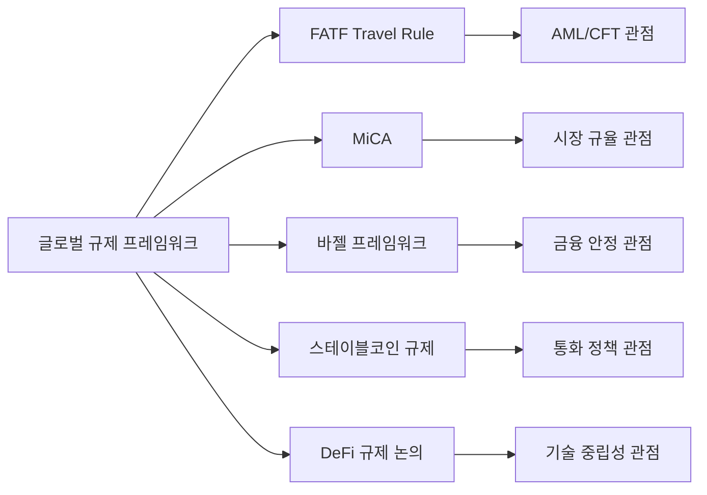
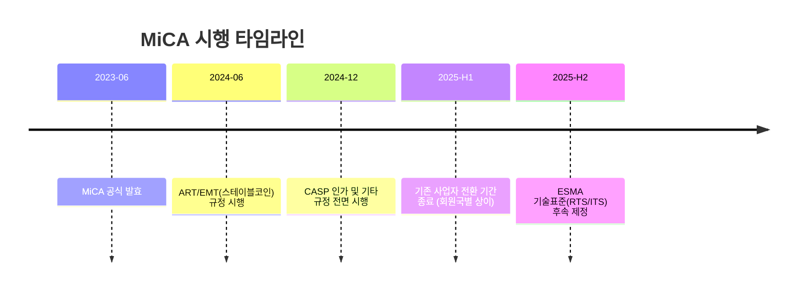
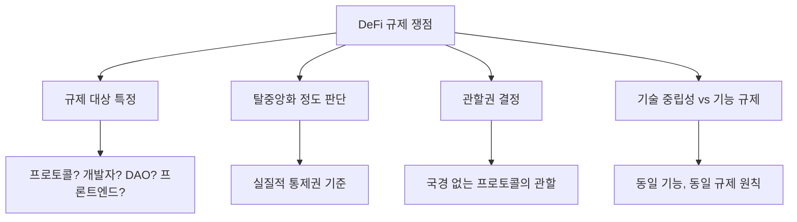
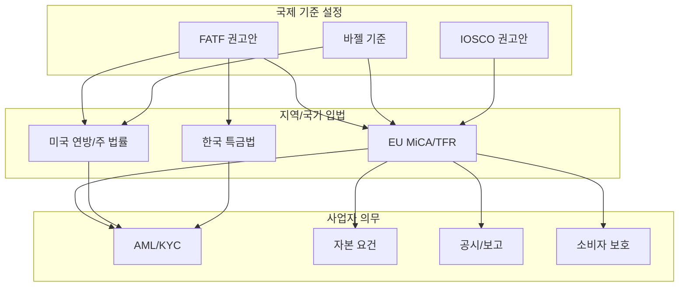

# 규제 프레임워크

> 마지막 검토: 2025년 5월

가상자산 시장에 적용되는 주요 글로벌 규제 프레임워크를 정리한다. 각 프레임워크는 서로 다른 관점(AML, 투자자보호, 금융안정)에서 가상자산을 규율하며, 상호 보완적으로 작동한다.

---

## 1. FATF Travel Rule

### 개요

FATF(Financial Action Task Force) 권고안 제16조, 통칭 **Travel Rule**은 가상자산 이전 시 송신인과 수신인의 신원 정보를 함께 전달하도록 요구하는 규정이다. 기존 은행 간 전신송금에 적용되던 원칙을 가상자산 영역으로 확장한 것이다.

### 핵심 내용

- **적용 대상**: VASP 간 가상자산 이전, 일정 금액 이상(각국 기준 상이, 대체로 USD 1,000 또는 EUR 1,000)
- **전달 정보**: 송신인(이름, 계정번호, 주소/국적/생년월일 중 하나), 수신인(이름, 계정번호)
- **의무 주체**: 송신 VASP는 정보를 수집·전달, 수신 VASP는 정보를 수신·검증

### 이행 현황 (2025년 기준)

| 항목 | 현황 |
|------|------|
| FATF 회원국 이행률 | 약 75% 부분 이행 이상 |
| 한국 | 2022년부터 시행 (CODE 프로토콜, VerifyVASP 등 활용) |
| 미국 | FinCEN 규칙 적용, USD 3,000 이상 |
| EU | TFR(Transfer of Funds Regulation)로 입법화 |
| 일본 | 2023년 6월 시행, TRUST 프로토콜 |

### 기술적 이행 방식

Travel Rule 이행을 위한 주요 프로토콜:

- **TRISA** (Travel Rule Information Sharing Architecture): 글로벌 표준 지향
- **OpenVASP**: 오픈소스 기반 P2P 프로토콜
- **Sygna Bridge**: 아시아 중심
- **VerifyVASP / CODE**: 한국 시장 중심
- **TRUST** (Travel Rule Universal Solution Technology): Coinbase 주도, 미국 중심

!!! warning "상호운용성 과제"
    각 프로토콜 간 상호운용성(interoperability)이 완전하지 않아, VASP들이 여러 프로토콜을 동시에 지원해야 하는 부담이 있다. IVMS101 표준 메시지 포맷이 이를 해결하려는 시도이다.

---

## 2. MiCA (Markets in Crypto-Assets)

### 개요

MiCA는 EU가 제정한 세계 최초의 포괄적 가상자산 규제 법안이다. 2023년 6월 공식 발효되었으며, 2024~2025년에 걸쳐 단계적으로 시행된다.

### 목적

- 가상자산 시장의 법적 확실성 제공
- 소비자·투자자 보호
- 시장 건전성 확보 및 금융 안정 유지
- EU 단일 시장 내 통일된 규제 적용 (패스포팅)

### 핵심 내용

| 구분 | 내용 |
|------|------|
| **CASP 인가** | 가상자산서비스제공자는 EU 회원국에서 인가를 받아야 함. 인가 1건으로 EU 전역 영업 가능(패스포팅) |
| **자산 분류** | ART(Asset-Referenced Token), EMT(E-Money Token), 기타 가상자산으로 3분류 |
| **스테이블코인** | ART/EMT 발행자에 대해 준비자산 요건, 상환권 보장, 발행 한도 등 엄격한 규제 |
| **백서 의무** | 가상자산 발행 시 표준화된 백서(White Paper) 공시 의무 |
| **시장남용 금지** | 내부자거래, 시장조작, 미공개정보 이용 금지 |
| **환경 공시** | 에너지 소비·환경 영향 관련 정보 공시 |

### 시행 타임라인

### 영향

- EU 역내 가상자산 사업의 법적 확실성 대폭 향상
- 글로벌 규제 표준의 벤치마크 역할
- 소규모 사업자에게는 컴플라이언스 비용 부담
- DeFi, NFT는 대부분 적용 범위 밖 (후속 규제 논의 중)

→ 상세: [EU 규제 현황](by-country/eu.md)

---

## 3. 바젤 프레임워크 (은행의 가상자산 익스포저)

### 개요

바젤은행감독위원회(BCBS)는 은행이 보유하거나 취급하는 가상자산에 대한 자본 요건을 2022년 12월 확정하고, 2025년 1월 1일부터 시행하도록 권고했다.

### 핵심 내용

가상자산을 두 그룹으로 분류하여 차등 규제:

| 그룹 | 대상 | 자본 요건 |
|------|------|-----------|
| **Group 1a** | 토큰화된 전통자산 | 기초자산과 동일한 위험가중치 적용 |
| **Group 1b** | 효과적 안정화 메커니즘 보유 스테이블코인 | 기초자산 위험가중치 + 추가 부담 |
| **Group 2a** | 헤지 인정 가능한 가상자산 | 시장리스크 프레임워크 적용, 최소 RW 100% |
| **Group 2b** | 기타 가상자산 (BTC, ETH 등) | **1,250% 위험가중치** (실질적 전액 자본 적립) |

### 영향

- Group 2b 자산에 대한 1,250% 위험가중치는 은행의 직접적인 가상자산 보유를 사실상 억제
- 은행이 가상자산 수탁(custody) 서비스를 제공하려면 상당한 자본 확보 필요
- 전통 금융과 가상자산 간 체계적 통합에 대한 가이드라인 제시
- **익스포저 한도**: 총 Group 2 익스포저는 Tier 1 자본의 2% 이내 권고

!!! note "시행 지연"
    일부 관할권에서 바젤 기준의 국내법 전환이 지연되고 있으며, 2025년 중반 기준으로 주요국의 이행 현황이 상이하다.

---

## 4. 스테이블코인 규제 동향

### 왜 스테이블코인이 특별한가

스테이블코인은 법정화폐에 연동되어 결제 수단으로 활용 가능하며, 시가총액이 USD 1,500억을 초과(2025년 기준)한다. Terra/Luna 붕괴(2022)와 USDC의 일시적 디페깅(SVB 사태, 2023) 이후 규제 논의가 급격히 가속화되었다.

### 주요국 규제 현황

| 국가/지역 | 접근 방식 | 핵심 요건 |
|-----------|-----------|-----------|
| **EU (MiCA)** | EMT/ART로 분류, 전자화폐 규제 적용 | 준비자산 100% 보유, 상환권 보장, 일일 거래량 한도(significant EMT) |
| **미국** | 의회 입법 진행 중 (2025) | 은행/비은행 발행자 이원 구조, 연방 수준 법안 논의 |
| **한국** | 별도 법률 미제정, 특금법 범위 내 | 가상자산으로 분류, 향후 별도 규제 가능성 |
| **일본** | 자금결제법 개정 (2023) | 전자결제수단으로 분류, 은행/자금이전업자만 발행 가능 |
| **싱가포르** | MAS 스테이블코인 프레임워크 (2023) | 단일 화폐 연동, 준비자산 요건, 공시 의무 |

### 규제의 공통 요소

- **준비자산 요건**: 발행량의 100% 이상을 고품질 유동자산으로 보유
- **상환권 보장**: 보유자가 액면가로 상환 청구 가능
- **감사/공시**: 정기적 준비자산 감사 및 공시
- **발행자 자격**: 인가받은 금융기관 또는 별도 라이선스 보유 법인

---

## 5. DeFi 규제 논의

### 현재 상황

DeFi(Decentralized Finance)는 전통적 중개자 없이 스마트 컨트랙트로 금융 서비스를 제공하는 프로토콜을 의미한다. 2025년 현재 대부분의 관할권에서 DeFi에 대한 명시적 규제 프레임워크는 부재하며, 논의가 진행 중이다.

### 핵심 쟁점

### 주요 접근 방식

- **FATF**: "소유자/운영자(owner/operator)" 개념으로 VASP 의무 부과 시도
- **EU (MiCA)**: 현행 MiCA는 "완전히 탈중앙화된" 서비스를 적용 제외. 후속 규제 논의 예정
- **미국 SEC**: DeFi 프로토콜도 증권법 적용 가능하다는 입장 (사례별 판단)
- **IOSCO**: DeFi에 대한 9개 정책 권고안 발표 (2023)

!!! warning "규제 불확실성"
    DeFi 규제는 글로벌 차원에서 가장 불확실한 영역이다. "코드가 법이다(Code is Law)"라는 입장과 "동일 기능, 동일 규제(Same Activity, Same Risk, Same Regulation)"라는 원칙이 충돌하고 있다.

---

## 프레임워크 간 관계

## 참고 자료

- FATF: [Updated Guidance for a Risk-Based Approach to Virtual Assets and VASPs (2021)](https://www.fatf-gafi.org/en/publications/Fatfrecommendations/Guidance-rba-virtual-assets-2021.html)
- EU: [Regulation (EU) 2023/1114 (MiCA)](https://eur-lex.europa.eu/eli/reg/2023/1114/oj)
- BCBS: [Prudential treatment of cryptoasset exposures (2022)](https://www.bis.org/bcbs/publ/d545.htm)
- IOSCO: [Policy Recommendations for Decentralized Finance (2023)](https://www.iosco.org/library/pubdocs/pdf/IOSCOPD747.pdf)

---

→ [개요로 돌아가기](index.md) | [국가별 현황](by-country/index.md) | [관련 기관](authorities.md)
