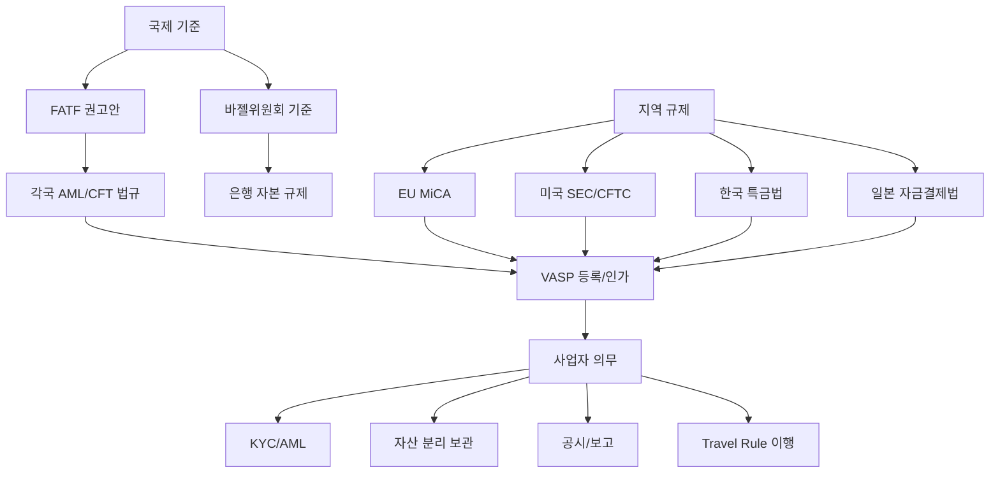

# 가상자산 규제 개요

> 마지막 검토: 2025년 5월

## 가상자산 규제란 무엇인가

가상자산 규제(Crypto-Asset Regulation)는 블록체인 기반 디지털 자산의 발행, 거래, 보관, 이전에 대해 국가 또는 국제기구가 설정하는 법적·제도적 틀을 의미한다. 비트코인, 이더리움과 같은 암호화폐뿐만 아니라 스테이블코인, NFT, 토큰증권(STO), DeFi 프로토콜까지 그 대상이 확대되고 있다.

규제의 핵심은 **기존 금융 규제 원칙**(투자자 보호, 시장 건전성, 금융 안정)을 새로운 기술 환경에 적용하는 것이며, 동시에 혁신을 저해하지 않는 균형점을 찾는 것이 각국 규제 당국의 과제다.

## 왜 알아야 하는가

### 투자자 보호

가상자산 시장은 높은 변동성, 정보 비대칭, 사기 리스크가 존재한다. 규제는 공시 의무, 자산 분리 보관, 불공정거래 금지 등을 통해 투자자를 보호한다.

### 자금세탁 방지 (AML/CFT)

가상자산의 익명성과 국경 초월 특성은 자금세탁, 테러자금조달에 악용될 수 있다. FATF 권고안과 각국의 AML 법규는 VASP(가상자산사업자)에게 고객확인(KYC), 의심거래보고(STR) 등을 의무화한다.

### 시장 안정

대규모 스테이블코인 붕괴(Terra/Luna, 2022)나 거래소 파산(FTX, 2022)은 금융 시스템 전체에 파급 효과를 줄 수 있음을 보여주었다. 규제는 시스템 리스크를 관리하는 안전장치 역할을 한다.

### PM/비즈니스 관점

가상자산 관련 서비스를 기획하거나, 결제·금융 도메인에서 일하는 PM이라면 규제 환경을 이해해야 합법적이고 지속 가능한 제품을 설계할 수 있다.

## 핵심 키워드

| 키워드 | 설명 |
|--------|------|
| **VASP** | Virtual Asset Service Provider. 가상자산사업자. 거래소, 수탁업체, 지갑서비스 등 |
| **AML/CFT** | Anti-Money Laundering / Combating the Financing of Terrorism. 자금세탁방지/테러자금조달방지 |
| **KYC** | Know Your Customer. 고객확인의무 |
| **Travel Rule** | FATF 권고 제16조. 가상자산 이전 시 송수신인 정보 전달 의무 |
| **MiCA** | Markets in Crypto-Assets. EU의 포괄적 가상자산 규제 법안 |
| **특금법** | 특정금융거래정보의 보고 및 이용 등에 관한 법률. 한국의 VASP 규제 근거법 |
| **Howey Test** | 미국 SEC가 증권 여부를 판별하는 기준 |
| **CASP** | Crypto-Asset Service Provider. MiCA에서 정의하는 가상자산서비스제공자 |
| **CBDC** | Central Bank Digital Currency. 중앙은행 디지털 화폐 |
| **STO** | Security Token Offering. 토큰증권 발행 |

## 규제 체계 구조

## 하위 문서

| 문서 | 내용 |
|------|------|
| [규제 프레임워크](frameworks.md) | FATF Travel Rule, MiCA, 바젤 프레임워크, 스테이블코인·DeFi 규제 |
| [국가별 현황](by-country/index.md) | 주요국 규제 비교표 및 상세 분석 |
| [한국](by-country/korea.md) | 특금법, VASP 신고제, 이용자보호법, 과세 |
| [미국](by-country/usa.md) | SEC vs CFTC, Howey Test, 주별 라이선스 |
| [EU](by-country/eu.md) | MiCA 시행, CASP 인가, TFR |
| [관련 기관](authorities.md) | FATF, SEC, 금융위, ESMA 등 규제 기관 상세 |
| [트렌드 및 전망](trends.md) | CBDC, DeFi 규제, NFT, STO, AI 감시 |

## 관련 도메인

- **PG(Payment Gateway)**: 가상자산 결제 연동 시 VASP 규제, AML 의무가 적용됨
- **MOR(Merchant of Record)**: 가상자산을 결제 수단으로 수용하는 MOR은 추가적인 규제 준수 필요
- **핀테크/금융**: 전통 금융과 가상자산의 경계가 흐려지면서 통합 규제 논의 진행 중

!!! warning "규제 변동 주의"
    가상자산 규제는 빠르게 변화하고 있다. 본 문서는 학습 참고용이며, 실제 사업 의사결정 시에는 반드시 최신 법령과 전문 법률 자문을 확인해야 한다.
