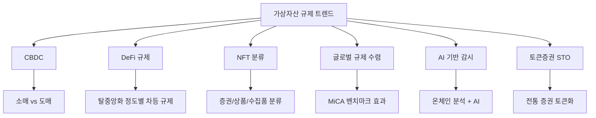
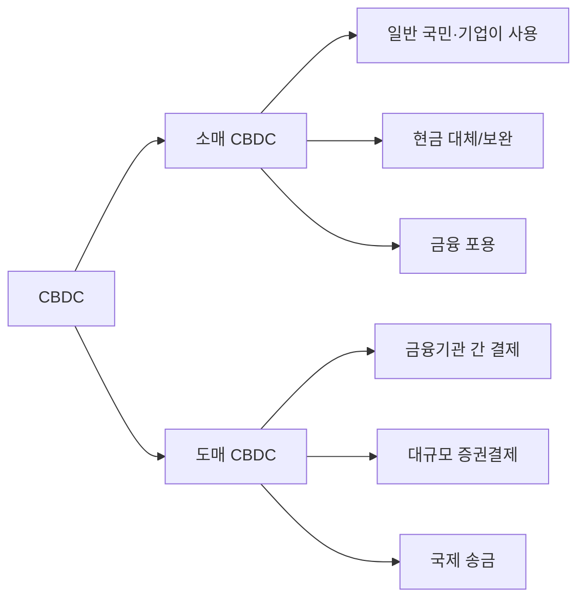
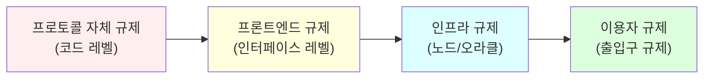
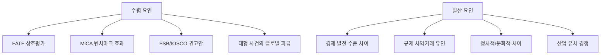
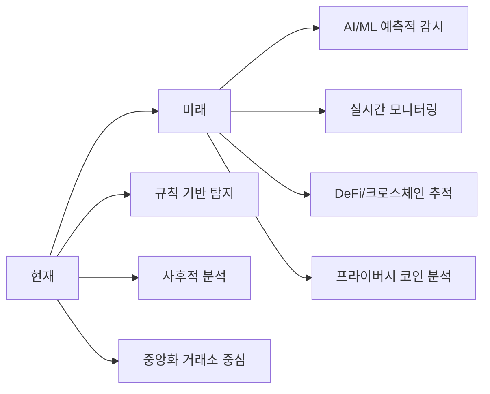
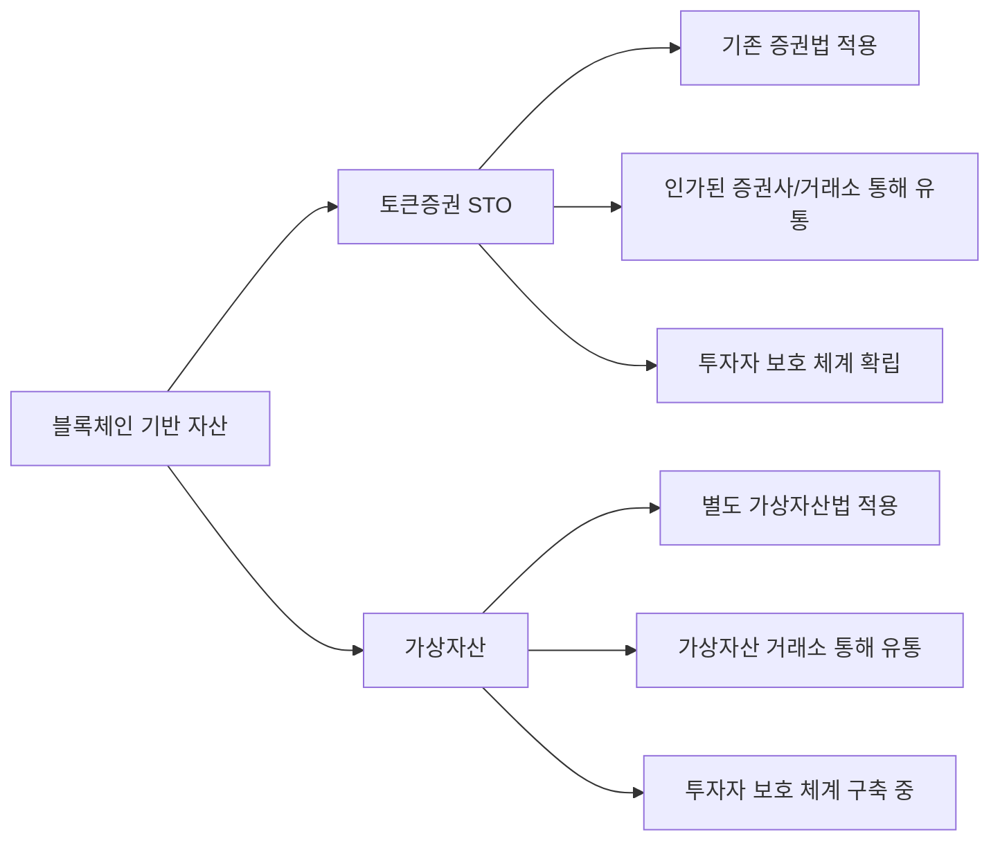
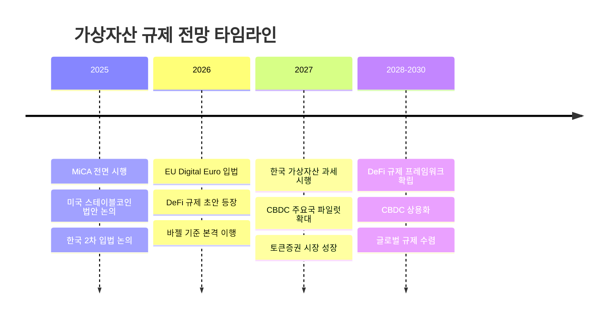

---
tags:
  - 디지털자산
  - 규제
  - 가상자산
---
# 가상자산 규제 트렌드 및 전망

> 마지막 검토: 2025년 5월

## 개요

가상자산 규제는 기술 발전, 시장 사건, 정치적 환경에 따라 빠르게 진화하고 있다. 이 문서에서는 2025년 현재 가장 주목해야 할 규제 트렌드와 향후 전망을 분석한다.

---

## 1. CBDC (중앙은행 디지털 화폐)

### 현황

2025년 기준 전 세계 130개국 이상이 CBDC를 연구하거나 시범 운영 중이며, 일부 국가는 이미 출시했다.

### 주요국 진행 상황

| 국가/지역 | 단계 | 명칭 | 특이사항 |
|-----------|------|------|----------|
| **중국** | 시범 운영 확대 | e-CNY (디지털 위안) | 26개 도시 이상 시범, 누적 거래 수조 위안 |
| **바하마** | 출시 완료 | Sand Dollar | 세계 최초 CBDC (2020) |
| **나이지리아** | 출시 (저조한 채택) | eNaira | 채택률 문제로 의무화 논의 |
| **EU** | 설계 단계 | Digital Euro | ECB 준비 단계(2023~2025), 입법 논의 중 |
| **한국** | 연구·시범 | (미정) | 한국은행 CBDC 실험 프로젝트 진행 |
| **미국** | 연구 단계 | (미정) | FedNow 운영 중, CBDC 입법 논의 정체 |
| **일본** | 파일럿 | (미정) | 2024~2025년 파일럿 프로그램 |
| **인도** | 파일럿 | Digital Rupee | 도매·소매 CBDC 병행 시범 |

### CBDC의 유형

### 규제적 함의

- **가상자산과의 관계**: CBDC가 스테이블코인을 대체할 가능성 vs 공존
- **프라이버시**: 중앙은행이 모든 거래를 추적할 수 있다는 우려
- **금융 중개 탈피**: 시중은행의 역할 약화 가능성 (disintermediation)
- **프로그래머블 화폐**: 조건부 지급, 만기 설정 등 정책 도구로 활용 가능성

!!! warning "프라이버시 논쟁"
    CBDC는 규제 당국에 전례 없는 거래 추적 능력을 부여할 수 있다. 이에 대한 프라이버시 우려로 미국에서는 "CBDC 금지 법안"이 발의되기도 했다. EU의 Digital Euro는 오프라인 소액 결제에 대해 프라이버시를 보장하는 설계를 추진 중이다.

---

## 2. DeFi 규제 방향

### 왜 DeFi 규제가 어려운가

| 전통 금융 규제 전제 | DeFi의 도전 |
|---------------------|------------|
| 규제할 중개자(법인)가 존재 | 스마트 컨트랙트가 자동 실행, 법인 없음 |
| 관할권이 명확 | 전 세계 어디서든 접근 가능 |
| KYC/AML 이행 주체가 있음 | 허가 없이 누구나 참여 (permissionless) |
| 책임 소재가 분명 | 개발자? DAO? 거버넌스 토큰 보유자? |

### 규제 접근 방식의 스펙트럼

### 2025년 주요 동향

- **EU**: MiCA는 "완전히 탈중앙화된" DeFi를 적용 제외했으나, 유럽위원회가 2025년 말까지 별도 보고서 발표 예정
- **미국**: SEC의 DeFi 프로토콜 대상 소송 (Uniswap, Lido 등)은 새 행정부 하에서 일부 철회/완화 기조
- **IOSCO**: "Same Activity, Same Risk, Same Regulation" 원칙에 기반한 DeFi 정책 권고안 (2023) 이행 모니터링
- **FATF**: "소유자/운영자" 기준으로 DeFi에 AML 의무 부과 시도 지속
- **자율 규제**: DeFi 프로토콜들의 자발적 컴플라이언스 도구 도입 증가 (예: Uniswap의 지갑 스크리닝)

### 예상 발전 방향

1. **탈중앙화 정도에 따른 차등 규제**: 실질적 통제 주체가 있는 "명목상 탈중앙화" 프로토콜은 규제 대상
2. **프론트엔드/인터페이스 규제**: 프로토콜 자체보다 사용자가 접하는 프론트엔드에 규제 적용
3. **온체인 컴플라이언스**: 프라이버시 보존 KYC(영지식증명 기반) 등 기술적 해법 발전

---

## 3. NFT 분류 및 규제

### NFT의 규제 분류 문제

NFT(Non-Fungible Token)는 용도에 따라 전혀 다른 규제가 적용될 수 있다:

| 용도/성격 | 규제 분류 | 적용 규제 |
|-----------|-----------|-----------|
| **디지털 아트/수집품** | 일반 재화 | 소비자보호법, 과세 (재산) |
| **게임 아이템** | 일반 재화 또는 가상자산 | 관할권별 상이 |
| **회원권/유틸리티** | 서비스 이용권 | 소비자보호, 사안별 판단 |
| **증권형 NFT** | 증권 | 증권법 (배당, 수익 분배가 있는 경우) |
| **분할 소유 NFT** | 증권/가상자산 | 투자계약으로 분류 가능성 높음 |
| **실물자산 연동 NFT** | 사안별 | 기초자산 규제 + 토큰 규제 |

### 주요국 입장

- **EU (MiCA)**: "진정한 고유(unique and not fungible)" NFT는 적용 제외. 시리즈로 대량 발행되거나 사실상 대체 가능하면 MiCA 적용 가능
- **미국 SEC**: 일부 NFT 프로젝트에 증권법 위반 소송 (Impact Theory 등)
- **한국**: NFT의 가상자산 해당 여부를 사안별로 판단. 대체 가능성이 높으면 가상자산으로 분류
- **일본**: NFT 자체는 가상자산이 아니나, 결제수단으로 사용되면 가상자산 해당 가능

!!! note "NFT 시장 침체와 규제"
    2022~2023년 NFT 시장 거래량이 급감하면서 규제 긴급성이 낮아졌으나, 실물자산 토큰화(RWA)의 일환으로 NFT가 재부상할 경우 규제 논의가 재점화될 수 있다.

---

## 4. 글로벌 규제 수렴 vs 발산

### 수렴 요인

### 수렴 영역

대부분의 주요 관할권에서 합의가 형성되고 있는 영역:

| 영역 | 수렴 방향 |
|------|-----------|
| **AML/KYC** | FATF 권고안 기반 VASP에 AML 의무 부과 |
| **Travel Rule** | FATF 권고 제16조 이행 (속도 차이 있으나 방향은 동일) |
| **스테이블코인** | 준비자산 요건, 상환권 보장, 발행자 인가 |
| **투자자 보호** | 자산 분리보관, 공시, 불공정거래 금지 |

### 발산 영역

| 영역 | 발산 양상 |
|------|-----------|
| **자산 분류** | 증권/상품/결제수단/별도 자산 — 국가마다 다름 |
| **DeFi** | 규제 vs 방관 vs 금지 |
| **과세** | 세율, 과세 유형(자본이득/소득/비과세) 다양 |
| **CBDC** | 적극 도입 vs 신중 vs 반대 |
| **채굴/PoW** | 환경 규제(EU, 뉴욕 모라토리엄) vs 유치(텍사스) |

### MiCA의 "브뤼셀 효과"

MiCA가 글로벌 규제의 사실상 표준(de facto standard)이 되는 현상:

- 글로벌 사업자가 MiCA 기준을 글로벌 표준으로 채택하는 추세
- 영국, 홍콩, 일본 등이 MiCA를 참고하여 자국 규제 설계
- GDPR의 전례와 유사한 "브뤼셀 효과(Brussels Effect)"

---

## 5. AI와 가상자산 감시

### 온체인 분석 (On-chain Analytics)

가상자산 거래는 블록체인에 공개적으로 기록되므로, AI/ML 기반 분석이 규제·감시에 활용된다:

| 분야 | 활용 |
|------|------|
| **AML 감시** | 의심스러운 거래 패턴 자동 탐지, 고위험 지갑 식별 |
| **제재 이행** | OFAC 제재 대상 지갑 추적 (Tornado Cash 사례) |
| **시장 감시** | 워시트레이딩, 시세조종 패턴 탐지 |
| **수사 지원** | 범죄 수익 추적, 거래소 연결 분석 |
| **탈세 적발** | 미신고 가상자산 거래 식별 |

### 주요 분석 기업

- **Chainalysis**: 정부·금융기관 대상 블록체인 분석 시장 선도
- **Elliptic**: 금융기관 대상, AI 기반 위험 탐지
- **TRM Labs**: 실시간 온체인 모니터링
- **CipherTrace** (Mastercard 인수): 규제 기관 지원

### AI 규제 감시의 발전 방향

### 프라이버시와의 균형

- **프라이버시 코인** (Monero, Zcash): 일부 거래소에서 상장 폐지, 일부 국가에서 금지 논의
- **믹서/텀블러**: Tornado Cash 제재 (OFAC, 2022) — 오픈소스 코드의 규제 가능성 논쟁
- **영지식증명(ZKP)**: 프라이버시를 보존하면서 컴플라이언스를 달성하는 기술적 해법으로 주목

!!! warning "감시와 프라이버시의 긴장"
    AI 기반 온체인 분석의 발전은 규제 효과성을 높이지만, 금융 프라이버시와의 근본적 긴장 관계를 심화시킨다. 이 균형점을 어디에 설정할 것인지는 사회적·정치적 판단의 영역이다.

---

## 6. 토큰증권 (STO) 규제

### 토큰증권이란

STO(Security Token Offering)는 전통 증권(주식, 채권, 부동산 등)을 블록체인 토큰으로 발행하는 것이다. 가상자산이 기존 규제 체계 밖의 새로운 자산인 것과 달리, 토큰증권은 **기존 증권 규제 체계 안에서** 블록체인 기술을 활용한다.

### 주요국 동향

| 국가 | 현황 |
|------|------|
| **한국** | 2023년 토큰증권 가이드라인 발표, 자본시장법 개정 논의. 금융위 혁신금융서비스(규제 샌드박스) 통해 시범 |
| **미국** | Reg D, Reg S, Reg A+ 등 기존 면제 규정 활용. tZERO, Securitize 등 플랫폼 운영 |
| **EU** | DLT Pilot Regime (2023 시행) — 토큰화 금융상품의 거래·결제를 위한 샌드박스 |
| **일본** | 금융상품거래법 개정으로 "전자기록이전권리" 도입. SBI 등 대형 금융사 참여 |
| **싱가포르** | MAS의 Project Guardian — 토큰화 채권·예금 실험 |
| **스위스** | DLT법 제정 (2021) — 토큰화 증권에 대한 명확한 법적 기반 |

### 토큰증권 vs 가상자산 규제

### 핵심 규제 과제

| 과제 | 내용 |
|------|------|
| **발행** | 기존 증권 발행 절차와의 정합성, 전자등록 체계 연계 |
| **유통** | 토큰증권 전용 거래 인프라 필요, 기존 거래소와의 연계 |
| **청산·결제** | 기존 CSD(중앙예탁기관)와 블록체인 결제의 공존 |
| **크로스보더** | 국가 간 토큰증권 유통 시 규제 충돌 해결 |
| **스마트 컨트랙트 리스크** | 코드 오류, 해킹 등에 대한 책임·보상 체계 |

### 전망

토큰증권은 **실물자산 토큰화(RWA: Real-World Assets)**의 핵심 영역으로, 블랙록, JP모건 등 대형 금융기관이 적극 참여하면서 시장이 확대되고 있다. 2025년 이후 주요국의 법제도 정비가 가속화될 것으로 전망된다.

---

## 종합 전망

### 단기 (2025~2026)

- MiCA 전면 시행 및 안정화, 글로벌 벤치마크 확립
- 미국 스테이블코인 법안 통과 가능성
- 한국 2차 입법(토큰증권, 스테이블코인) 논의 구체화
- AI 기반 온체인 감시 기술의 규제 활용 확대

### 중기 (2027~2030)

- DeFi 규제 프레임워크 본격 등장
- CBDC 주요국 출시 (EU, 일본 등)
- 토큰증권 시장 본격 성장
- 글로벌 규제 수렴 가속화

### 장기 (2030~)

- 전통 금융과 가상자산의 규제 통합
- 프로그래머블 화폐/자산에 맞는 새로운 규제 패러다임
- AI 자율 에이전트에 대한 규제 논의

!!! warning "전망의 한계"
    가상자산 규제 전망은 기술 발전, 시장 사건(거래소 파산, 해킹 등), 정치적 변화에 따라 급변할 수 있다. 위 전망은 2025년 5월 기준이며, 실제 전개는 상당히 다를 수 있다.

---

→ [개요로 돌아가기](index.md) | [규제 프레임워크](frameworks.md) | [국가별 현황](by-country/index.md)
