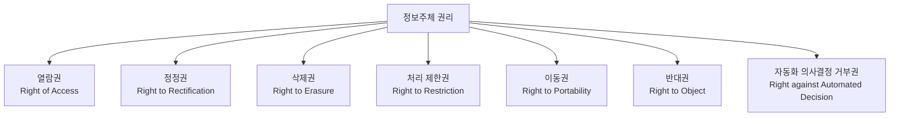
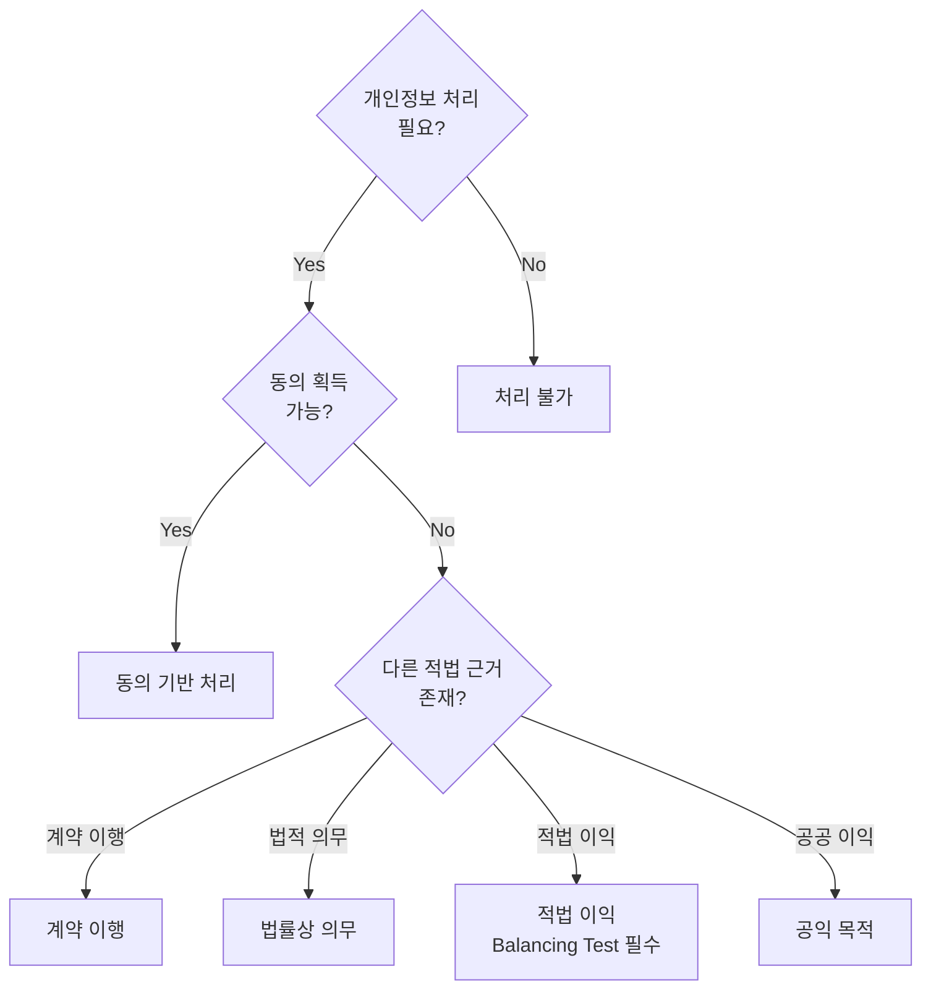
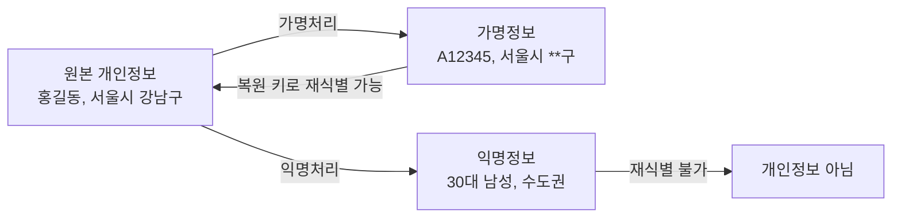

---
tags:
  - 규제
  - 개인정보
  - 데이터
---
# 데이터 규제 핵심 개념

## 개인정보 / 개인데이터 (Personal Data)

**개인정보**란 살아 있는 개인에 관한 정보로서, 해당 정보만으로 또는 다른 정보와 쉽게 결합하여 특정 개인을 식별할 수 있는 정보를 의미한다. 각 법률마다 정의가 약간 다르지만, 핵심 개념은 "식별 가능성(Identifiability)"이다.

| 법률 | 개인정보 정의의 핵심 |
|------|---------------------|
| GDPR | 식별되었거나 식별 가능한 자연인에 관한 모든 정보 |
| 한국 개인정보보호법 | 살아 있는 개인에 관한 정보로서 개인을 식별할 수 있는 정보 |
| CCPA | 특정 소비자 또는 가구를 식별·관련·기술하는 정보 |

!!! info "개인정보의 범위 확장"
    IP 주소, 쿠키 ID, 디바이스 ID, 위치 정보, 행동 패턴 등 온라인 식별자도 개인정보에 해당할 수 있다. GDPR은 이를 명시적으로 포함한다.

---

## 정보주체 권리 (Data Subject Rights)

정보주체(Data Subject)는 개인정보의 주인인 개인을 의미한다. 현대 데이터 규제의 핵심은 정보주체에게 자신의 데이터에 대한 실질적 통제권을 부여하는 것이다.

| 권리 | GDPR | 한국 개인정보보호법 | CCPA/CPRA |
|------|------|-------------------|-----------|
| 열람권 | O | O | O (Know) |
| 정정권 | O | O | O (Correct) |
| 삭제권 | O | O | O (Delete) |
| 처리 제한권 | O | O (일부) | X |
| 이동권 | O | O (2023 개정) | X |
| 반대권 | O | O | O (Opt-out) |
| 자동화 의사결정 거부권 | O | O (2023 개정) | O (제한적) |

---

## 동의 기반 vs 적법 이익

### 동의 (Consent)

개인정보 처리의 가장 기본적인 적법 근거다. 유효한 동의의 요건:

- **자유로운 의사(Freely given)**: 동의 거부 시 불이익이 없어야 함
- **구체적(Specific)**: 처리 목적별로 개별 동의
- **정보가 제공된(Informed)**: 처리 내용을 사전에 명확히 고지
- **명확한 의사표시(Unambiguous)**: 침묵, 사전 체크박스는 동의로 불인정

### 적법 이익 (Legitimate Interest)

GDPR에서 동의 외에 인정되는 적법 처리 근거의 하나다. 데이터 처리자의 적법한 이익이 정보주체의 권리보다 우선하는 경우에 한해 동의 없이 처리가 가능하다.

!!! warning "한국법과의 차이"
    한국 개인정보보호법은 GDPR과 달리 '적법 이익'을 명시적 처리 근거로 인정하지 않았으나, 2023년 개정법에서 '정당한 이익'을 적법 처리 근거로 신설했다. 다만 적용 범위와 해석은 GDPR보다 제한적이다.

---

## DPO (Data Protection Officer)

**DPO(개인정보 보호 책임자)**는 조직 내에서 개인정보 보호 업무를 총괄하는 독립적 역할이다.

### GDPR의 DPO 선임 의무

다음 중 하나에 해당하면 DPO 선임이 의무:
1. 공공기관이 데이터를 처리하는 경우
2. 대규모의 정기적·체계적 모니터링이 핵심 활동인 경우
3. 민감정보 또는 범죄경력 정보를 대규모로 처리하는 경우

### 한국의 개인정보 보호 책임자

한국 개인정보보호법은 모든 개인정보처리자에게 개인정보 보호 책임자(CPO) 지정을 의무화한다. GDPR의 DPO와 유사하나, 독립성 요건이 GDPR보다 약하다는 차이가 있다.

---

## DPIA (Data Protection Impact Assessment)

**DPIA(개인정보 영향평가)**는 개인정보 처리가 정보주체의 권리에 미치는 영향을 사전에 평가하는 절차다. 고위험 처리 활동에 대해 의무적으로 수행해야 한다.

DPIA 의무 수행 상황:
- 프로파일링 등 자동화된 의사결정
- 민감정보의 대규모 처리
- 공개 장소에서의 대규모 체계적 모니터링
- 새로운 기술의 활용

!!! tip "DPIA 수행 절차"
    (1) 처리 활동 기술 → (2) 필요성·비례성 평가 → (3) 정보주체 위험 식별 → (4) 위험 완화 조치 도출 → (5) 문서화 및 검토. 잔여 위험이 높으면 감독 기관에 사전 협의해야 한다.

---

## 국외 이전 (Cross-border Transfer)

개인정보의 국외 이전은 데이터 규제의 가장 복잡한 영역 중 하나다. 각국은 자국민의 데이터가 적절한 보호 수준이 보장되지 않는 국가로 이전되는 것을 제한한다.

### 적법 이전 메커니즘

| 메커니즘 | 설명 | 활용 |
|----------|------|------|
| 적정성 결정 | 수신국의 보호 수준이 적정하다는 판단 | EU↔한국 적정성 결정 (2022) |
| SCC (표준계약조항) | EU 집행위가 제정한 표준 계약서 | 가장 널리 사용 |
| BCR (구속력 있는 기업 규칙) | 다국적 기업 그룹 내부 규칙 | 대기업 그룹에 적합 |
| 정보주체 동의 | 명시적 동의 기반 이전 | 예외적 상황에 한정 |

---

## 가명정보와 익명정보

### 가명정보 (Pseudonymized Data)

추가 정보 없이는 특정 개인을 식별할 수 없도록 처리한 정보다. 원래의 식별자를 대체 식별자로 교체하되, 복원 키를 별도 보관하는 방식이다.

### 익명정보 (Anonymous Data)

시간, 비용, 기술 등을 합리적으로 고려했을 때 더 이상 개인을 식별할 수 없는 정보다. 개인정보보호법의 적용을 받지 않는다.

!!! info "한국의 가명정보 활용"
    2020년 데이터 3법 개정으로 통계, 과학 연구, 공익적 기록 보존 목적의 가명정보 활용이 허용되었다. 가명정보 결합은 결합전문기관을 통해서만 가능하다.

---

## 프라이버시 바이 디자인 (Privacy by Design)

**프라이버시 바이 디자인**은 시스템 설계 단계부터 개인정보 보호를 내재화하는 원칙이다. GDPR 제25조에서 법적 의무로 규정한다.

7대 기본 원칙:
1. **사후 대응이 아닌 사전 예방**
2. **기본 설정으로서의 프라이버시** (Privacy by Default)
3. **설계에 내재된 프라이버시**
4. **제로섬이 아닌 포지티브섬** (보호와 활용의 양립)
5. **전 생명주기 보호** (수집부터 파기까지)
6. **가시성과 투명성**
7. **사용자 중심 존중**

---

## 관련 문서

- [데이터 규제 개요](index.md) — 전체 개요
- [규제 법률 비교](products/index.md) — GDPR, 개인정보보호법, CCPA 비교
- [트렌드](trends.md) — AI와 개인정보, 마이데이터 확산
- [AML/KYC 개념](../aml-kyc/concepts.md) — KYC 데이터와 개인정보 보호
