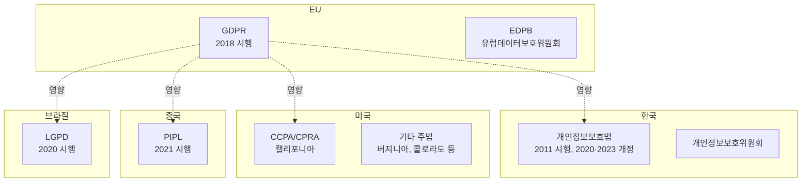

# 데이터 규제 개요

## 정의

**데이터 규제(Data Regulation)**는 개인정보(Personal Data)의 수집, 처리, 저장, 이전, 삭제 등 데이터 생명주기 전반에 걸쳐 정보주체의 권리를 보호하고 기업의 의무를 규정하는 법적 체계이다.

## 상세 설명

디지털 경제의 확대로 기업이 수집·활용하는 개인정보의 양이 폭발적으로 증가하면서, 개인의 프라이버시 보호와 데이터 활용 사이의 균형이 글로벌 핵심 이슈가 되었다. 2018년 EU의 **GDPR(General Data Protection Regulation)** 시행을 기점으로, 전 세계 137개 이상 국가가 개인정보 보호법을 제정하거나 강화했다.

한국은 **개인정보보호법**, **정보통신망법**, **신용정보법** 등을 통해 데이터 규제를 시행하며, 2020년 데이터 3법 개정으로 가명정보 활용, 마이데이터 도입, 개인정보보호위원회의 독립 기관화 등 주요 변화를 경험했다. 개인정보보호위원회가 독립 규제기관으로서 감독·집행 권한을 행사한다.

데이터 규제의 글로벌 트렌드는 정보주체의 권리 강화, 기업의 책임(Accountability) 중시, 국외 이전 규제 강화, AI 시대의 새로운 프라이버시 과제로 수렴하고 있다. 특히 AI/ML 모델의 학습 데이터, 프로파일링, 자동화된 의사결정에 대한 규제가 새로운 초점이 되고 있다.

## 핵심 키워드

| 키워드 | 설명 |
|--------|------|
| **GDPR** | EU 일반 데이터 보호 규정. 글로벌 데이터 규제의 사실상 표준 |
| **개인정보보호법** | 한국의 개인정보 보호 기본법 |
| **CCPA/CPRA** | 캘리포니아 소비자 프라이버시법/프라이버시 권리법 |
| **마이데이터** | 정보주체가 자신의 데이터를 직접 관리·활용하는 체계 |
| **동의** | 개인정보 처리의 가장 기본적인 적법 근거 |
| **DPO** (Data Protection Officer) | 개인정보 보호 책임자 |
| **과징금** | 데이터 규제 위반 시 부과되는 행정 제재금 |

## 글로벌 데이터 규제 지형

## 핵심 포인트

!!! info "역외 적용(Extraterritorial Scope)"
    GDPR, PIPL, 한국 개인정보보호법 모두 자국 내 정보주체의 데이터를 처리하는 해외 기업에도 적용된다. 한국 사용자 데이터를 처리하는 해외 기업은 한국법을 준수해야 한다.

!!! warning "과징금 규모"
    GDPR 위반 시 최대 전 세계 연 매출의 4% 또는 2,000만 유로 중 큰 금액이 과징금으로 부과된다. Meta는 2023년 12억 유로의 GDPR 과징금을 부과받았다.

!!! tip "데이터 3법 개정의 의미"
    한국의 2020년 데이터 3법 개정은 가명정보 개념을 도입하여 데이터 활용의 길을 열었고, 개인정보보호위원회를 독립 중앙행정기관으로 격상시켜 감독 체계를 강화했다.

## 관련 개념

- [핵심 개념 상세](concepts.md) — 정보주체 권리, 동의, DPO, DPIA 등 개념 심화
- [규제 비교](products/index.md) — GDPR, 개인정보보호법, CCPA 등 주요 법률 비교
- [트렌드](trends.md) — AI와 개인정보, 글로벌 규제 수렴, 마이데이터 확산
- [AML/KYC](../aml-kyc/index.md) — AML과 개인정보 보호의 교차점
- [레그테크](../regtech/index.md) — 데이터 규제 준수를 위한 기술 솔루션

## 실무 적용

1. **개인정보 관리 체계 구축**: 개인정보 처리 목록(Data Inventory) 작성, 처리 활동 기록(ROPA) 유지
2. **동의 관리**: 적법한 동의 획득·관리 시스템 구축, 동의 철회 메커니즘 제공
3. **DPO 지정**: 법정 요건에 따른 개인정보 보호 책임자 지정 및 역할 정의
4. **국외 이전**: 적정성 결정, 표준계약조항(SCC), 구속력 있는 기업 규칙(BCR) 등 적법 이전 근거 확보
5. **침해 대응**: 개인정보 침해 사고 대응 계획 수립, 72시간 내 통지 체계 마련
