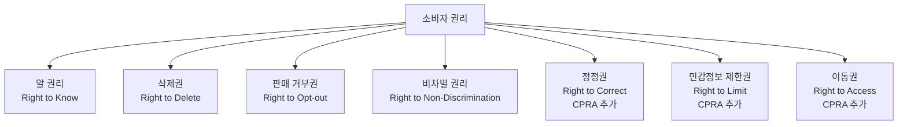
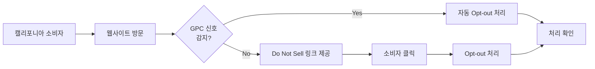

---
tags:
  - 규제
  - 개인정보
  - 데이터
---
# CCPA/CPRA (캘리포니아 소비자 프라이버시법)

## 정의

**CCPA(California Consumer Privacy Act)**는 2020년 시행된 미국 캘리포니아주의 소비자 개인정보 보호법이며, **CPRA(California Privacy Rights Act)**는 2023년 시행된 개정·강화 법률로, 두 법을 합쳐 미국에서 가장 강력한 주(州) 단위 데이터 규제 체계를 구성한다.

## 상세 설명

미국은 연방 차원의 포괄적 개인정보 보호법이 없는 대신, 산업별(HIPAA-의료, GLBA-금융, FERPA-교육)과 주별 법률로 규제한다. 이 중 캘리포니아의 CCPA/CPRA는 가장 포괄적이고 영향력 있는 주법으로, 사실상 미국 전역의 기업 관행에 영향을 미친다.

CCPA는 2018년 캘리포니아 주민투표 발의를 배경으로 긴급 입법되었다. 소비자에게 기업이 수집하는 개인정보에 대한 알 권리(Right to Know), 삭제권(Right to Delete), 판매 거부권(Right to Opt-out of Sale)을 부여했다. 2020년 다시 주민투표를 통해 CPRA가 통과되어 CCPA를 강화하고, 전용 감독기관인 **CPPA(California Privacy Protection Agency)**를 설립했다.

CCPA/CPRA의 가장 큰 특징은 **Opt-out 모델**이다. GDPR이나 한국법이 수집 전 동의(Opt-in)를 요구하는 것과 달리, CCPA는 기본적으로 데이터 수집·판매를 허용하되 소비자가 거부할 수 있는 권리를 부여한다. 이는 미국의 자유 시장 전통과 기업 친화적 접근법을 반영한다.

## 핵심 규제 내용

### 적용 대상

CCPA/CPRA는 캘리포니아 소비자의 개인정보를 처리하는 기업 중 다음 조건 중 하나를 충족하는 경우 적용된다:

| 조건 | 기준 |
|------|------|
| 연 매출 | $25,000,000 이상 |
| 데이터 규모 | 10만 명 이상의 소비자/가구 개인정보 매매·공유 |
| 데이터 수익 | 개인정보 판매 수익이 연 매출의 50% 이상 |

!!! info "중소기업 면제"
    위 조건에 해당하지 않는 중소기업은 CCPA/CPRA 적용 대상이 아니다. 이는 GDPR이 규모 무관하게 적용되는 것과 대비된다.

### 소비자 권리

### CCPA vs CPRA 차이

| 항목 | CCPA (2020) | CPRA (2023) |
|------|-------------|-------------|
| 소비자 권리 | 알 권리, 삭제권, 판매 거부 | + 정정권, 민감정보 제한, 자동화 의사결정 거부 |
| 데이터 범주 | 판매(Sale) | + 공유(Sharing) 개념 추가 |
| 민감정보 | 별도 분류 없음 | 민감 개인정보(SPI) 범주 신설 |
| 보유 기간 | 규정 없음 | 목적 달성에 필요한 기간으로 제한 |
| 감독 기관 | 법무장관(AG) | CPPA (전용 기관) + AG |
| 과태료 | 건당 $2,500~$7,500 | 동일 + CPPA 직접 집행 |
| 감사권 | 없음 | CPPA의 정기 감사 권한 |

### 기업 의무

1. **프라이버시 정책 공개**: 수집하는 개인정보 범주, 목적, 제3자 공유 내역 공개
2. **"Do Not Sell or Share" 링크**: 웹사이트에 판매/공유 거부 링크 필수 게시
3. **소비자 요청 처리**: 알 권리·삭제·정정 요청에 45일 내 응답
4. **서비스 제공자 계약**: 개인정보를 전달하는 서비스 제공자와 데이터 보호 계약 체결
5. **보안 조치**: 합리적 보안 조치 미이행 시 데이터 침해 소송 대상

## 집행 및 과태료

### 행정 집행

| 항목 | 내용 |
|------|------|
| 의도적 위반 | 건당 $7,500 |
| 비의도적 위반 | 건당 $2,500 (시정 기회 30일 → CPRA에서 삭제) |
| 아동 데이터 | 16세 미만 데이터 위반 시 건당 $7,500 |
| 집행 기관 | CPPA + 법무장관 |

### 민사 소송 (Private Right of Action)

!!! warning "데이터 침해 소송"
    CCPA는 데이터 침해 시 소비자의 민사 소송권을 인정한다. 소비자는 건당 $100~$750 또는 실제 손해액 중 큰 금액을 청구할 수 있다. 집단 소송(Class Action)으로 이어질 경우 기업의 배상 규모가 천문학적으로 증가할 수 있다.

### 주요 집행 사례

| 기업 | 제재 | 연도 | 위반 사항 |
|------|------|------|----------|
| Sephora | $120만 | 2022 | 판매 거부 미이행, 서비스 제공자 계약 미체결 |
| DoorDash | $37.5만 | 2023 | 소비자 동의 없는 개인정보 판매 |
| Tilray | $12.2만 | 2024 | 삭제 요청 미이행 |

## 한국 기업에 대한 영향

### CCPA/CPRA 적용 대상인 한국 기업

- 미국(캘리포니아) 시장에 서비스를 제공하는 이커머스, 게임, SaaS 기업
- 캘리포니아 소비자 데이터를 처리하는 광고·마케팅 기업
- 미국 자회사를 둔 한국 기업

### 실무 대응 포인트

!!! tip "Opt-out 메커니즘 구현"
    "Do Not Sell or Share My Personal Information" 링크를 웹사이트 푸터에 배치하고, GPC(Global Privacy Control) 신호를 인식·처리하는 기술적 구현이 필요하다.

## 미국 주법 확산 동향

CCPA/CPRA의 영향으로 미국 전역에서 주 단위 프라이버시법이 확산 중이다. 2025년 기준 20개 이상의 주가 포괄적 프라이버시법을 제정했거나 제정 중이다.

| 주 | 법률명 | 시행 연도 |
|----|--------|----------|
| 버지니아 | VCDPA | 2023 |
| 콜로라도 | CPA | 2023 |
| 코네티컷 | CTDPA | 2023 |
| 유타 | UCPA | 2023 |
| 텍사스 | TDPSA | 2024 |
| 오레곤 | OCPA | 2024 |

## 관련 문서

- [규제 법률 비교](index.md) — 글로벌 비교표
- [GDPR](gdpr.md) — EU 규제와의 비교
- [한국 개인정보보호법](korea-pipa.md) — 한국 규제
- [핵심 개념](../concepts.md) — 동의, 정보주체 권리 상세
- [트렌드](../trends.md) — 미국 연방법 논의 동향
