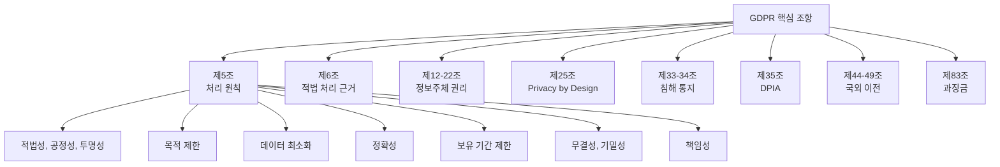

# GDPR (General Data Protection Regulation)

## 정의

**GDPR(일반 데이터 보호 규정)**은 EU(유럽연합)가 2018년 5월 25일 시행한 개인정보 보호법으로, EU 역내 정보주체의 개인데이터 처리에 관한 통일 규제 체계이자 글로벌 데이터 규제의 사실상 표준이다.

## 상세 설명

GDPR은 1995년 EU 데이터보호지침(Directive 95/46/EC)을 대체하여 제정되었다. 지침(Directive)이 각국의 국내법 전환을 요하는 것과 달리, 규정(Regulation)인 GDPR은 EU 27개 회원국에 직접 적용된다. 이를 통해 EU 내 개인정보 보호 규제를 통일하고, 기업의 규제 대응 비용을 줄이는 동시에 정보주체의 권리를 대폭 강화했다.

GDPR의 가장 혁신적인 요소는 **역외 적용(Extraterritorial Scope)**이다. EU에 사업장이 없더라도, EU 정보주체에게 재화·서비스를 제공하거나 행동을 모니터링하는 기업에 GDPR이 적용된다. 이로 인해 한국 기업을 포함한 전 세계 기업이 GDPR 준수 대상이 되었다.

과징금 규모도 파격적이다. 최대 전 세계 연 매출의 4% 또는 2,000만 유로 중 큰 금액이 부과될 수 있으며, 2023년 Meta에 부과된 12억 유로 과징금은 GDPR 집행의 위력을 보여주는 대표 사례다.

## 핵심 규제 기관

| 기관 | 역할 |
|------|------|
| **EDPB** (European Data Protection Board) | EU 차원 일관된 GDPR 적용 보장, 가이드라인 발행 |
| **각국 DPA** (Data Protection Authority) | 자국 내 GDPR 집행, 과징금 부과, 민원 처리 |
| **Lead Supervisory Authority** | 다국적 기업의 주된 사업장 소재국 DPA가 주관 감독 |

## 주요 조항

### 7대 처리 원칙 (제5조)

1. **적법성, 공정성, 투명성**: 합법적으로, 공정하게, 투명하게 처리
2. **목적 제한**: 명시된 적법한 목적으로만 수집
3. **데이터 최소화**: 목적에 필요한 최소한의 데이터만 수집
4. **정확성**: 부정확한 데이터는 지체 없이 정정·삭제
5. **보유 기간 제한**: 목적 달성에 필요한 기간만 보유
6. **무결성과 기밀성**: 적절한 보안 조치로 데이터 보호
7. **책임성(Accountability)**: 위 원칙 준수를 입증할 수 있어야 함

### 6가지 적법 처리 근거 (제6조)

| 근거 | 설명 | 사례 |
|------|------|------|
| 동의 | 정보주체의 명시적 동의 | 뉴스레터 구독 |
| 계약 이행 | 계약 체결·이행에 필요 | 배송을 위한 주소 처리 |
| 법적 의무 | 법률상 의무 이행 | 세금 신고를 위한 소득 정보 |
| 생명 보호 | 정보주체의 생명적 이익 보호 | 응급 의료 상황 |
| 공공 이익 | 공적 임무 수행 | 공공기관의 행정 처리 |
| 적법 이익 | 컨트롤러의 정당한 이익 | 사기 방지, 직접 마케팅 |

## 과징금 사례

| 기업 | 과징금 | 연도 | 위반 사항 |
|------|--------|------|----------|
| Meta (Ireland) | 12억€ | 2023 | EU→미국 데이터 이전 위반 |
| Amazon (Luxembourg) | 7.46억€ | 2021 | 동의 없는 타겟 광고 |
| Meta/WhatsApp (Ireland) | 2.25억€ | 2021 | 투명성 의무 위반 |
| Google (France) | 1.5억€ | 2022 | 쿠키 동의 처리 위반 |
| H&M (Germany) | 3,526만€ | 2020 | 직원 개인정보 과다 수집 |

!!! danger "과징금 추세"
    GDPR 시행 이후 과징금 규모가 매년 증가하고 있다. 2023년 기준 누적 과징금은 40억 유로를 초과했으며, 빅테크 기업에 대한 대형 과징금 사례가 늘어나는 추세다.

## 한국 기업에 대한 영향

### GDPR 적용 대상인 한국 기업

- EU 시장에 제품·서비스를 제공하는 기업 (이커머스, SaaS, 게임 등)
- EU 사용자의 행동을 모니터링하는 기업 (웹 분석, 광고 타겟팅)
- EU에 사업장·자회사가 있는 기업

### EU-한국 적정성 결정 (2022)

!!! tip "적정성 결정의 의미"
    2022년 EU 집행위는 한국을 적정성 결정 국가로 인정했다. 이로 인해 EU에서 한국으로의 개인데이터 이전 시 SCC 등 추가 보호 장치 없이도 이전이 가능해졌다. 한국 기업의 EU 비즈니스 편의성이 크게 향상되었다.

## 관련 문서

- [규제 법률 비교](index.md) — 글로벌 데이터 규제 비교표
- [한국 개인정보보호법](korea-pipa.md) — 한국법과의 비교
- [CCPA/CPRA](ccpa.md) — 미국 캘리포니아 규제
- [핵심 개념](../concepts.md) — 동의, DPO, DPIA 상세
- [트렌드](../trends.md) — GDPR 이후 글로벌 규제 수렴
