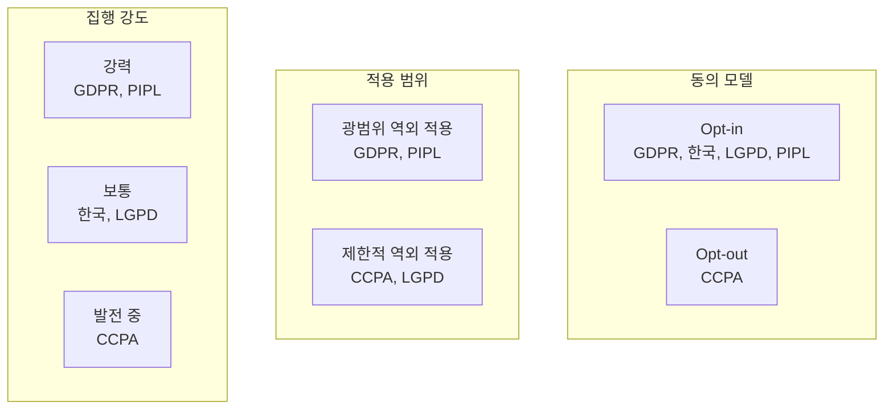
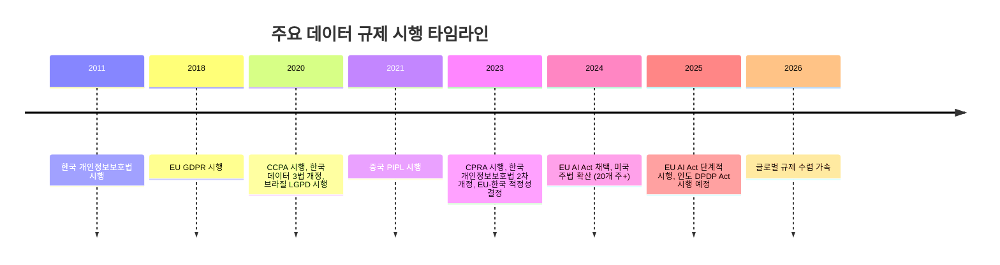

# 글로벌 데이터 규제 법률 비교

## 비교 요약

전 세계 주요 개인정보 보호법을 적용 범위, 정보주체 권리, 집행력, 과징금 기준으로 비교한다. GDPR이 사실상 글로벌 표준으로 작용하며, 각국 법률은 GDPR의 영향을 받되 자국의 법체계와 문화를 반영한 차이를 보인다.

| 항목 | [GDPR](gdpr.md) | [한국 개인정보보호법](korea-pipa.md) | [CCPA/CPRA](ccpa.md) | LGPD (브라질) | PIPL (중국) |
|------|------|------|------|------|------|
| **시행 연도** | 2018 | 2011 (2020·2023 개정) | 2020 (CPRA 2023) | 2020 | 2021 |
| **적용 범위** | EU 정보주체 데이터 | 한국 내 처리 + 역외 | 캘리포니아 소비자 | 브라질 내 처리 + 역외 | 중국 내 처리 + 역외 |
| **역외 적용** | O | O (2023 개정) | O (제한적) | O | O |
| **동의 요건** | Opt-in (명시적) | Opt-in (명시적) | Opt-out | Opt-in | Opt-in (별도 동의) |
| **DPO 의무** | 조건부 의무 | 전면 의무 | X | 조건부 의무 | O (PIPC) |
| **정보이동권** | O | O (2023) | X | O | O |
| **자동화 의사결정 거부** | O | O (2023) | O (제한적) | O | O |
| **과징금 상한** | 매출 4% / 2,000만€ | 매출 3% / 위반유형별 | 건당 $7,500 | 매출 2% / 5,000만 R$ | 매출 5% / 5,000만 ¥ |
| **감독 기관** | 각국 DPA + EDPB | 개인정보보호위원회 | CPPA | ANPD | CAC |

## 규제 기관 비교

| 규제 기관 | 관할 | 독립성 | 집행력 |
|----------|------|--------|--------|
| EDPB / 각국 DPA | EU 27개국 | ★★★★★ | ★★★★★ |
| 개인정보보호위원회 (PIPC) | 한국 | ★★★★☆ | ★★★★☆ |
| CPPA (California Privacy Protection Agency) | 캘리포니아 | ★★★☆☆ | ★★★☆☆ |
| ANPD | 브라질 | ★★★☆☆ | ★★★☆☆ |
| CAC (국가인터넷정보판공실) | 중국 | ★★☆☆☆ (정부 직속) | ★★★★★ |

## 주요 차이점 분석

### 동의 모델의 차이

!!! info "Opt-in vs Opt-out"
    **Opt-in** (GDPR, 한국): 개인정보 수집 전에 명시적 동의를 받아야 한다. 동의하지 않으면 처리 불가.
    **Opt-out** (CCPA): 기본적으로 수집·판매가 허용되며, 소비자가 거부(opt-out)해야 중단된다.

### 과징금 체계의 차이

| 법률 | 과징금 산정 방식 | 최대 과징금 사례 |
|------|-----------------|-----------------|
| GDPR | 매출 기반 비례 (최대 4%) | Meta 12억€ (2023) |
| 한국 개인정보보호법 | 매출 기반 (최대 3%) + 유형별 | 카카오 151억원 (2023) |
| CCPA | 건당 과태료 ($2,500~$7,500) | Sephora $120만 (2022) |
| PIPL | 매출 기반 (최대 5%) | DiDi 80억 위안 (2022) |

### 국외 이전 규제

| 법률 | 이전 메커니즘 | 특이사항 |
|------|-------------|---------|
| GDPR | 적정성 결정, SCC, BCR | Schrems II 판결로 미국 이전 복잡화 |
| 한국 | 동의, 적정성 결정 (2023 도입) | EU 적정성 결정 획득 (2022) |
| CCPA | 별도 규정 없음 | 판매 시 고지 의무 |
| PIPL | 안전평가, 인증, SCC | 데이터 현지화 요건 강화 |

## 시나리오별 선택 가이드

!!! tip "글로벌 서비스 기업"
    GDPR을 기준으로 컴플라이언스 체계를 구축하되, 각 시장별 추가 요건을 레이어로 적용하는 전략이 효율적이다. GDPR 준수 시 대부분의 규제를 80% 이상 충족한다.

!!! tip "한국 중심 기업"
    개인정보보호법 + 정보통신망법을 기본으로, 해외 진출 시장의 규제를 추가 확인한다. EU 적정성 결정 획득으로 EU 이전은 상대적으로 용이하다.

!!! tip "중국 시장 진출 기업"
    PIPL의 데이터 현지화 요건에 주의해야 한다. 일정 규모 이상의 데이터 처리 시 중국 내 데이터 저장이 의무이며, 국외 이전 시 안전평가가 필요하다.

## 글로벌 규제 타임라인

## 관련 문서

- [데이터 규제 개요](../index.md) — 전체 개요
- [핵심 개념](../concepts.md) — 개인정보, 동의, DPO 등 개념 심화
- [트렌드](../trends.md) — 글로벌 규제 수렴 동향
- [AML/KYC](../../aml-kyc/index.md) — 데이터 규제와 AML의 교차점
