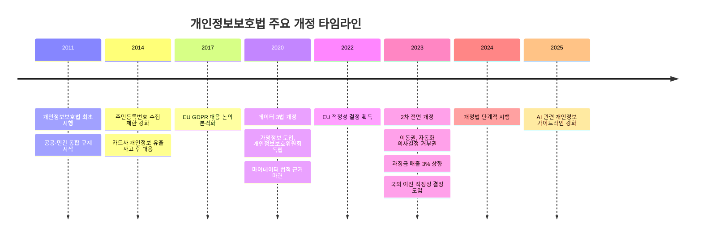
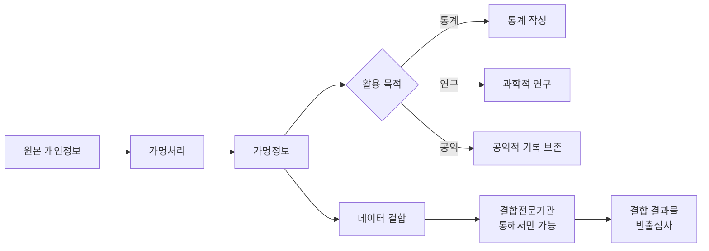

# 한국 개인정보보호법 (PIPA)

## 정의

**개인정보보호법(Personal Information Protection Act, PIPA)**은 개인정보의 처리 및 보호에 관한 한국의 기본법으로, 공공부문과 민간부문을 포괄하여 개인정보 처리의 원칙, 정보주체의 권리, 개인정보처리자의 의무를 규정한다.

## 상세 설명

2011년 9월 시행된 개인정보보호법은 한국의 개인정보 보호 체계를 공공·민간 통합으로 전환한 획기적 법률이다. 이전까지 공공부문(공공기관의 개인정보 보호에 관한 법률)과 민간부문(정보통신망법)으로 이원화된 규제를 일원화했다.

2020년 **데이터 3법 개정**(개인정보보호법, 신용정보법, 정보통신망법)은 한국 데이터 법제의 패러다임 전환이었다. 가명정보 개념 도입으로 데이터 활용의 길을 열었고, 개인정보보호위원회를 국무총리 소속 독립 중앙행정기관으로 격상시켜 감독 체계를 강화했다.

2023년 **2차 개정**에서는 GDPR에 준하는 정보주체 권리 강화(이동권, 자동화 의사결정 거부권), 국외 이전 규제 현대화(적정성 결정 도입), 과징금 상향(매출 3%) 등이 이루어졌다. 이를 통해 EU 적정성 결정 유지 기반을 다지면서도, 데이터 활용과 보호의 균형을 추구한다.

## 개정 연혁

## 핵심 내용

### 개인정보 처리 원칙

| 원칙 | 내용 |
|------|------|
| 목적 제한 | 명확한 목적 하에 최소한의 개인정보 수집 |
| 목적 내 이용 | 수집 목적 범위 내에서만 이용 |
| 정확성 | 개인정보의 정확성·최신성 확보 |
| 안전성 | 기술적·관리적·물리적 보호조치 |
| 공개 원칙 | 개인정보 처리 방침 공개 |
| 정보주체 권리 보장 | 열람·정정·삭제·처리정지 청구권 |
| 사생활 침해 최소화 | 익명처리 가능한 경우 익명처리 |
| 책임 원칙 | 개인정보처리자의 책임과 의무 |

### 가명정보 제도

!!! info "가명정보와 개인정보의 차이"
    가명정보는 여전히 개인정보에 해당하므로 안전조치 의무가 적용된다. 다만 정보주체 동의 없이 통계·연구·공익 목적으로 활용이 가능하다는 점에서 일반 개인정보와 구별된다.

### 마이데이터 (MyData)

2020년 신용정보법 개정으로 도입된 마이데이터는 정보주체가 자신의 데이터를 한 곳에 모아 관리·활용할 수 있는 체계다.

- **전송요구권**: 금융기관에 자신의 데이터를 마이데이터 사업자에게 전송하도록 요구
- **마이데이터 사업자**: 허가제로 운영, 2024년 기준 60개 이상 사업자 등록
- **확대 영역**: 금융에서 의료, 공공, 통신, 유통으로 확대 추진 중

### 개인정보보호위원회 (PIPC)

| 항목 | 내용 |
|------|------|
| 지위 | 국무총리 소속 중앙행정기관 (2020 독립) |
| 위원 구성 | 위원장 1명 + 부위원장 1명 + 위원 7명 (총 9명) |
| 핵심 기능 | 정책 수립, 법령 해석, 실태 점검, 과징금 부과, 국제 협력 |
| 집행 수단 | 시정 명령, 과징금, 과태료, 형사 고발, 영업 정지 |

## 과징금 제도

!!! warning "2023년 개정 과징금 강화"
    2023년 개정으로 과징금 상한이 위반 관련 매출의 3%로 상향되었다. 이전에는 위반 유형별 정액 상한이었으나, GDPR과 유사한 매출 비례형으로 전환되었다.

### 주요 과징금 사례

| 기업 | 과징금 | 연도 | 위반 사항 |
|------|--------|------|----------|
| 카카오 | 151억 원 | 2023 | 오픈채팅 개인정보 유출 |
| 구글 | 692억 원 | 2022 | 위치정보 수집 동의 위반 |
| 메타 | 308억 원 | 2022 | 얼굴인식 정보 무단 수집 |
| 이스트소프트 | 20억 원 | 2023 | 개인정보 유출 |

## GDPR과의 비교

| 항목 | GDPR | 한국 개인정보보호법 |
|------|------|-------------------|
| 적법 처리 근거 | 6가지 (적법 이익 포함) | 동의 중심 + 정당한 이익 (2023 신설) |
| DPO | 조건부 의무 | 전면 의무 (CPO) |
| 침해 통지 | 72시간 내 감독기관 통지 | 72시간 내 정보주체+PIPC 통지 |
| DPIA | 고위험 처리 시 의무 | 공공기관 의무, 민간 권장 |
| 과징금 | 매출 4% | 매출 3% |
| 형사 처벌 | 각국 결정 | 5년 이하 징역·5,000만 원 이하 벌금 |

## 관련 문서

- [규제 법률 비교](index.md) — 글로벌 비교표
- [GDPR](gdpr.md) — EU 규제와의 상세 비교
- [CCPA/CPRA](ccpa.md) — 미국 캘리포니아 규제
- [핵심 개념](../concepts.md) — 동의, 가명정보, 프라이버시 바이 디자인
- [트렌드](../trends.md) — 마이데이터 확산, AI와 개인정보
