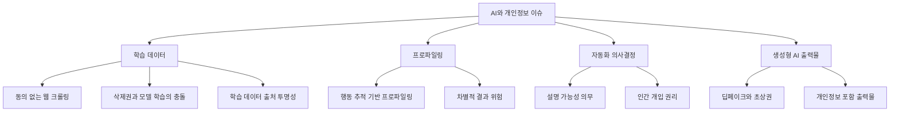
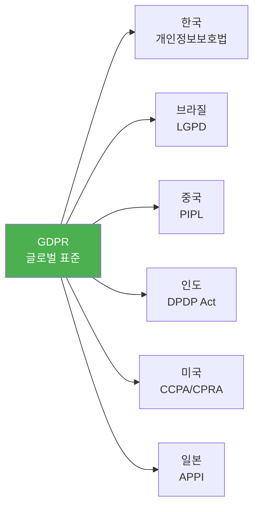
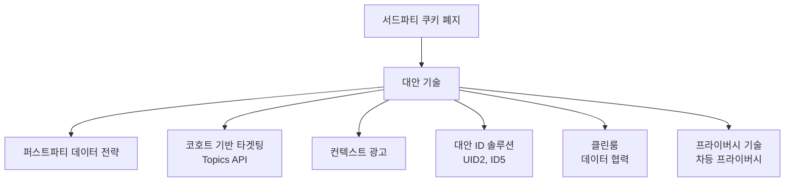

---
tags:
  - 규제
  - 개인정보
  - 데이터
---
# 데이터 규제 트렌드

## 개요

데이터 규제는 AI 기술의 급속한 발전, 글로벌 규제 수렴, 정보주체 권리 의식 강화에 의해 빠르게 진화하고 있다. 기존의 "수집-동의-보호" 패러다임에서 "AI 거버넌스-데이터 주권-프라이버시 기술" 중심으로 전환이 가속화되는 시점이다.

---

## 1. AI와 개인정보

### 현황

생성형 AI(ChatGPT, Claude 등)의 폭발적 성장으로 AI 학습 데이터, 프로파일링, 자동화된 의사결정에 대한 개인정보 이슈가 최우선 과제로 부상했다. 이탈리아의 ChatGPT 일시 차단(2023), EU AI Act 채택(2024) 등이 이를 반영한다.

### 핵심 이슈

| 규제 동향 | 내용 |
|----------|------|
| EU AI Act | AI 시스템을 위험 수준별로 분류하고, 고위험 AI에 적합성 평가·투명성 의무 부과 |
| GDPR 제22조 | 자동화된 의사결정에 대한 정보주체의 거부권 및 인간 개입 요구권 |
| 한국 AI 가이드라인 | 개인정보보호위원회의 "AI 시대 개인정보 보호 가이드라인" 발표 |
| 미국 AI BoR | AI 권리장전 청사진(Blueprint for an AI Bill of Rights) |

!!! warning "AI 학습과 삭제권의 충돌"
    정보주체가 삭제를 요구할 때, 이미 AI 모델에 학습된 데이터를 어떻게 "삭제"할 것인가? 머신 언러닝(Machine Unlearning)은 아직 기술적·법적으로 미해결 과제다.

---

## 2. 글로벌 규제 수렴

### 현황

GDPR을 중심으로 전 세계 데이터 규제가 점진적으로 수렴하고 있다. 2025년 기준 137개 이상 국가가 데이터 보호법을 보유하며, 대부분 GDPR의 핵심 원칙(동의, 목적 제한, 데이터 최소화, 정보주체 권리)을 채택했다.

### 수렴 패턴

### 수렴과 발산

| 수렴 요소 | 발산 요소 |
|----------|----------|
| 정보주체 권리 (열람, 삭제, 정정) | 동의 모델 (Opt-in vs Opt-out) |
| 데이터 침해 통지 의무 | 과징금 산정 방식 |
| DPO/CPO 제도 | 국외 이전 메커니즘 |
| 아동 개인정보 강화 보호 | 데이터 현지화 요건 |

!!! tip "기업 대응 전략"
    "GDPR-first" 전략으로 가장 엄격한 기준을 충족한 뒤, 각 시장의 추가 요건을 레이어로 적용하면 글로벌 컴플라이언스 비용을 최소화할 수 있다.

---

## 3. 마이데이터 확산

### 현황

정보주체가 자신의 데이터를 직접 관리·활용하는 **마이데이터(MyData)** 패러다임이 금융을 넘어 의료, 공공, 교육 등으로 확산하고 있다.

### 글로벌 현황

| 국가/지역 | 이니셔티브 | 현황 |
|----------|----------|------|
| 한국 | 마이데이터 (신용정보법) | 금융 60+ 사업자, 의료·공공 확대 중 |
| EU | 데이터 거버넌스법, 데이터법 | 산업 데이터 공유 프레임워크 구축 |
| 영국 | Open Banking → Open Finance | 금융 데이터 공유 선도 |
| 호주 | Consumer Data Right (CDR) | 금융→에너지→통신 확대 |
| 인도 | DEPA (Data Empowerment) | Account Aggregator 프레임워크 |

!!! info "마이데이터의 비즈니스 모델"
    마이데이터 사업자는 정보주체의 데이터를 한 곳에 통합하여 자산관리, 건강관리, 보험 비교 등 부가가치 서비스를 제공한다. 핵심은 정보주체의 동의에 기반한 "데이터 이동"이다.

---

## 4. 아동 개인정보 보호

### 현황

아동·청소년의 디지털 활동 증가로, 아동 개인정보 보호가 글로벌 규제의 최우선 의제로 부상했다. 소셜미디어, 게임, 교육 플랫폼의 아동 데이터 수집·활용에 대한 규제가 급속히 강화되고 있다.

### 주요 규제

| 규제 | 대상 연령 | 핵심 내용 |
|------|----------|----------|
| COPPA (미국) | 13세 미만 | 부모 동의 필수, FTC 집행 |
| UK AADC | 18세 미만 | 아동 친화적 디자인 코드, 15개 기준 |
| EU DSA | 미성년자 | 미성년자 대상 타겟 광고 금지 |
| 한국 | 14세 미만 | 법정대리인 동의 필수 |
| CCPA/CPRA | 16세 미만 | Opt-in 동의 필수 (판매 시) |

!!! danger "아동 데이터 위반의 제재 강화"
    CCPA/CPRA는 아동 데이터 위반 시 건당 $7,500(일반 $2,500의 3배)의 과태료를 부과한다. Meta는 인스타그램의 아동 데이터 처리로 4.05억 유로의 GDPR 과징금을 부과받았다.

---

## 5. 쿠키리스 시대

### 현황

구글 크롬의 서드파티 쿠키 단계적 폐지(2024~), 사파리·파이어폭스의 이미 완료된 차단, GDPR의 쿠키 동의 엄격 해석으로 "쿠키 없는 웹(Cookieless Web)" 전환이 가속화되고 있다.

### 대안 기술

!!! tip "퍼스트파티 데이터의 중요성"
    쿠키리스 전환의 핵심 대응은 퍼스트파티 데이터 역량 강화다. 고객과의 직접 관계에서 동의 기반으로 수집한 데이터의 가치가 급격히 상승하고 있다.

---

## 6. 데이터 주권 (Data Sovereignty)

### 현황

국가 안보, 경제적 이익, 시민 보호를 이유로 데이터의 국내 저장 및 처리를 요구하는 **데이터 현지화(Data Localization)** 요건이 강화되고 있다.

| 국가 | 현지화 수준 | 내용 |
|------|-----------|------|
| 중국 | 엄격 | 핵심 데이터·대규모 개인정보 중국 내 저장 의무 |
| 러시아 | 엄격 | 러시아 시민 개인정보 국내 서버 저장 의무 |
| 인도 | 보통 | 결제 데이터 국내 저장 의무 |
| EU | 보통 | 적정성 결정 없는 국가로 이전 제한 |
| 한국 | 완화 | 동의 또는 적정성 결정 기반 이전 허용 |

!!! warning "클라우드 사업자에 대한 영향"
    데이터 현지화 요건은 AWS, Azure, GCP 등 글로벌 클라우드 사업자에게 각국 리전(Region) 구축 비용을 발생시킨다. 기업은 클라우드 아키텍처 설계 시 데이터 저장 위치를 규제 요건에 맞춰야 한다.

---

## 실무 시사점

1. **AI 거버넌스 수립**: AI 모델의 학습 데이터 출처 관리, 자동화 의사결정에 대한 설명 가능성 확보, DPIA 수행
2. **글로벌 규제 모니터링**: GDPR 기준으로 기본 체계를 구축하되, 진출 시장별 추가 요건을 지속 추적
3. **퍼스트파티 데이터 전략**: 서드파티 쿠키 의존도를 줄이고, 동의 기반 직접 데이터 수집 역량 강화
4. **마이데이터 대비**: 데이터 이동권 대응을 위한 API 인프라 구축, 데이터 표준화
5. **아동 보호 강화**: 서비스 이용자 중 아동·청소년 비율 파악, 연령 확인 메커니즘 도입

## 관련 문서

- [데이터 규제 개요](index.md) — 전체 개요
- [핵심 개념](concepts.md) — 개인정보, 동의, DPO 등
- [규제 비교](products/index.md) — GDPR, PIPA, CCPA 비교
- [AML/KYC 트렌드](../aml-kyc/trends.md) — AML과 개인정보의 교차점
- [레그테크 트렌드](../regtech/trends.md) — 규제 기술 전반의 동향
