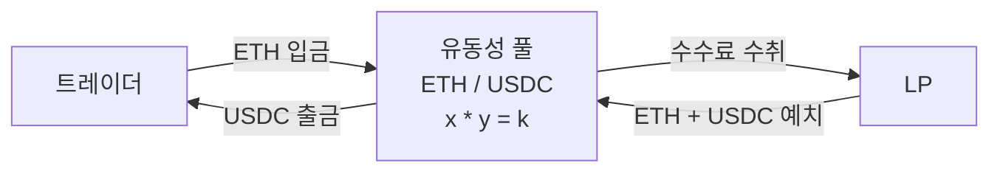
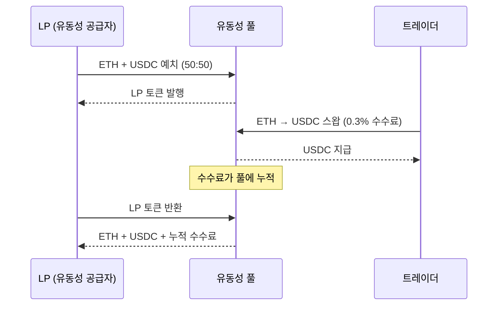
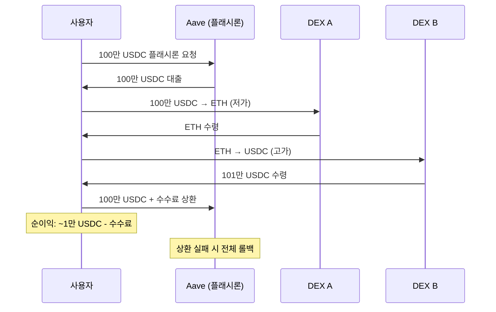
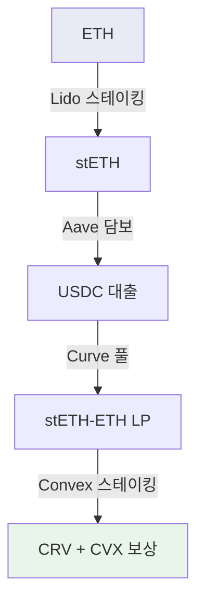
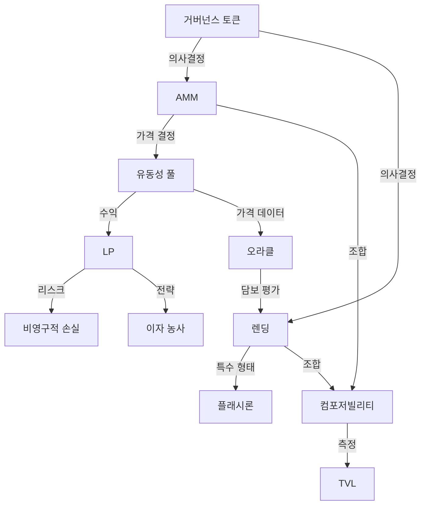

---
tags:
  - 디지털자산
  - DeFi
---
# DeFi 핵심 개념

DeFi 생태계를 구성하는 핵심 개념을 체계적으로 정리한다. 각 개념은 DeFi 프로토콜의 작동 원리를 이해하는 기초이며, 서로 긴밀하게 연결되어 있다.

---

## AMM (Automated Market Maker)

**AMM**은 전통 거래소의 주문장(order book) 대신 수학 공식과 유동성 풀을 사용하여 자산 가격을 결정하고 거래를 체결하는 메커니즘이다.

가장 기본적인 AMM은 **상수곱 공식(x * y = k)**을 사용한다. 풀에 두 토큰(x, y)이 예치되어 있을 때, 한 토큰을 넣으면 공식을 유지하도록 다른 토큰이 나오는 구조다. 거래량이 많을수록 슬리피지(가격 영향)가 커진다.

| AMM 유형 | 공식 | 대표 프로토콜 | 특징 |
|---------|------|-------------|------|
| 상수곱 (CPMM) | x * y = k | [Uniswap](products/uniswap.md) v2 | 범용, 단순 |
| 집중 유동성 | 가격 범위 지정 | Uniswap v3/v4 | 자본 효율성 극대화 |
| StableSwap | 변형 곡선 | [Curve](products/index.md) | 동종 자산 저슬리피지 |
| 가중 풀 | w_x * x + w_y * y = k | Balancer | 다중 자산, 비균등 비율 |

!!! tip "AMM의 혁신성"
    전통 거래소는 마켓 메이커가 호가를 제시해야 거래가 성립하지만, AMM은 수학 공식으로 항상 가격이 존재한다. 이는 어떤 토큰이든 즉시 거래 가능하게 하며, DeFi 생태계의 기반 인프라가 되었다.

---

## 유동성 풀 (Liquidity Pool)

**유동성 풀**은 스마트 컨트랙트에 예치된 토큰 쌍으로, AMM 거래의 유동성을 제공한다. LP(Liquidity Provider)가 자산을 예치하면 거래 수수료의 일부를 보상으로 받는다.

---

## 이자 농사 (Yield Farming)

**이자 농사**는 DeFi 프로토콜에 자산을 예치하고, 거래 수수료·프로토콜 토큰 보상·대출 이자 등 다양한 수익원을 극대화하는 전략이다.

단순 LP 수수료를 넘어, LP 토큰을 다시 스테이킹하거나 다른 프로토콜에 예치하는 "재귀적 농사"로 수익률을 증폭시킬 수 있다. 그러나 높은 APY는 대부분 프로토콜 토큰 인플레이션에 의존하므로, 지속 가능성에 대한 비판이 있다.

| 수익원 | 지속 가능성 | 리스크 |
|--------|-----------|--------|
| 거래 수수료 | 높음 (실제 수요) | 거래량 감소 시 수익 하락 |
| 프로토콜 토큰 보상 | 낮음 (인플레이션) | 토큰 가격 하락 시 실질 수익 마이너스 |
| 대출 이자 | 중간 | 담보 청산 리스크 |
| Real Yield | 높음 | 수익률이 상대적으로 낮음 |

---

## 플래시론 (Flash Loan)

**플래시론**은 담보 없이 무한 금액을 빌리되, 같은 트랜잭션 내에서 반드시 상환해야 하는 초단기 무담보 대출이다. 상환하지 못하면 트랜잭션 전체가 롤백된다.

!!! warning "플래시론 공격"
    플래시론은 차익거래, 담보 교체, 셀프 청산 등 합법적 용도에 쓰이지만, DeFi 프로토콜의 오라클·가격 메커니즘을 조작하는 공격 도구로도 악용된다. 2020~2024년 수십억 달러 규모의 플래시론 공격이 발생했다.

---

## 오라클 (Oracle)

**오라클**은 블록체인 외부의 데이터(가격, 날씨, 이벤트 등)를 스마트 컨트랙트에 전달하는 인프라다. DeFi에서는 자산 가격 피드가 핵심이며, Chainlink가 시장을 지배하고 있다.

스마트 컨트랙트는 자체적으로 외부 데이터에 접근할 수 없으므로, 오라클 없이는 렌딩 프로토콜의 담보 가치 평가, DEX의 가격 참조, 파생상품의 정산 등이 불가능하다.

| 오라클 | 방식 | 시장점유율 |
|--------|------|----------|
| **Chainlink** | 분산 노드 네트워크 | ~60% |
| **Pyth Network** | 1차 데이터 소스 직접 제공 | ~15% |
| **Uniswap TWAP** | 온체인 가격 시계열 | DEX 내부 |
| **Redstone** | 주문형 오라클 | 성장 중 |

---

## TVL (Total Value Locked)

**TVL**은 DeFi 프로토콜에 예치(잠금)된 총 자산의 달러 가치로, DeFi 생태계의 규모와 건강도를 측정하는 핵심 지표다.

2021년 최고점 약 $180B에서 2022년 크립토 겨울 동안 $40B까지 하락했으나, 2025년 다시 $100B 이상으로 회복했다. TVL은 단순한 크기 지표를 넘어, 프로토콜의 신뢰도·유동성 깊이·보안성을 간접적으로 반영한다.

!!! note "TVL의 한계"
    TVL은 같은 자산이 여러 프로토콜에 중복 계산될 수 있고(레버리지), 토큰 가격 변동에 의해 왜곡될 수 있다. "실질 TVL"을 파악하려면 레버리지 비율과 자산 구성을 함께 분석해야 한다.

---

## 비영구적 손실 (Impermanent Loss)

**비영구적 손실**은 LP가 유동성 풀에 자산을 예치한 후, 토큰 가격이 변동하면서 발생하는 기회비용이다. 단순히 보유(HODL)했을 때보다 LP로 예치했을 때 가치가 낮아지는 현상이다.

가격 변동이 클수록 비영구적 손실이 커지며, 가격이 예치 시점으로 돌아오면 손실이 사라진다("비영구적"). 그러나 실제로는 가격이 원점으로 돌아오지 않는 경우가 많아 영구적 손실이 되기도 한다.

| 가격 변동 | 비영구적 손실 |
|----------|-------------|
| 1.25x (25% 변동) | ~0.6% |
| 1.50x (50% 변동) | ~2.0% |
| 2x (100% 변동) | ~5.7% |
| 3x (200% 변동) | ~13.4% |
| 5x (400% 변동) | ~25.5% |

---

## 거버넌스 토큰

**거버넌스 토큰**은 DeFi 프로토콜의 의사결정(파라미터 변경, 자금 집행, 업그레이드 등)에 투표권을 부여하는 토큰이다. UNI(Uniswap), AAVE, MKR(MakerDAO), CRV(Curve) 등이 대표적이다.

거버넌스 토큰은 프로토콜의 탈중앙화를 실현하는 핵심 메커니즘이지만, 실제로는 소수의 대규모 보유자(고래)가 의사결정을 좌우하는 문제, 낮은 투표 참여율, 거버넌스 공격 등의 과제가 있다.

---

## 컴포저빌리티 (Composability)

**컴포저빌리티**는 DeFi 프로토콜들이 레고 블록처럼 자유롭게 조합되어 새로운 금융 서비스를 만들 수 있는 특성이다. "Money Lego"라고도 불린다.

위 예시에서 ETH 하나로 Lido → Aave → Curve → Convex를 순차적으로 조합하여 다층 수익을 창출한다. 이러한 컴포저빌리티가 DeFi의 가장 강력한 혁신이자, 동시에 시스템 리스크(하나의 프로토콜 실패가 연쇄적 영향)의 원인이기도 하다.

!!! tip "크로스체인 컴포저빌리티"
    현재 컴포저빌리티는 주로 같은 체인(Ethereum) 내에서 작동한다. 크로스체인 브릿지를 통한 멀티체인 컴포저빌리티는 아직 초기 단계이며, 브릿지 해킹 리스크가 주요 과제다. [크로스체인 트렌드](trends.md)를 참고하라.

---

## 개념 간 관계

## 관련 문서

- [DeFi 개요](index.md)
- [주요 프로토콜 비교](products/index.md)
- [시장 트렌드](trends.md)
