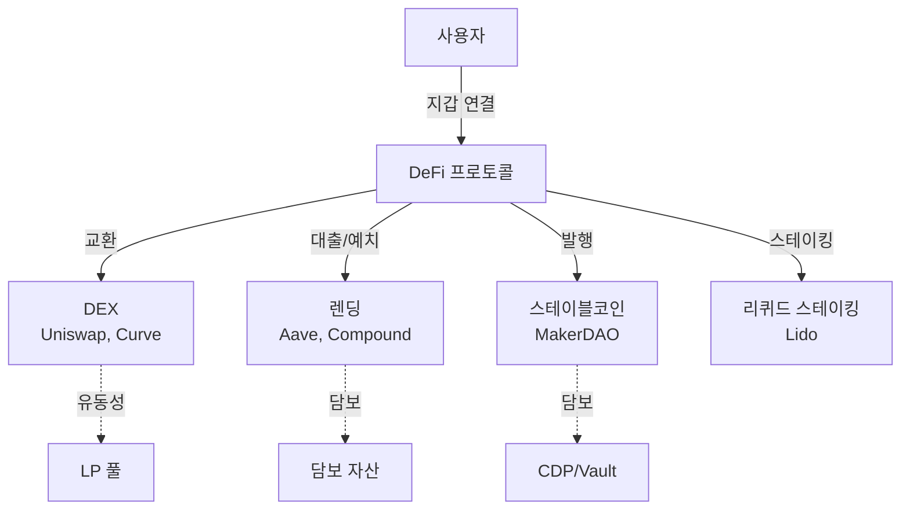

# DeFi 프로토콜 (탈중앙화 금융)

**DeFi(Decentralized Finance)**는 블록체인 스마트 컨트랙트를 기반으로 은행·증권사·보험사 등 전통 금융 중개자 없이 대출, 거래, 보험, 자산 운용 등 금융 서비스를 제공하는 탈중앙화 금융 생태계다.

## 왜 중요한가

전통 금융(TradFi)은 중개 기관의 신뢰에 의존하며, 이로 인해 높은 수수료, 느린 정산, 접근성 제한, 운영 불투명성 등의 구조적 한계를 갖는다. DeFi는 코드가 곧 규칙(Code is Law)이라는 원칙 아래, 스마트 컨트랙트로 금융 로직을 자동 실행하여 이러한 중개 비용을 제거하고 24/7 글로벌 접근을 가능하게 한다.

2020년 "DeFi Summer"로 폭발적 성장을 시작한 이후, TVL(Total Value Locked)이 수백억 달러에 이르며 금융 인프라의 대안으로 자리잡았다. 최근에는 기관 투자자의 진입, L2 확장, [RWA 토큰화](../sto/index.md)와의 융합으로 새로운 성장 국면에 접어들고 있다.

## 핵심 키워드

| 키워드 | 설명 |
|--------|------|
| **DEX (탈중앙화 거래소)** | 중앙 주문장 없이 AMM으로 토큰을 교환하는 프로토콜 |
| **렌딩 (Lending)** | 담보 기반 무신뢰 대출·예치 프로토콜 |
| **LP (Liquidity Provider)** | 유동성 풀에 자산을 예치하여 수수료를 수취하는 참여자 |
| **TVL (Total Value Locked)** | 프로토콜에 예치된 총 자산 가치, DeFi의 핵심 지표 |
| **스마트 컨트랙트** | 블록체인에 배포된 자동 실행 프로그램 |

!!! info "DeFi vs CeFi vs TradFi"
    **TradFi**(은행·증권사)는 규제된 중앙 기관이 서비스를 제공하고, **CeFi**(Binance, Coinbase)는 암호화폐를 다루되 중앙화된 기업이 운영하며, **DeFi**는 스마트 컨트랙트로 완전 자동화된다. DeFi는 투명성과 접근성에서 우위지만, 보안 리스크와 규제 불확실성이 과제다.

## 전통 금융과의 차이

| 구분 | 전통 금융 | DeFi |
|------|----------|------|
| 중개자 | 은행, 증권사, 거래소 | 스마트 컨트랙트 (코드) |
| 운영 시간 | 영업일·영업시간 | 24/7/365 |
| 접근성 | KYC 필수, 지역 제한 | 지갑만 있으면 글로벌 접근 |
| 투명성 | 제한적 (내부 장부) | 완전 투명 (온체인 데이터) |
| 정산 | T+2 (2영업일) | 즉시 (블록 확인) |
| 수수료 | 다층 중개 수수료 | 가스비 + 프로토콜 수수료 |
| 리스크 | 거래상대방 리스크, 시스템 리스크 | 스마트 컨트랙트 리스크, 오라클 리스크 |

## 이 섹션의 구성

| 문서 | 내용 |
|------|------|
| [핵심 개념](concepts.md) | AMM, 유동성 풀, 플래시론, 오라클, TVL, 비영구적 손실 등 |
| [주요 프로토콜 비교](products/index.md) | Uniswap, Aave, MakerDAO, Curve, Compound, Lido |
| [시장 트렌드](trends.md) | DeFi 2.0, Real Yield, 기관 DeFi, L2, 크로스체인 |

## 관련 도메인

- [CBDC](../cbdc/index.md) — CBDC와 DeFi의 공존 가능성, 프로그래머블 머니
- [토큰증권 (STO)](../sto/index.md) — RWA 토큰의 DeFi 담보 활용, TradFi-DeFi 브릿지

## 실무 적용

- **DeFi 개발자**: Solidity/Vyper 스마트 컨트랙트, 보안 감사, 프론트엔드 통합
- **트레이더/투자자**: 이자 농사, 유동성 공급, 차익거래 전략
- **기관 투자자**: 허가형 DeFi 풀, RWA 담보 렌딩, 기관급 수탁
- **규제 기관**: DeFi 규제 프레임워크 설계, AML/KYC 적용 방안
- **리서처**: 토크노믹스 분석, MEV 연구, 거버넌스 메커니즘 설계
