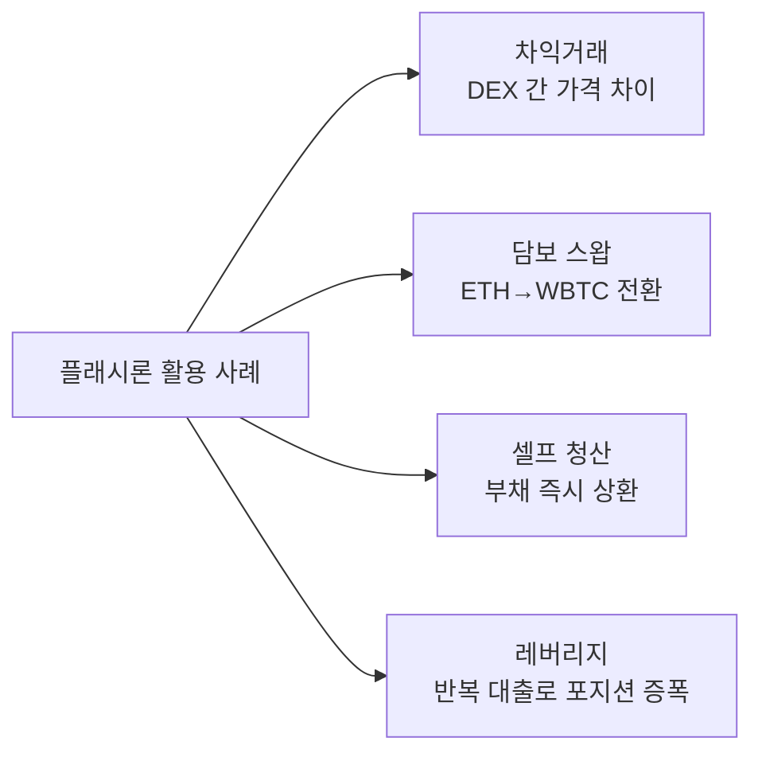
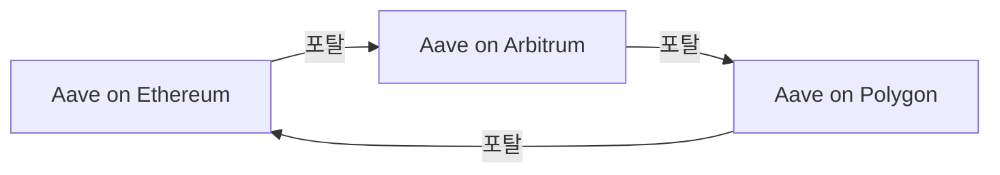

# Aave

**Aave**는 DeFi 최대 렌딩(대출·예치) 프로토콜로, 플래시론을 최초로 상용화하고 GHO 스테이블코인을 발행하며, 15개 이상의 체인에 배포된 멀티체인 선도 프로토콜이다.

## 개요

핀란드 출신의 Stani Kulechov가 2017년 ETHLend로 시작하여 2020년 Aave로 리브랜딩한 이후, DeFi 렌딩 시장의 지배적 프로토콜로 성장했다. "Aave"는 핀란드어로 "유령"을 의미한다.

Aave의 핵심 모델은 간단하다. 예치자(Supplier)가 자산을 풀에 넣으면 이자를 받고, 차입자(Borrower)는 담보를 제공하고 자산을 빌린다. 이자율은 풀의 활용률(utilization rate)에 따라 알고리즘으로 자동 결정된다.

TVL 약 $15B(2025년 기준)으로 DeFi 전체에서 Lido와 함께 최대 규모를 차지한다.

## 핵심 메커니즘

```mermaid
graph TD
    SUPPLIER[예치자] -->|USDC 예치| POOL[Aave 풀<br/>활용률 기반 이자율]
    POOL -->|aUSDC 발행| SUPPLIER
    BORROWER[차입자] -->|ETH 담보 제공| POOL
    POOL -->|USDC 대출| BORROWER
    POOL -->|이자 축적| SUPPLIER
    BORROWER -->|이자 지급| POOL

    ORACLE[Chainlink 오라클] -->|가격 피드| POOL
    POOL -->|담보 부족 시| LIQUIDATOR[청산자]
    LIQUIDATOR -->|담보 매입 (할인)| POOL
```

| 항목 | 내용 |
|------|------|
| 예치 | aToken 수령 (이자 자동 누적) |
| 대출 | 담보 대비 LTV(Loan-to-Value) 비율 내 차입 |
| 이자율 | 변동 금리 (활용률 기반) + 고정 금리 옵션 |
| 청산 | 담보 가치 하락 시 자동 청산 (5~10% 보너스) |
| 오라클 | Chainlink 가격 피드 의존 |

## 플래시론 (Flash Loans)

Aave는 [플래시론](../concepts.md)을 DeFi 최초로 상용화했다. 담보 없이 풀의 전체 유동성을 빌릴 수 있되, 같은 트랜잭션 내에서 반드시 상환해야 한다.



수수료는 빌린 금액의 0.05%이며, 단일 트랜잭션에서 수백만 달러를 무담보로 활용할 수 있어 DeFi 생태계의 유동성 효율을 극대화한다.

!!! warning "플래시론 공격"
    플래시론은 오라클 조작, 거버넌스 공격, 가격 조작 등에 악용된 사례가 있다. Aave는 v3에서 보안 모듈(Safety Module)과 격리 시장을 도입하여 리스크를 관리한다.

## Aave v3 주요 기능

### E-Mode (효율 모드)
상관관계가 높은 자산 간 대출 시 LTV를 최대 97%까지 높여 자본 효율성을 극대화한다. 예: stETH 담보로 ETH 대출 시 거의 1:1 비율로 차입 가능.

### 격리 시장 (Isolation Mode)
새로 상장된 리스크 높은 자산의 담보 사용을 제한한다. 격리 시장의 자산은 스테이블코인만 차입 가능하며, 부채 한도가 설정된다.

### 크로스체인 포탈
Aave가 배포된 여러 체인 간에 aToken을 이동할 수 있는 기능. 한 체인에서 예치하고 다른 체인에서 차입하는 크로스체인 렌딩의 기초다.



## GHO 스테이블코인

GHO는 Aave가 발행하는 탈중앙화 스테이블코인으로, [MakerDAO의 DAI](makerdao.md)와 유사한 과담보 모델을 사용한다.

| 항목 | GHO | DAI |
|------|-----|-----|
| 발행 주체 | Aave DAO | MakerDAO |
| 담보 | Aave 예치 자산 | ETH, RWA 등 |
| 이자 | 차입 이자율 (변동) | 안정화 수수료 (가변) |
| 특징 | Aave 생태계 통합 | 최대 탈중앙화 스테이블코인 |
| 시가총액 | ~$150M | ~$5B |

!!! info "GHO의 차별화"
    GHO는 Aave의 기존 예치 자산을 담보로 활용하므로, 사용자가 추가 담보를 제공하지 않고도 스테이블코인을 발행할 수 있다. stkAAVE 보유자에게 GHO 차입 할인을 제공하여 AAVE 토큰의 유틸리티를 강화한다.

## 멀티체인 배포

| 체인 | TVL | 특징 |
|------|-----|------|
| Ethereum | ~$10B | 최대 TVL, 모든 기능 |
| Avalanche | ~$1B | 초기 멀티체인 확장 |
| Polygon | ~$500M | 저렴한 가스비 |
| Arbitrum | ~$1.5B | L2 최대 TVL |
| Optimism | ~$500M | OP 보상 프로그램 |
| Base | ~$300M | Coinbase L2, 빠른 성장 |
| 기타 | ~$1B+ | BNB, Fantom, Metis 등 |

## 강점과 약점

**강점**:
- DeFi 렌딩 TVL 1위 (~$15B), 검증된 보안
- 플래시론 원조, DeFi 유동성 효율의 핵심
- GHO로 스테이블코인 생태계 확장
- 15개+ 체인 배포, 최대 멀티체인 커버리지
- E-Mode, 격리 시장 등 정교한 리스크 관리

**약점**:
- Chainlink 오라클 의존 — 오라클 장애 시 시스템 리스크
- 과담보 모델의 자본 비효율성
- 거버넌스 복잡성 증가 (멀티체인 파라미터 관리)
- GHO 시가총액이 DAI 대비 아직 작음
- 스마트 컨트랙트 복잡도에 따른 해킹 리스크

## 관련 문서

- [DeFi 개요](../index.md) | [핵심 개념 — 플래시론](../concepts.md)
- [주요 프로토콜 비교](index.md)
- [Uniswap](uniswap.md) | [MakerDAO](makerdao.md)
- [STO — RWA 담보 렌딩](../../sto/trends.md)
