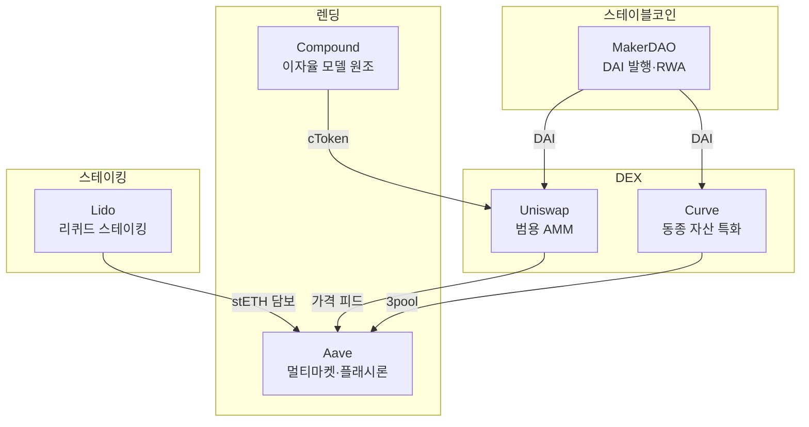
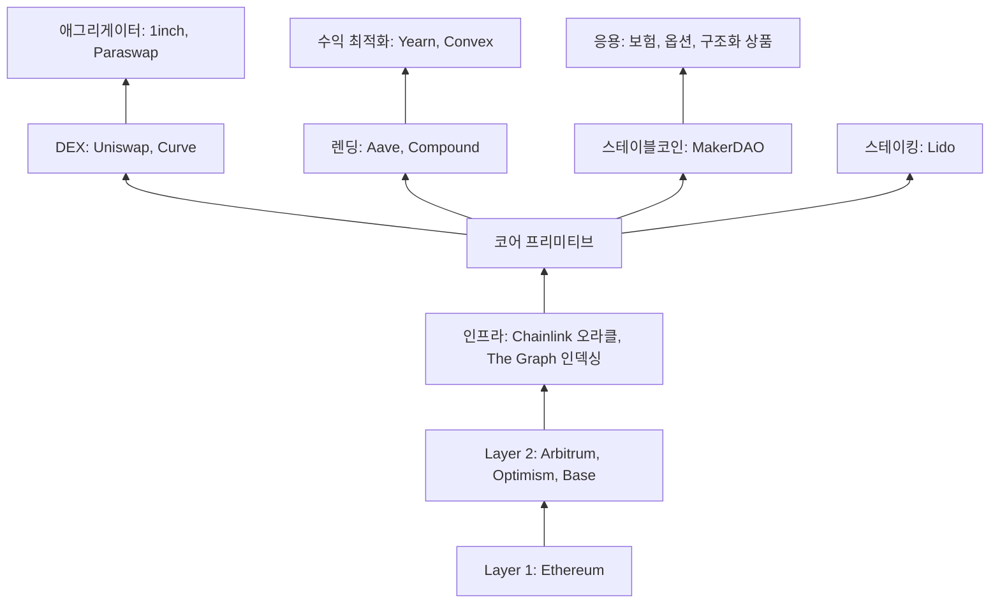

---
tags:
  - 디지털자산
  - DeFi
---
# 주요 DeFi 프로토콜 비교

DeFi 생태계를 대표하는 6개 프로토콜을 비교 분석한다. 각 프로토콜은 서로 다른 금융 기능을 담당하며, [컴포저빌리티](../concepts.md)를 통해 하나의 생태계로 연결된다.

---

## 비교 요약

| 항목 | Uniswap | Aave | MakerDAO | Curve | Compound | Lido |
|------|---------|------|----------|-------|----------|------|
| **카테고리** | DEX | 렌딩 | 스테이블코인 발행 | DEX (동종 자산) | 렌딩 | 리퀴드 스테이킹 |
| **출시** | 2018 | 2020 | 2017 | 2020 | 2018 | 2020 |
| **체인** | Ethereum, L2 다수 | Ethereum, L2, 멀티체인 | Ethereum | Ethereum, L2 | Ethereum, L2 | Ethereum, L2 |
| **거버넌스 토큰** | UNI | AAVE | MKR (→SKY) | CRV | COMP | LDO |
| **TVL** | ~$5B | ~$15B | ~$8B | ~$3B | ~$3B | ~$15B |
| **핵심 혁신** | AMM, 집중 유동성 | 플래시론, 멀티마켓 | CDP, RWA 담보 | StableSwap 곡선 | 이자율 모델 | stETH 유동성 |
| **현재 버전** | v4 (Hooks) | v3 (GHO) | Sky Protocol | v2 | v3 | v2 |
| **수익 모델** | 거래 수수료 | 대출 이자 스프레드 | 안정화 수수료 | 거래 수수료 | 대출 이자 스프레드 | 스테이킹 수수료 10% |

!!! info "TVL은 2025년 기준"
    TVL 수치는 시장 상황에 따라 크게 변동한다. DeFi Llama(defillama.com)에서 실시간 데이터를 확인할 수 있다.

---

## 카테고리별 포지셔닝

---

## 개별 프로토콜 요약

### Uniswap
DEX 1위, AMM 모델의 창시자. v3에서 집중 유동성(concentrated liquidity)을 도입하여 자본 효율성을 혁신했고, v4에서는 Hooks로 맞춤형 풀 로직을 지원한다.

**강점**: 최대 거래량, 멀티체인 배포, v4 Hooks 확장성
**약점**: 비영구적 손실, 가스비 부담 (L1)

→ [Uniswap 상세](uniswap.md)

### Aave
렌딩 프로토콜 1위, 플래시론을 최초로 상용화했다. v3에서 크로스체인 포탈, E-Mode(효율 모드), 격리 시장을 도입했으며, GHO 스테이블코인도 발행한다.

**강점**: TVL 1위급, 플래시론, GHO, 멀티체인
**약점**: 스마트 컨트랙트 리스크, 오라클 의존

→ [Aave 상세](aave.md)

### MakerDAO (Sky Protocol)
DeFi 최초의 스테이블코인 DAI를 발행하는 프로토콜. CDP(Collateralized Debt Position) 모델로 ETH 등을 담보로 DAI를 생성한다. 2024년 Sky Protocol로 리브랜딩하며 RWA 투자를 대폭 확대했다.

**강점**: DAI 생태계, RWA 선도, 오랜 실적
**약점**: 리브랜딩 혼란, 중앙화 논란 (RWA)

→ [MakerDAO 상세](makerdao.md)

### Curve Finance
스테이블코인·동종 자산 교환에 특화된 DEX. StableSwap 곡선으로 극히 낮은 슬리피지를 달성하며, CRV 토큰의 veCRV 모델(투표 잠금)은 DeFi 거버넌스의 벤치마크가 되었다.

**강점**: 동종 자산 최저 슬리피지, veCRV 거버넌스 모델
**약점**: UI 불친절, 2023년 해킹 사건

### Compound
이자율 모델의 원조로, 공급-수요에 따라 이자율이 자동 조정되는 알고리즘을 최초로 구현했다. cToken 모델은 DeFi 컴포저빌리티의 표준이 되었다.

**강점**: 이자율 모델 원조, 기관 친화적 (Compound Treasury)
**약점**: Aave 대비 기능·TVL 열세, 거버넌스 토큰 분배 논란

### Lido
Ethereum PoS 전환 이후 가장 큰 리퀴드 스테이킹 프로토콜. ETH를 스테이킹하면 stETH를 받아 DeFi에서 계속 활용할 수 있다.

**강점**: 최대 리퀴드 스테이킹, stETH의 DeFi 유틸리티
**약점**: Ethereum 검증자 중앙화 우려, stETH 디페깅 리스크

---

## 시나리오별 선택 가이드

| 시나리오 | 추천 프로토콜 | 이유 |
|---------|-------------|------|
| 토큰 교환 (범용) | Uniswap | 최대 유동성, 최다 토큰 쌍 |
| 스테이블코인 교환 | Curve | 최저 슬리피지 |
| 예치·대출 | Aave | 멀티마켓, 최대 TVL |
| 스테이블코인 발행 | MakerDAO | DAI 생태계, 검증된 모델 |
| ETH 스테이킹 수익 | Lido | stETH 유동성 + DeFi 활용 |
| 기관 DeFi 진입 | Aave Arc, Compound Treasury | KYC 지원 |

---

## DeFi 스택

## 관련 문서

- [DeFi 개요](../index.md) | [핵심 개념](../concepts.md)
- [시장 트렌드](../trends.md)
