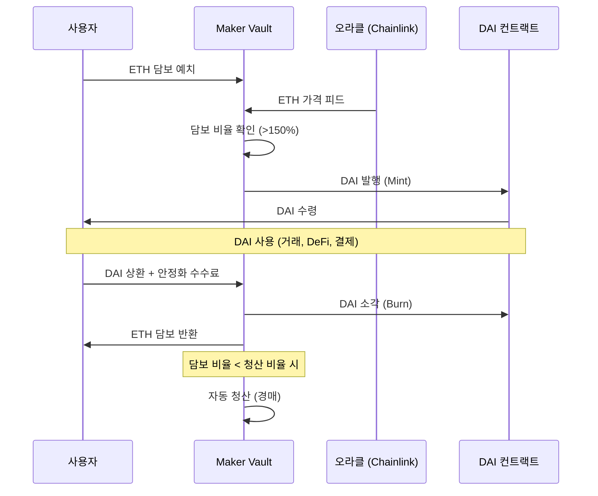
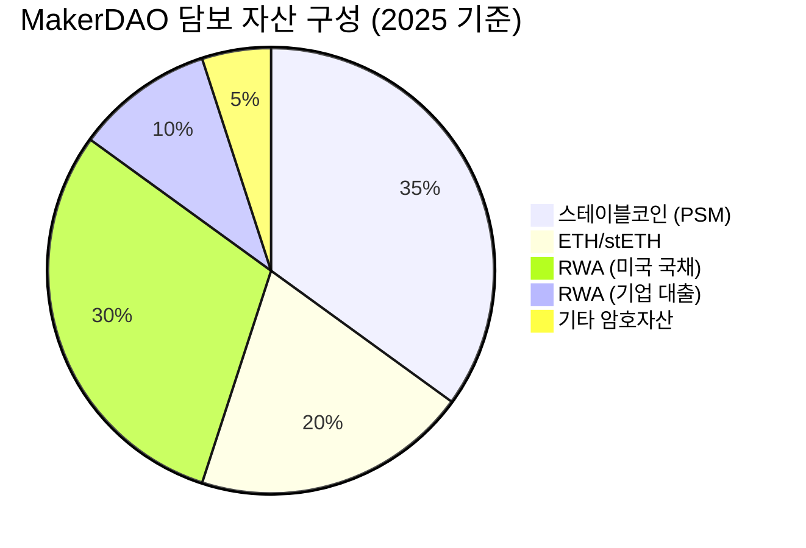
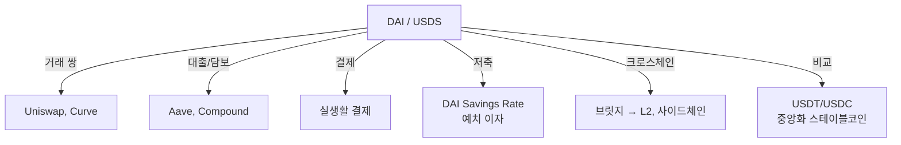

---
tags:
  - 디지털자산
  - DeFi
---
# MakerDAO (Sky Protocol)

**MakerDAO**는 DeFi 최초이자 최대의 탈중앙화 스테이블코인 **DAI**를 발행하는 프로토콜로, CDP(Collateralized Debt Position) 모델을 창시했으며, 2024년 **Sky Protocol**로 리브랜딩하면서 RWA(실물자산) 투자를 대폭 확대하고 있다.

## 개요

2017년 Rune Christensen이 설립한 MakerDAO는 ETH를 담보로 USD 페깅 스테이블코인 DAI를 발행하는 프로토콜로 시작했다. 이후 다중 담보(Multi-Collateral DAI), PSM(Peg Stability Module), RWA 도입 등을 거쳐 DeFi에서 가장 중요한 인프라 프로토콜 중 하나로 자리잡았다.

DAI는 시가총액 약 $5B으로 탈중앙화 스테이블코인 1위이며, DeFi 전반에서 결제·담보·유동성 수단으로 널리 사용된다. 2024년 Sky Protocol로 리브랜딩하며 DAI→USDS, MKR→SKY로 토큰을 전환하고, SubDAO 구조를 도입하는 대규모 개편("Endgame Plan")을 진행 중이다.

## CDP/Vault 메커니즘



| 항목 | 내용 |
|------|------|
| 담보 유형 | ETH, WBTC, stETH, RWA, 스테이블코인 등 |
| 최소 담보 비율 | 150% (ETH), 자산별 상이 |
| 안정화 수수료 | 연 0~8% (거버넌스로 조정) |
| 청산 페널티 | 13% |
| DAI 페깅 | PSM(Peg Stability Module)으로 $1 유지 |

## Sky Protocol 리브랜딩

2024년 MakerDAO는 "Endgame Plan"의 일환으로 **Sky Protocol**로 리브랜딩했다. 이는 단순한 이름 변경이 아니라 프로토콜의 구조적 개편이다.

```mermaid
graph TD
    subgraph Sky Protocol (신)
        SKY[SKY 토큰<br/>거버넌스]
        USDS[USDS<br/>스테이블코인]
        SUBDAO[SubDAO들]
    end
    subgraph MakerDAO (구)
        MKR[MKR 토큰]
        DAI[DAI]
        CORE[Core Unit들]
    end

    MKR -->|1:24000 전환| SKY
    DAI -->|1:1 전환| USDS
    CORE -->|재구성| SUBDAO
```

| 변경 사항 | 기존 | 신규 |
|----------|------|------|
| 거버넌스 토큰 | MKR | SKY (1 MKR = 24,000 SKY) |
| 스테이블코인 | DAI | USDS (1:1 교환) |
| 조직 구조 | Core Unit | SubDAO (독립 운영) |
| 전략 | DeFi 순수주의 | RWA + DeFi 하이브리드 |

!!! warning "리브랜딩 논란"
    커뮤니티 내에서 리브랜딩의 필요성, SKY 토큰 희석 효과, DAI의 브랜드 가치 포기 등에 대한 논란이 있다. 기존 DAI와 MKR은 계속 사용 가능하며, 전환은 선택적이다.

## RWA 투자

MakerDAO/Sky Protocol의 가장 대담한 전략 변화는 **RWA(Real World Assets) 투자**다. 프로토콜이 보유한 자산의 상당 부분을 미국 국채, 기업 대출 등 실물 자산에 투자하여 수익을 창출한다.



**주요 RWA 투자**:

| 파트너 | 유형 | 규모 | 의미 |
|--------|------|------|------|
| [BlackRock BUIDL](../../sto/products/securitize.md) | 토큰화 국채 | $500M+ | 세계 최대 자산운용사와 협력 |
| Monetalis | 미국 국채 | $1.2B | 가장 큰 단일 RWA 볼트 |
| Centrifuge | 기업 대출 | $200M+ | DeFi-TradFi 브릿지 |
| BlockTower | 구조화 신용 | $150M | 기관 신용 대출 |

!!! info "RWA의 역설"
    MakerDAO가 미국 국채에 수십억 달러를 투자한다는 것은 "탈중앙화" 프로토콜이 "중앙화된" 전통 자산에 의존한다는 역설이다. 이는 수익성과 탈중앙화 사이의 트레이드오프이며, 커뮤니티 내 지속적인 논쟁 주제다. [STO 트렌드의 DeFi 연동](../../sto/trends.md) 참고.

## DAI의 생태계적 위치

DAI는 DeFi에서 가장 널리 사용되는 탈중앙화 스테이블코인으로, 수백 개의 프로토콜에서 결제·담보·유동성 수단으로 활용된다.



**DAI Savings Rate (DSR)**은 DAI 보유자가 MakerDAO에 DAI를 예치하고 이자를 받는 메커니즘이다. 안정화 수수료 수익에서 지급되며, 거버넌스로 이율이 조정된다. 2025년 기준 약 5~8%의 이자율을 제공하고 있다.

## 강점과 약점

**강점**:
- DeFi 최초·최대 탈중앙화 스테이블코인 (DAI $5B)
- RWA 투자로 실질 수익(Real Yield) 창출 선도
- BlackRock 등 세계적 기관과의 RWA 파트너십
- DAI Savings Rate로 안정적 수익 제공
- 7년+ 운영 실적, 검증된 보안

**약점**:
- RWA 의존 증가로 탈중앙화 약화 논란
- Sky Protocol 리브랜딩으로 브랜드 혼란
- 거버넌스 복잡성 증가 (SubDAO 구조)
- USDC PSM 의존으로 Circle 리스크 노출
- GHO(Aave), FRAX 등 경쟁 스테이블코인 성장

## 관련 문서

- [DeFi 개요](../index.md) | [핵심 개념](../concepts.md)
- [주요 프로토콜 비교](index.md)
- [Uniswap](uniswap.md) | [Aave — GHO](aave.md)
- [STO — RWA 토큰화](../../sto/concepts.md)
- [STO — Securitize (BUIDL)](../../sto/products/securitize.md)
