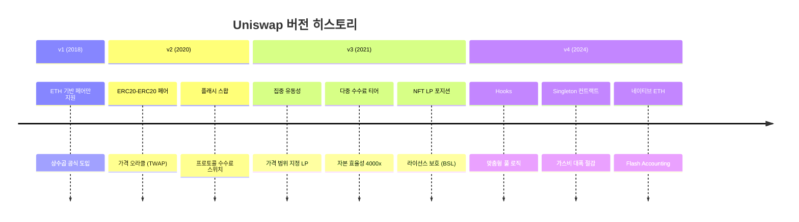
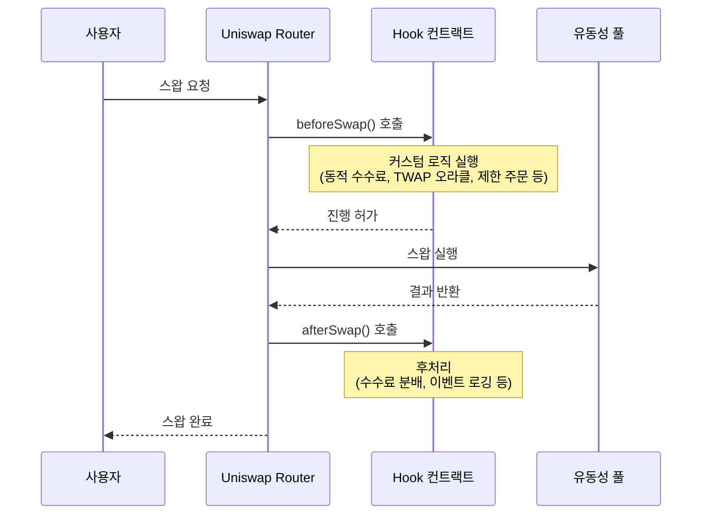
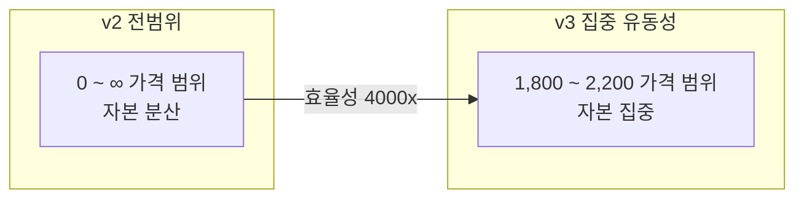

# Uniswap

**Uniswap**은 Ethereum 기반 탈중앙화 거래소(DEX) 1위 프로토콜로, AMM(Automated Market Maker) 모델을 창시하여 DeFi 생태계의 기반 인프라를 구축했으며, v4에서 Hooks를 도입하여 맞춤형 풀 로직의 새로운 패러다임을 열었다.

## 개요

2018년 Hayden Adams가 출시한 Uniswap은 전통 거래소의 주문장(order book) 모델 대신, 스마트 컨트랙트와 유동성 풀을 활용한 AMM 방식으로 토큰 거래를 혁신했다. 중앙 주문장 없이도 즉시 거래가 가능하며, 누구나 LP(유동성 공급자)가 될 수 있다.

Uniswap은 DEX 시장의 약 60%를 점유하며, 일일 거래량이 수십억 달러에 달한다. Ethereum 메인넷을 비롯해 Arbitrum, Optimism, Polygon, Base, BNB Chain 등 10개 이상의 체인에 배포되어 있다.

## 버전 진화

## v4 Hooks

Uniswap v4의 가장 혁신적인 기능은 **Hooks**다. Hooks는 풀의 라이프사이클(스왑 전/후, LP 추가/제거 전/후) 시점에 커스텀 로직을 실행할 수 있는 플러그인 시스템이다.

**Hooks로 가능한 기능**:

| Hook 유형 | 설명 |
|----------|------|
| 동적 수수료 | 시장 변동성에 따라 수수료 자동 조정 |
| TWAP 오라클 | 온체인 시간가중평균가격 제공 |
| 제한 주문 | AMM에서 지정가 주문 구현 |
| 자동 재투자 | LP 수수료 자동 복리 |
| KYC 게이트 | 허가된 주소만 거래 가능 (기관 DeFi) |
| MEV 보호 | 프론트러닝 방지 로직 |

!!! tip "Hooks의 의미"
    Hooks는 Uniswap을 단순한 DEX에서 "DEX 플랫폼"으로 전환시킨다. 개발자가 자유롭게 풀 로직을 확장할 수 있어, Uniswap v4 위에 수천 개의 맞춤형 DEX가 구축될 수 있다. 이는 App Store가 스마트폰을 플랫폼으로 만든 것과 유사한 전환이다.

## 집중 유동성 (v3)

v3에서 도입된 집중 유동성은 LP가 특정 가격 범위에만 유동성을 집중 배치할 수 있게 한다. v2의 전범위 유동성 대비 자본 효율성이 최대 4,000배 향상된다.

그러나 가격이 설정 범위를 벗어나면 LP의 수수료 수입이 0이 되며, 적극적인 포지션 관리가 필요하다. 이는 패시브 LP에서 액티브 LP로의 전환을 의미한다.

## 가스비와 멀티체인

| 체인 | 일반 스왑 가스비 | 특징 |
|------|----------------|------|
| Ethereum L1 | $5~50 | 최대 유동성, 높은 가스비 |
| Arbitrum | $0.1~1 | Ethereum L2, 높은 유동성 |
| Optimism | $0.1~1 | Ethereum L2, OP 보상 |
| Base | $0.01~0.1 | Coinbase L2, 빠른 성장 |
| Polygon | $0.01~0.1 | 사이드체인, 넓은 생태계 |

v4의 Singleton 컨트랙트 구조는 모든 풀을 하나의 컨트랙트로 통합하여, 멀티홉 스왑 시 가스비를 약 99% 절감한다.

## 강점과 약점

**강점**:
- DEX 시장 점유율 60%, 최대 거래량과 유동성
- v4 Hooks로 무한한 확장성 (DEX → DEX 플랫폼)
- 10개+ 체인 배포로 멀티체인 커버리지
- Singleton 구조로 가스비 대폭 절감
- 오픈소스, 강력한 개발자 커뮤니티

**약점**:
- LP의 [비영구적 손실](../concepts.md) 리스크
- 집중 유동성은 액티브 관리 필요 (패시브 LP에 불리)
- UNI 토큰의 프로토콜 수수료 활성화 논란
- L1 가스비 여전히 높음 (L2 마이그레이션 필요)
- MEV(최대추출가능가치) 문제 — 프론트러닝, 샌드위치 공격

## 관련 문서

- [DeFi 개요](../index.md) | [핵심 개념 — AMM](../concepts.md)
- [주요 프로토콜 비교](index.md)
- [Aave](aave.md) | [MakerDAO](makerdao.md)
- [DeFi 트렌드 — L2 이동](../trends.md)
