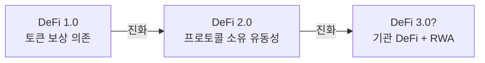
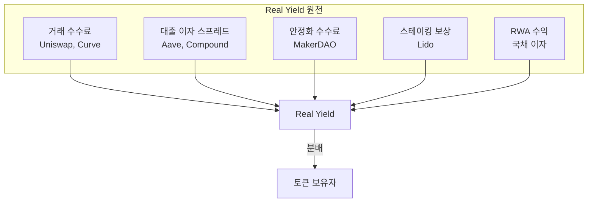
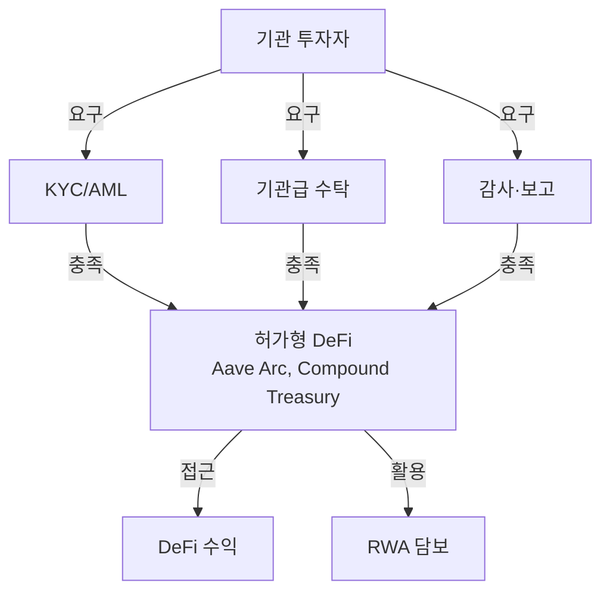
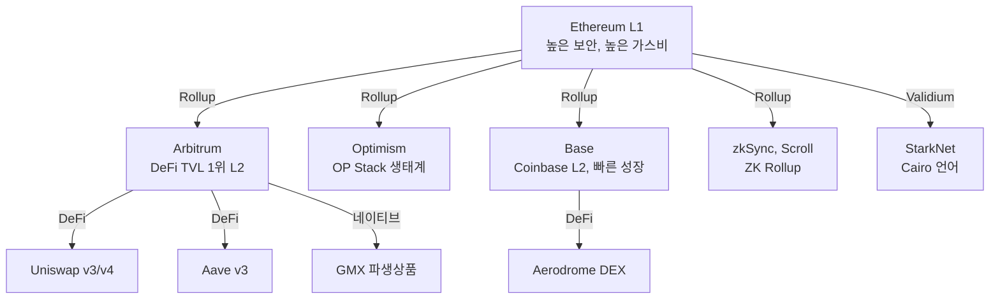
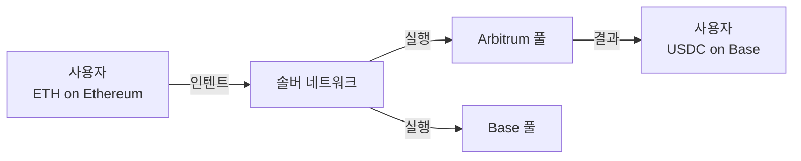
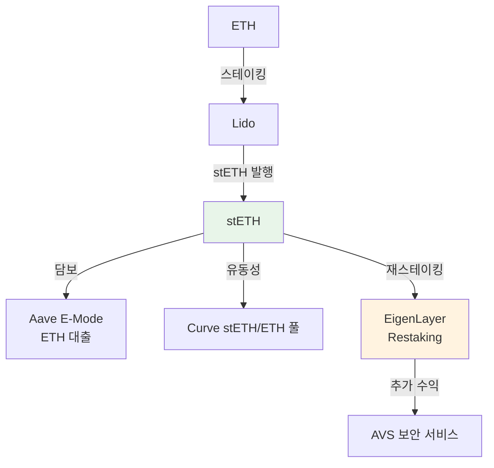
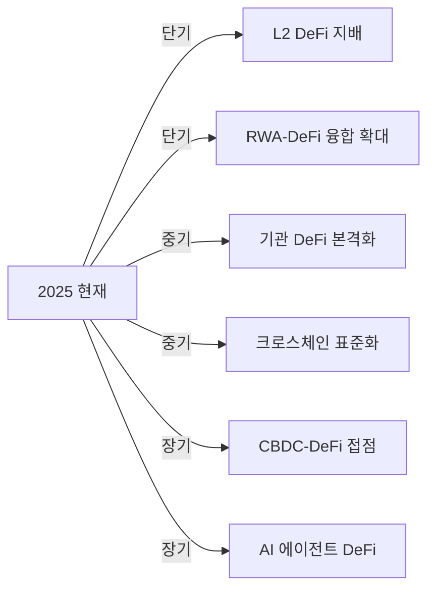

# DeFi 시장 트렌드

DeFi 생태계를 형성하는 7가지 핵심 트렌드를 분석한다. DeFi 1.0의 실험적 단계를 넘어, 지속 가능한 수익 모델과 기관 참여가 시장의 방향을 결정하고 있다.

---

## 1. DeFi 2.0

**DeFi 2.0**은 DeFi 1.0의 한계(비지속적 유동성 채굴, 자본 비효율, 프로토콜 소유 유동성 부재)를 극복하려는 2세대 프로토콜 물결을 의미한다.

| 구분 | DeFi 1.0 | DeFi 2.0 |
|------|---------|---------|
| 유동성 | 임대 유동성 (LP 보상으로 유치) | 프로토콜 소유 유동성 (POL) |
| 수익 모델 | 토큰 인플레이션 보상 | Real Yield (실질 수익) |
| 자본 효율 | 전범위 유동성 (낭비) | 집중 유동성, 레버리지 최적화 |
| 대표 사례 | Uniswap v2, Compound v2 | OlympusDAO(POL), Uniswap v3(집중) |

---

## 2. Real Yield

**Real Yield**는 프로토콜 토큰 인플레이션이 아닌, 실제 프로토콜 수수료·수익에서 발생하는 수익을 의미한다. DeFi의 지속 가능성 핵심 지표다.

| 프로토콜 | Real Yield 원천 | 연간 수익 규모 |
|---------|---------------|-------------|
| [Uniswap](products/uniswap.md) | LP 거래 수수료 | ~$500M |
| [Aave](products/aave.md) | 대출 이자 스프레드 | ~$200M |
| [MakerDAO](products/makerdao.md) | 안정화 수수료 + RWA | ~$300M |
| Lido | 스테이킹 수수료 10% | ~$400M |
| GMX | 거래 수수료 + 펀딩 | ~$100M |

!!! tip "Real Yield 투자 기준"
    높은 APY를 광고하는 프로토콜이 토큰 인플레이션에 의존하는지, 실제 수수료 수익에서 발생하는지를 구분하는 것이 핵심이다. DeFi Llama의 "Fees" 탭에서 프로토콜별 실제 수수료 수익을 확인할 수 있다.

---

## 3. 기관 DeFi

전통 금융기관이 DeFi에 진입하는 트렌드로, "허가형 DeFi(Permissioned DeFi)"라는 새로운 카테고리를 형성하고 있다.

| 기관 | 참여 형태 | 의미 |
|------|----------|------|
| BlackRock | [BUIDL 펀드 via MakerDAO](products/makerdao.md) | RWA-DeFi 브릿지 |
| JPMorgan | Onyx 플랫폼, Aave와 실험 | 대형 IB의 DeFi 실험 |
| Goldman Sachs | GS DAP | 기관 토큰화 플랫폼 |
| Aave | Arc (KYC 전용 풀) | 기관 전용 허가형 렌딩 |
| Compound | Treasury | 기관 투자자 정기 수익 상품 |

!!! warning "탈중앙화 vs 규제 준수"
    기관 DeFi는 KYC/AML을 요구하므로 DeFi의 핵심 가치인 비허가 접근성(permissionless)과 충돌한다. "허가형 DeFi"는 DeFi인가, 단지 블록체인을 사용하는 CeFi인가라는 철학적 논쟁이 진행 중이다.

---

## 4. 규제 대응

각국 규제 기관이 DeFi에 대한 입장을 명확히 하고 있으며, 프로토콜들은 규제 대응 전략을 수립하고 있다.

| 지역 | 규제 방향 | DeFi 영향 |
|------|----------|----------|
| **미국 SEC** | 증권법 적용 확대 시도 | DEX 토큰의 증권 분류 논란 |
| **유럽 MiCA** | 포괄적 암호자산 규제 | DeFi "순수" 프로토콜은 적용 제외 검토 |
| **한국** | 가상자산이용자보호법 | DeFi 직접 규제는 미적용, 간접 영향 |
| **싱가포르** | Project Guardian | 기관 DeFi 실험 장려 |
| **FATF** | Travel Rule 확대 | DeFi 프로토콜의 VASP 해당 여부 논의 |

!!! info "프론트엔드 규제"
    DeFi 스마트 컨트랙트 자체는 규제가 어렵지만, 프론트엔드(웹사이트)는 규제 가능하다. Uniswap Labs가 특정 토큰을 프론트엔드에서 차단하거나, Tornado Cash 제재 사례가 이 접근의 선례다. [STO 규제 정비](../sto/trends.md)도 참고.

---

## 5. L2 이동

DeFi 활동이 Ethereum L1에서 L2(Layer 2)로 급속히 이동하고 있다. 가스비 절감과 처리 속도 향상이 핵심 동력이다.

| L2 | DeFi TVL | 특징 |
|----|---------|------|
| Arbitrum | ~$3B | DeFi L2 1위, GMX 네이티브 |
| Base | ~$2B | Coinbase 생태계, 빠른 성장 |
| Optimism | ~$1B | OP Stack, Superchain 비전 |
| zkSync | ~$500M | ZK Rollup, 네이티브 계정 추상화 |

---

## 6. 크로스체인

DeFi 유동성이 여러 체인에 분산되면서, 크로스체인 인프라의 중요성이 급증하고 있다.

**크로스체인 유형**:

| 유형 | 대표 | 방식 |
|------|------|------|
| 브릿지 | LayerZero, Wormhole, Axelar | 자산을 체인 간 전송 |
| 인텐트 기반 | Across, UniswapX | 사용자 의도를 솔버가 실행 |
| 어그리게이터 | Li.Fi, Socket | 최적 경로 자동 선택 |
| 네이티브 상호운용 | Cosmos IBC, Polkadot XCM | 프로토콜 레벨 연결 |

!!! warning "브릿지 해킹 리스크"
    크로스체인 브릿지는 DeFi에서 가장 많이 해킹된 인프라다. Ronin Bridge ($620M), Wormhole ($320M), Nomad ($190M) 등 대규모 사고가 발생했다. 인텐트 기반 모델은 자산을 브릿지에 잠그지 않아 보안 리스크를 줄인다. [CBDC 상호운용성](../cbdc/concepts.md)과도 연결되는 주제다.

---

## 7. LSDfi

**LSDfi(Liquid Staking Derivatives Finance)**는 Lido의 stETH, Rocket Pool의 rETH 등 리퀴드 스테이킹 토큰(LST)을 활용한 DeFi 생태계다.

**EigenLayer와 Restaking**: Ethereum 스테이킹 자산을 재스테이킹(restaking)하여 다른 프로토콜(AVS)의 보안을 제공하고 추가 수익을 얻는 모델. 2024~2025년 DeFi의 가장 뜨거운 트렌드 중 하나이며, TVL $15B+ 규모로 급성장했다.

!!! note "LSDfi 리스크"
    stETH의 ETH 대비 디페깅(depeg) 리스크, EigenLayer의 슬래싱(slashing) 리스크, 그리고 레버리지 루프(stETH 담보 → ETH 대출 → stETH 추가 구매)로 인한 시스템 리스크에 주의해야 한다.

---

## 향후 전망

1. **L2가 DeFi 메인 무대**: Ethereum L1은 결제 레이어로, L2가 실행 레이어로 분화
2. **RWA가 TVL 성장 견인**: 국채·부동산·사모 신용 토큰화 → DeFi 유동성 유입
3. **인텐트 기반 UX 혁신**: 사용자가 "무엇"을 원하는지만 명시, 실행은 솔버에 위임
4. **AI 에이전트 DeFi**: AI가 자동으로 이자 농사, 포트폴리오 리밸런싱, 리스크 관리 수행
5. **[CBDC](../cbdc/index.md)와의 접점**: 프로그래머블 CBDC가 DeFi 풀에서 활용되는 미래 시나리오

## 관련 문서

- [DeFi 개요](index.md) | [핵심 개념](concepts.md)
- [주요 프로토콜 비교](products/index.md)
- [CBDC 트렌드](../cbdc/trends.md) | [STO 트렌드](../sto/trends.md)
