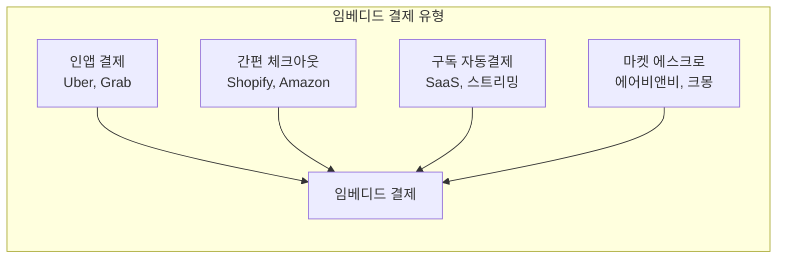
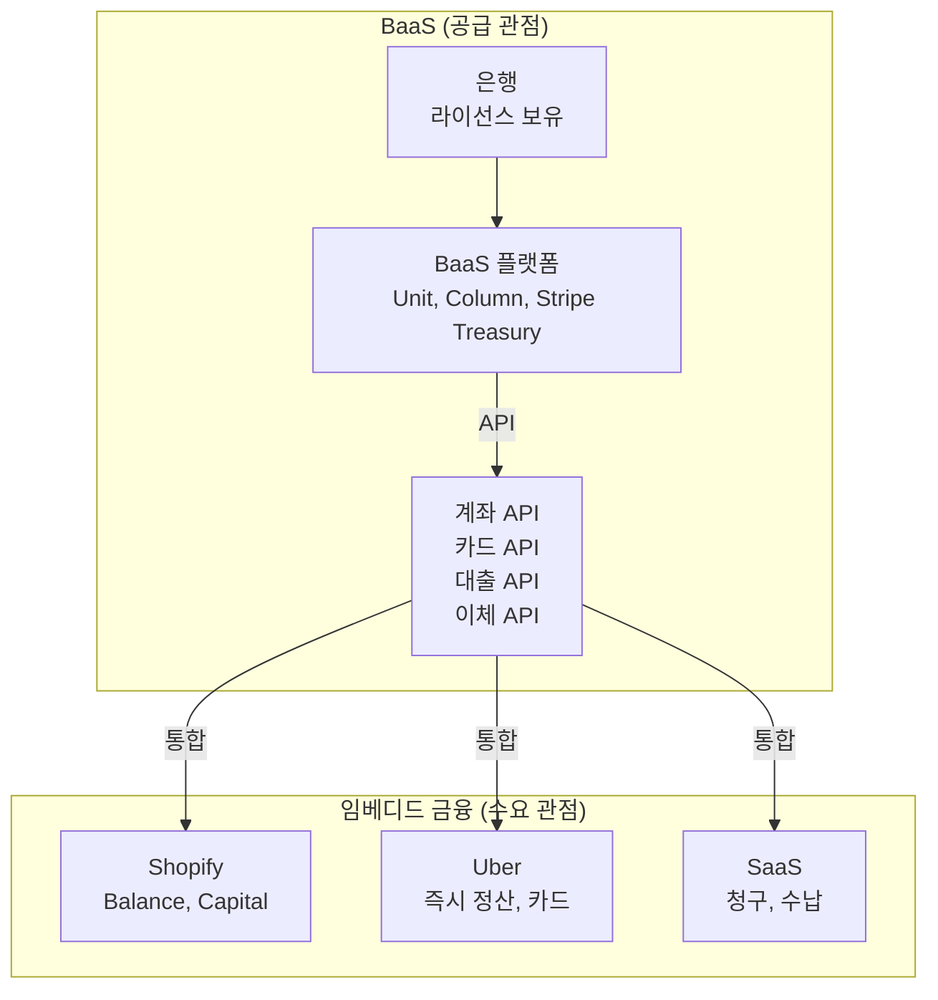

# 임베디드 금융 핵심 개념

## 임베디드 결제 (Embedded Payments)

비금융 플랫폼 안에서 결제가 이루어지는 가장 기본적이고 보편적인 임베디드 금융 형태이다.

임베디드 결제는 이미 일상에 깊숙이 침투해 있다. Uber에서 하차 시 자동 결제, Amazon 원클릭 결제, Shopify 체크아웃 모두 임베디드 결제의 예이다. 핵심은 사용자가 "결제를 하고 있다"는 인식 없이 자연스럽게 거래가 완료되는 것이다.

!!! tip "핵심 포인트"
    - 결제를 별도 프로세스가 아닌 서비스 경험의 일부로 통합
    - 전환율과 고객 만족도를 동시에 향상
    - Stripe, Adyen 등 결제 인프라가 핵심 이네이블러

---

## 임베디드 대출 (Embedded Lending)

비금융 플랫폼이 사용자에게 대출을 직접 제공하는 모델이다. 플랫폼이 보유한 사용자 데이터를 활용하여 은행보다 정교한 신용평가가 가능하다.

| 유형 | 예시 | 데이터 활용 |
|------|------|-------------|
| **POS 금융** | Affirm at Peloton | 구매 이력, 결제 패턴 |
| **판매자 대출** | Shopify Capital, Amazon Lending | 매출 데이터, 재고 회전율 |
| **급여 선지급** | DailyPay, Earnin | 근무 시간, 급여 주기 |
| **운전자금 대출** | Grab Financial, 토스 사업자 대출 | 플랫폼 거래 데이터 |

!!! example "Shopify Capital 사례"
    Shopify는 판매자의 매출 데이터를 실시간으로 분석하여, 별도 서류 없이 수 분 내에 운전자금 대출을 제안한다. 상환은 일별 매출에서 자동으로 일정 비율을 차감하는 방식이다. 플랫폼 데이터 기반 신용평가의 교과서적 사례이다.

---

## 임베디드 보험 (Embedded Insurance)

구매, 예약, 이용 시점에 관련 보험을 자연스럽게 제안하는 모델이다.

- **여행 예약 시**: 여행자 보험, 항공편 지연 보험
- **전자제품 구매 시**: 연장 보증, 파손 보험
- **차량 호출 시**: 탑승자 보험, 사고 보험
- **부동산 거래 시**: 화재/누수 보험

임베디드 보험의 핵심은 **맥락적 적합성(Contextual Relevance)**이다. 보험이 필요한 정확한 순간에 제안되기 때문에 전환율이 전통 보험 대비 5~10배 높다.

---

## 임베디드 투자 (Embedded Investment)

비금융 앱 안에서 투자 기능을 제공하는 모델이다.

- **리워드 투자**: 카드 캐시백을 자동으로 주식/ETF에 투자 (Acorns, Stash)
- **급여 투자**: 급여의 일부를 자동으로 투자 계좌로 이체
- **이커머스 투자**: 쇼핑 리워드를 투자로 전환
- **소셜 투자**: 메신저/SNS 앱 내 투자 기능

---

## BaaS vs 임베디드 금융

두 개념은 밀접하지만 관점이 다르다.

| 구분 | BaaS | 임베디드 금융 |
|------|------|--------------|
| 관점 | 기술/인프라 (공급) | 비즈니스/서비스 (수요) |
| 주체 | BaaS 플랫폼, 파트너 은행 | 비금융 플랫폼 |
| 질문 | "어떻게 은행 기능을 API로 제공할까?" | "어떻게 우리 플랫폼에 금융을 내장할까?" |
| 가치 | 금융 인프라 민주화 | 고객 경험 향상 + 수익 다변화 |

---

## 라이선스 이슈

임베디드 금융의 가장 민감한 영역이다. 비금융 기업이 금융 서비스를 제공할 때 누가 규제 책임을 지는가?

!!! danger "라이선스 핵심 이슈"
    1. **은행 라이선스**: 예금 수신은 은행 라이선스 필수 → BaaS 파트너 은행 필요
    2. **대출 라이선스**: 대출 제공 시 대부업/금융업 라이선스 필요
    3. **보험 라이선스**: 보험 판매 시 보험 중개/대리 라이선스 필요
    4. **송금 라이선스**: 자금 이동 시 Money Transmitter License (미국) 필요
    5. **규제 중첩**: 비금융 기업 + BaaS + 은행 3자 간 규제 책임 배분 복잡

2023~2024년 BaaS 업계의 규제 조치 사례(Synapse 파산, Blue Ridge Bank 동의 명령 등)는 라이선스와 규제 준수의 중요성을 부각시켰다.

---

## 수익 모델

임베디드 금융은 비금융 플랫폼에게 새로운 수익원을 제공한다.

| 수익원 | 설명 | 예시 |
|--------|------|------|
| **인터체인지 수익** | 카드 결제 시 인터체인지 수수료 공유 | Brex, Ramp 기업카드 |
| **대출 이자** | 플랫폼 내 대출의 이자 수익 공유 | Shopify Capital |
| **예금 스프레드** | 고객 예치금의 이자 마진 | Stripe Treasury |
| **보험 수수료** | 보험 판매 커미션 | 여행 플랫폼 보험 |
| **구독 업셀** | 금융 기능을 프리미엄 요금제로 제공 | SaaS 결제 기능 |
| **데이터 수익** | 금융 데이터 기반 인사이트 판매 | 매출 분석 리포트 |

!!! info "수익 임팩트"
    임베디드 금융은 플랫폼의 ARPU(사용자당 평균 수익)를 2~5배 높일 수 있다. Shopify의 경우, Merchant Solutions(결제+금융) 수익이 전체 매출의 70%+를 차지한다.

## 관련 문서

- [임베디드 금융 개요](index.md)
- [제품 비교](products/index.md)
- [트렌드](trends.md)
- [오픈뱅킹 / BaaS 개념](../open-banking/concepts.md)
- [BNPL 개념](../bnpl/concepts.md) -- 임베디드 대출의 한 형태
