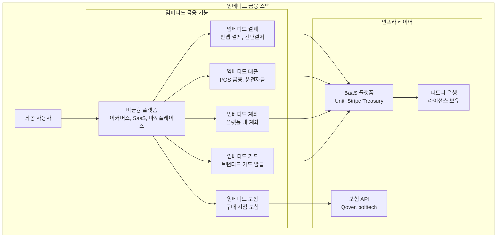
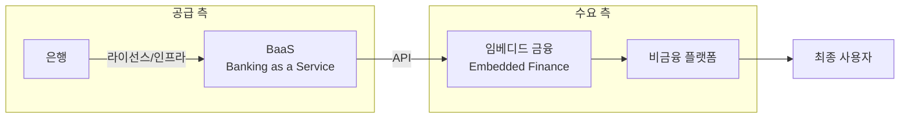

# 임베디드 금융 (Embedded Finance) 개요

## 정의

**임베디드 금융(Embedded Finance)**은 비금융 플랫폼(이커머스, SaaS, 마켓플레이스 등)이 자사 서비스 안에 결제, 대출, 보험, 투자 등 금융 기능을 자연스럽게 내장하는 것을 말한다.

## 상세 설명

임베디드 금융의 핵심 아이디어는 "금융 서비스가 사용자가 필요한 바로 그 순간, 그 맥락에서 제공되어야 한다"는 것이다. 소비자가 별도의 은행 앱이나 금융 서비스로 이동하지 않고, 이미 사용 중인 플랫폼 안에서 금융 행위를 완료한다. Uber 드라이버가 Uber 앱 안에서 즉시 정산을 받고, Shopify 셀러가 Shopify 대시보드에서 사업 대출을 신청하는 것이 대표적인 예이다.

임베디드 금융은 **BaaS(Banking as a Service)**를 기술적 토대로 한다. BaaS 제공자(Unit, Column, Stripe Treasury 등)가 은행의 핵심 기능을 API로 제공하고, 비금융 플랫폼은 이 API를 자사 제품에 통합한다. BaaS가 "공급" 측면이라면, 임베디드 금융은 "수요" 측면이다.

시장 규모는 폭발적으로 성장 중이다. Bain & Company에 따르면 글로벌 임베디드 금융 시장은 2021년 $430B에서 2026년 $7.2T에 이를 것으로 전망된다. 이 성장의 배경에는 BaaS 인프라의 성숙, API 경제의 확산, 그리고 비금융 기업의 금융 서비스 수익화 니즈가 있다.

## 핵심 포인트

!!! info "왜 중요한가"
    1. **맥락 기반 금융**: 사용자가 필요한 순간에 금융 서비스가 자연스럽게 제공
    2. **비금융 기업의 수익 다변화**: SaaS, 이커머스 기업이 금융 수익을 추가
    3. **고객 경험 향상**: 앱 이동 없이 원스톱으로 금융 행위 완료
    4. **시장 규모**: $7.2T (2026년 전망), 금융 산업 구조 재편
    5. **생태계 락인**: 금융 서비스가 플랫폼 이탈 방지 장치로 기능

## BaaS와 임베디드 금융의 관계

!!! note "BaaS vs 임베디드 금융"
    - **BaaS**: 은행 기능을 API로 제공하는 **인프라/기술** 관점
    - **임베디드 금융**: 비금융 플랫폼에 금융을 내장하는 **비즈니스/서비스** 관점
    - BaaS 없이도 임베디드 금융은 가능하나 (직접 은행 파트너십), BaaS가 진입 장벽을 획기적으로 낮춤

## 관련 문서

- [핵심 개념](concepts.md) -- 임베디드 결제/대출/보험/투자 상세
- [제품 비교](products/index.md) -- Stripe Treasury, Shopify Balance, Unit 등 비교
- [트렌드](trends.md) -- 시장 성장, 비금융 기업 금융 진출, 규제 과제
- [오픈뱅킹](../open-banking/index.md) -- BaaS와 오픈뱅킹의 관계
- [BNPL](../bnpl/index.md) -- 임베디드 금융의 대표적 사례
- [실시간 결제](../realtime-payment/index.md) -- 임베디드 결제의 인프라
