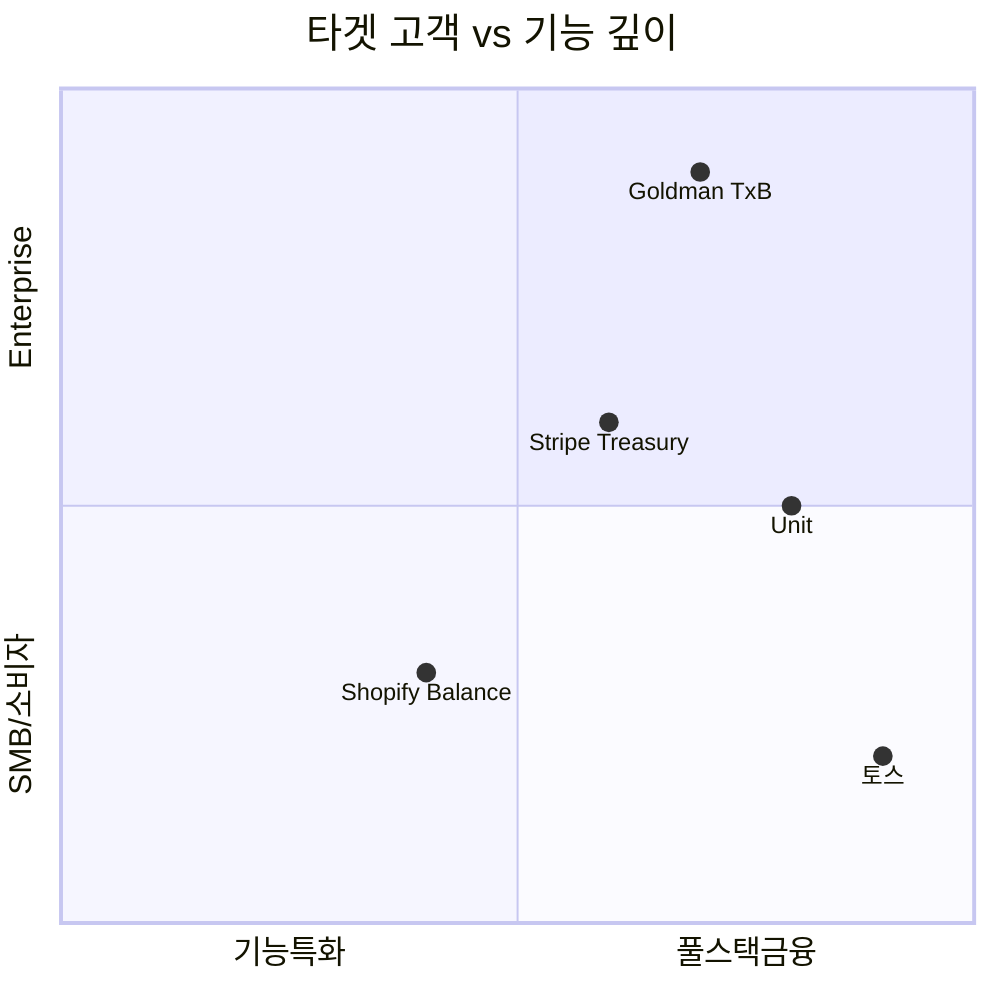

---
tags:
  - 금융
  - 임베디드금융
search:
  boost: 1.5
---
# 임베디드 금융 제품 비교

## 비교 요약

| 제품 | 유형 | 주요 시장 | 핵심 기능 | 타겟 | 차별화 |
|------|------|-----------|-----------|------|--------|
| **[Stripe Treasury](stripe-treasury.md)** | BaaS / 임베디드 금융 | 미국 (확장 중) | 계좌, 카드 발급, 자금 이동 | 플랫폼, SaaS | Stripe 생태계 통합 |
| **[Shopify Balance](shopify-balance.md)** | 이커머스 임베디드 금융 | 글로벌 (Shopify 사용자) | 판매자 계좌, 카드, 대출 | Shopify 셀러 | 이커머스 최적화 |
| **[Unit](unit.md)** | BaaS 플랫폼 | 미국 | 풀스택 BaaS API | 기술 기업 전반 | 가장 넓은 BaaS 기능 |
| **Goldman Sachs TxB** | 기업 금융 API | 글로벌 | 기업 계좌, 결제, 유동성 관리 | 대기업, 기관 | IB 브랜드 + 글로벌 규모 |
| **토스** | 슈퍼앱 임베디드 금융 | 한국 | 결제, 송금, 투자, 보험, 대출 | 한국 소비자 | 올인원 금융 슈퍼앱 |

## 개별 제품 강점 / 약점 / 차별화

### Stripe Treasury

- **강점**: Stripe Connect와 원활한 통합, 개발자 경험 최상급, 글로벌 확장성
- **약점**: 미국 중심 (Treasury 기능), Stripe 의존성, 자체 은행 라이선스 미보유
- **차별화**: 결제(Stripe) + 금융(Treasury)의 원스톱 플랫폼

### Shopify Balance

- **강점**: Shopify 셀러에게 최적화된 금융 경험, 매출 데이터 기반 대출
- **약점**: Shopify 생태계 한정, 소비자 금융 미지원, 기능 범위 제한
- **차별화**: 이커머스 플랫폼 임베디드 금융의 교과서적 사례

### Unit

- **강점**: 가장 포괄적인 BaaS API, 빠른 출시 지원, 다중 은행 파트너십
- **약점**: 미국 한정, 높은 초기 비용, 파트너 은행 리스크
- **차별화**: 기술 기업을 위한 가장 완전한 턴키 BaaS 솔루션

### Goldman Sachs Transaction Banking (TxB)

- **강점**: 글로벌 IB의 신뢰성, 대규모 기업 금융 경험, 규제 준수 역량
- **약점**: 중소기업 부적합, 높은 진입 비용, API 성숙도 낮음 (후발주자)
- **차별화**: 월가 투자은행이 제공하는 기업 금융 API

### 토스

- **강점**: 한국 최대 핀테크, 금융 전 영역 커버, 강력한 UX
- **약점**: 한국 시장 한정, 수익성 증명 과제, 기존 금융기관과 경쟁
- **차별화**: 비금융 앱에서 시작해 종합 금융 플랫폼이 된 한국 대표 사례

## 시나리오별 선택 가이드

!!! tip "어떤 제품을 선택해야 하나?"

    **"우리 SaaS 플랫폼에 결제 + 금융 계좌를 넣고 싶다"**
    → **Stripe Treasury** -- Stripe 결제 이미 사용 중이라면 최적

    **"이커머스 셀러에게 금융 서비스를 제공하고 싶다"**
    → **Shopify Balance** 모델 참고 -- 매출 데이터 기반 금융

    **"우리 플랫폼에 커스텀 금융 서비스를 구축하고 싶다"**
    → **Unit** -- 가장 유연하고 포괄적인 BaaS API

    **"대기업 대상 글로벌 기업 금융 API가 필요하다"**
    → **Goldman Sachs TxB** -- 엔터프라이즈급 트랜잭션 뱅킹

    **"한국에서 종합 금융 플랫폼을 만들고 싶다"**
    → **토스** 모델 연구 -- 한국 금융 규제 내 슈퍼앱 구축

## 관련 문서

- [임베디드 금융 개요](../index.md)
- [핵심 개념](../concepts.md)
- [트렌드](../trends.md)
- [오픈뱅킹 제품 비교](../../open-banking/products/index.md)
- [BNPL 제품 비교](../../bnpl/products/index.md)
