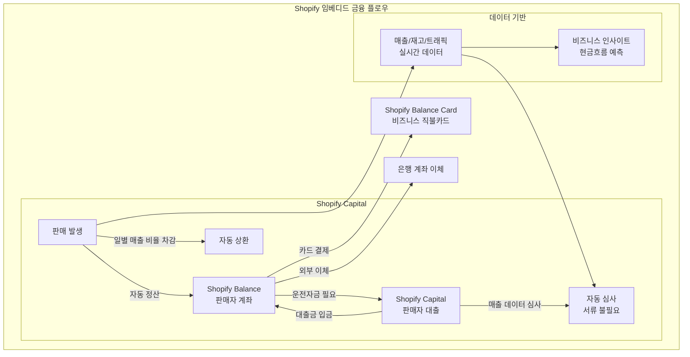

# Shopify Balance

## 기본 정보

| 항목 | 내용 |
|------|------|
| **운영사** | Shopify, Inc. |
| **출시** | 2020년 (Shopify Balance), 2016년 (Shopify Capital) |
| **유형** | 이커머스 임베디드 금융 |
| **주요 시장** | 미국 (Balance), 미국/캐나다/영국/호주 (Capital) |
| **타겟** | Shopify 판매자 (200만+ 가맹점) |
| **파트너 은행** | Stripe Treasury 기반 (Evolve Bank & Trust 등) |

## 정의

Shopify Balance는 Shopify 셀러가 별도의 비즈니스 은행 계좌 없이 **Shopify 대시보드 안에서 수익 관리, 지출, 대출**을 처리할 수 있는 이커머스 임베디드 금융 서비스이다.

## 상세 설명

Shopify Balance는 임베디드 금융의 교과서적 사례이다. Shopify는 판매자의 전체 비즈니스 라이프사이클(상품 등록 → 판매 → 정산 → 재투자)을 하나의 플랫폼에서 완결하려는 전략을 추진하고 있으며, Balance와 Capital은 이 전략의 금융 축이다.

판매자 입장에서는 별도의 비즈니스 은행 계좌를 개설하고, 정산금을 이체받고, 다시 사업 비용을 지출하는 번거로움이 사라진다. Shopify에서 발생한 매출이 Balance 계좌에 자동으로 입금되고, Shopify Balance 카드로 사업 비용을 직접 결제할 수 있다. 운전자금이 부족하면 Shopify Capital에서 매출 데이터 기반으로 대출을 받는다.

## 핵심 특징

!!! info "Shopify Balance의 5대 강점"
    1. **원스톱 비즈니스 금융**: 정산, 지출, 대출이 하나의 대시보드에서 완결
    2. **즉시 정산**: 판매 대금이 Balance 계좌에 빠르게 입금
    3. **데이터 기반 대출**: Shopify Capital이 매출 데이터로 자동 심사
    4. **비즈니스 카드**: 사업 비용 관리를 위한 직불카드
    5. **수수료 최소화**: 계좌 유지비, 최소 잔액 없음

## Shopify Capital 상세

Shopify Capital은 임베디드 대출의 모범 사례이다.

| 항목 | 내용 |
|------|------|
| 대출 유형 | 현금 선지급(Cash Advance) + 대출(Loan) |
| 대출 규모 | $200 ~ $2,000,000 |
| 심사 방식 | Shopify 매출 데이터 기반 자동 심사 |
| 서류 | 불필요 (Shopify 데이터 활용) |
| 상환 방식 | 일별 매출의 일정 비율 자동 차감 |
| 심사 시간 | 수 분 (자격 해당 시 자동 제안) |
| 누적 집행 | $5B+ (2024년 기준) |

!!! tip "Shopify Capital의 혁신"
    전통적인 중소기업 대출은 재무제표, 사업계획서, 담보 등을 요구하며 수주~수개월이 걸린다. Shopify Capital은 플랫폼 내 매출 데이터만으로 수 분 내에 대출을 제안한다. 상환도 일별 매출 비율로 자동 차감되어, 매출이 낮은 날에는 상환금도 줄어드는 유연한 구조이다.

## 가격

| 항목 | 비용 |
|------|------|
| Balance 계좌 유지비 | 무료 |
| 최소 잔액 | 없음 |
| ACH 이체 | 무료 |
| Balance 카드 | 무료 (발급 및 유지) |
| Capital 비용 | 고정 수수료 (이자 대신), 대출금의 ~10~17% |

## 장점

- Shopify 셀러에게 완전히 통합된 금융 경험
- 별도 서류 없이 매출 데이터 기반 즉시 대출
- 계좌/카드 무료, 진입 장벽 최소
- 일별 매출 비례 상환으로 현금흐름 부담 경감
- Shopify 비즈니스 인사이트와 결합된 재무 관리

## 단점

- Shopify 생태계 한정 (다른 이커머스 플랫폼 이용 불가)
- 미국 중심 (Balance 기능, Capital은 일부 국가)
- 개인 소비자 금융 미지원
- Capital 비용이 전통 대출 대비 높을 수 있음
- 예금 이자 지급 없음 (2024년 기준)

## 실무 적용

!!! example "Shopify Balance/Capital 활용"
    - **스타트업 셀러**: 비즈니스 은행 계좌 대신 Balance로 시작
    - **성장기 셀러**: Capital로 재고 확충, 마케팅 투자 자금 확보
    - **멀티채널 셀러**: Shopify 매출 기반 통합 재무 관리
    - **해외 진출 셀러**: Shopify Payments + Balance로 글로벌 정산

## 관련 문서

- [제품 비교](index.md)
- [임베디드 금융 개요](../index.md)
- [Stripe Treasury](stripe-treasury.md) -- Shopify Balance의 인프라
- [임베디드 금융 개념 - 임베디드 대출](../concepts.md)
