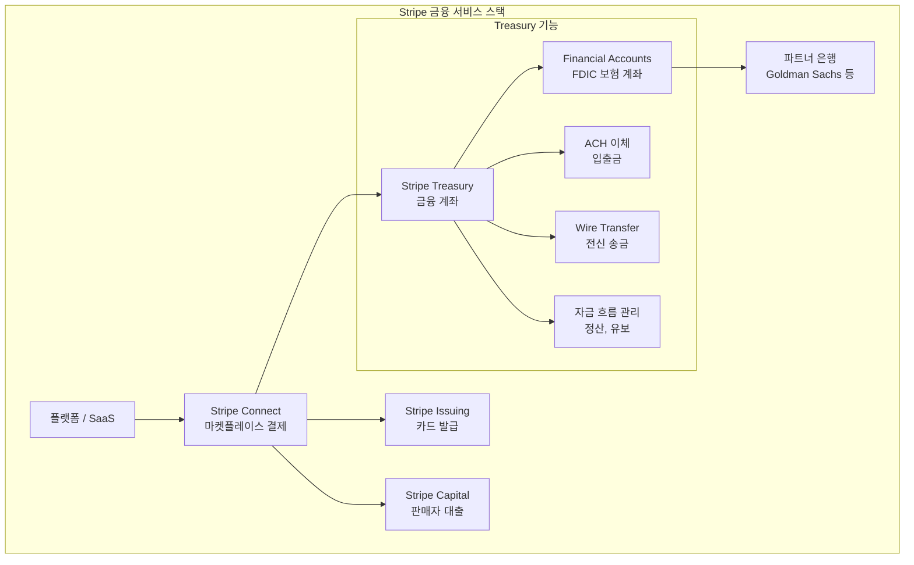

---
tags:
  - 금융
  - 임베디드금융
---
# Stripe Treasury

## 기본 정보

| 항목 | 내용 |
|------|------|
| **운영사** | Stripe, Inc. |
| **출시** | 2020년 (베타), 2021년 (GA) |
| **유형** | BaaS / 임베디드 금융 API |
| **주요 시장** | 미국 (확장 중) |
| **파트너 은행** | Goldman Sachs, Evolve Bank & Trust 등 |
| **타겟** | Stripe Connect 사용 플랫폼, SaaS, 마켓플레이스 |
| **FDIC 보험** | 파트너 은행을 통해 최대 $250K |

## 정의

Stripe Treasury는 Stripe 플랫폼 사용자가 자사 서비스 안에서 **FDIC 보험이 적용되는 금융 계좌, 카드 발급, 자금 이동** 기능을 제공할 수 있게 하는 임베디드 금융 API이다.

## 상세 설명

Stripe Treasury는 Stripe의 결제 인프라(Stripe Connect) 위에 구축된 금융 서비스 레이어이다. 플랫폼이 Stripe으로 결제를 처리하고 있다면, Treasury API를 추가하여 사용자에게 금융 계좌, 직불카드, ACH 이체 등을 제공할 수 있다. 이는 결제 → 금융으로의 자연스러운 확장이다.

Stripe Treasury의 핵심 가치는 **Stripe 생태계와의 원활한 통합**에 있다. Stripe Connect(마켓플레이스 결제), Stripe Issuing(카드 발급), Stripe Capital(대출) 등과 단일 API 경험으로 연결된다. 개발자는 이미 익숙한 Stripe API 패턴으로 금융 서비스를 구축할 수 있다.

## 핵심 특징

!!! info "Stripe Treasury의 5대 강점"
    1. **Stripe 생태계 통합**: Connect + Issuing + Capital과 단일 API 경험
    2. **개발자 경험**: 업계 최고 수준의 API 문서, SDK, 대시보드
    3. **FDIC 보험**: 파트너 은행을 통한 예금자 보호
    4. **유연한 자금 흐름**: 정산 타이밍, 자금 유보, 분배를 API로 제어
    5. **글로벌 확장 잠재력**: Stripe의 글로벌 인프라 위에 구축

## 주요 기능 상세

### Financial Accounts (금융 계좌)

플랫폼 사용자(판매자, 프리랜서, 기업)에게 개별 금융 계좌를 생성한다. FDIC 보험이 적용되며, 계좌 잔액 조회, 거래 내역 확인, 자금 이동이 가능하다.

### 카드 발급 (Stripe Issuing 연동)

Treasury 계좌와 연결된 가상/물리 직불카드를 발급한다. 사용 한도, 카테고리 제한, 실시간 승인 제어 등을 API로 관리한다.

### 자금 이동

| 방식 | 속도 | 비용 | 용도 |
|------|------|------|------|
| ACH | 1~3 영업일 | 저가 | 일반 이체 |
| Wire | 당일 | 고가 | 긴급/대량 이체 |
| 내부 이체 | 즉시 | 무료 | Stripe 계좌 간 |

## 가격

| 항목 | 비용 모델 |
|------|-----------|
| Financial Account | 계좌당 월정액 |
| ACH 이체 | 건당 과금 |
| Wire 이체 | 건당 과금 |
| 카드 발급 (Issuing) | 카드당 + 거래당 |
| 인터체인지 수익 | 카드 사용 시 수익 공유 |

!!! warning "가격 참고"
    Stripe Treasury의 가격은 Stripe Connect 볼륨에 따라 커스텀 협의된다. 공개 가격표가 없으며, 일정 규모 이상의 플랫폼을 대상으로 한다.

## 장점

- Stripe 결제 인프라와 원활한 통합
- 업계 최고 수준의 개발자 경험과 문서
- Goldman Sachs 등 신뢰할 수 있는 파트너 은행
- 카드 발급(Issuing) + 대출(Capital)과의 시너지
- Stripe의 지속적인 글로벌 확장에 편승

## 단점

- 미국 중심 (Treasury 기능의 글로벌 확장 느림)
- Stripe Connect 사용이 전제 (독립적 사용 불가)
- 대출 상품은 Stripe Capital로 제한적
- 높은 진입 기준 (소규모 스타트업에 부적합)
- BaaS 전문 플랫폼(Unit) 대비 금융 기능 범위 좁음

## 실무 적용

!!! example "Stripe Treasury 적용 시나리오"
    - **마켓플레이스**: 판매자에게 플랫폼 내 금융 계좌 + 직불카드 제공
    - **프리랜서 플랫폼**: 수익금을 Treasury 계좌에 보관, 즉시 인출
    - **SaaS**: 고객 자금을 관리하는 에스크로 계좌 구축
    - **물류 플랫폼**: 드라이버에게 즉시 정산 + 연료 카드 제공

## 관련 문서

- [제품 비교](index.md)
- [임베디드 금융 개요](../index.md)
- [Shopify Balance](shopify-balance.md) -- 이커머스 임베디드 금융 비교
- [Unit](unit.md) -- BaaS 전문 플랫폼 비교
- [오픈뱅킹 / BaaS 개념](../../open-banking/concepts.md)
