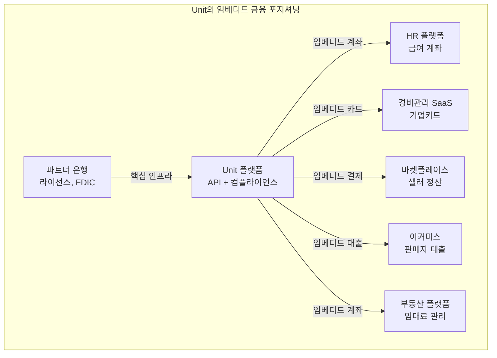

# Unit (임베디드 금융 관점)

## 기본 정보

| 항목 | 내용 |
|------|------|
| **설립** | 2019년, 미국 |
| **유형** | BaaS 플랫폼 → 임베디드 금융 인에이블러 |
| **주요 시장** | 미국 |
| **파트너 은행** | Blue Ridge Bank, Piermont Bank 등 |
| **핵심 역할** | 비금융 기업이 금융 서비스를 임베드할 수 있도록 풀스택 API 제공 |

## 정의

Unit은 기술 기업이 자사 플랫폼에 **계좌, 카드, 결제, 대출 등 금융 서비스를 임베드**할 수 있도록 하는 BaaS 플랫폼으로, 임베디드 금융의 핵심 인에이블러(Enabler) 역할을 수행한다.

## 임베디드 금융 관점에서의 Unit

> Unit의 BaaS 기능과 은행 파트너십 모델에 대한 상세 정보는 [오픈뱅킹 / BaaS 섹션의 Unit 문서](../../open-banking/products/unit.md)를 참고하라.

이 문서에서는 Unit을 **임베디드 금융의 인에이블러**로서 분석한다. Unit은 BaaS 인프라(공급 측)와 임베디드 금융(수요 측)의 중간에 위치하며, 비금융 기업이 금융 서비스를 자사 제품에 통합하는 과정을 가속화한다.

## Unit vs Stripe Treasury vs Shopify Balance

임베디드 금융을 구축하는 세 가지 대표적 접근법이 있다.

| 구분 | Unit | Stripe Treasury | Shopify Balance |
|------|------|-----------------|-----------------|
| **접근법** | 범용 BaaS API | 결제 인프라 확장 | 자체 플랫폼 전용 |
| **유연성** | 매우 높음 (커스텀) | 중간 (Stripe 생태계 내) | 낮음 (Shopify 전용) |
| **전제 조건** | 없음 | Stripe Connect 사용 | Shopify 가맹점 |
| **금융 기능 범위** | 가장 넓음 | 중간 | 제한적 |
| **개발 부담** | 높음 | 중간 | 없음 (빌트인) |
| **출시 속도** | 수 주 | 수 주 | 즉시 |

!!! tip "선택 기준"
    - **"최대한 커스텀 금융 서비스를 만들고 싶다"** → Unit
    - **"이미 Stripe를 쓰고 있고 금융 기능을 추가하고 싶다"** → Stripe Treasury
    - **"Shopify 셀러에게 금융을 제공하고 싶다"** → Shopify Balance

## 임베디드 금융 활용 사례

Unit을 활용한 대표적인 임베디드 금융 시나리오:

### 1. HR/급여 플랫폼
직원에게 즉시 급여 수령 계좌와 직불카드를 제공한다. 급여가 발생하면 Unit 계좌에 즉시 입금되고, 카드로 바로 사용 가능하다.

### 2. 프리랜서/긱 이코노미 플랫폼
프리랜서의 수익금을 플랫폼 내 계좌에 보관하고, 즉시 인출하거나 카드로 사용할 수 있게 한다.

### 3. 부동산 관리 플랫폼
임대료 수금, 보증금 관리, 관리비 지출을 Unit 계좌로 통합 관리한다.

### 4. B2B 마켓플레이스
판매자에게 플랫폼 내 비즈니스 계좌를 제공하고, 거래 대금을 즉시 정산한다.

!!! info "임베디드 금융의 비즈니스 가치"
    Unit을 통해 임베디드 금융을 구축한 플랫폼은:

    - **ARPU 2~5배 증가**: 금융 수익(인터체인지, 이자 마진) 추가
    - **이탈률 30~50% 감소**: 금융 서비스가 플랫폼 락인 효과
    - **LTV 향상**: 사용자가 금융 기능으로 더 깊이 플랫폼에 관여

## 관련 문서

- [제품 비교](index.md)
- [Unit - BaaS 관점](../../open-banking/products/unit.md) -- 은행 파트너십, 가격 등 상세
- [Stripe Treasury](stripe-treasury.md)
- [Shopify Balance](shopify-balance.md)
- [임베디드 금융 개념](../concepts.md) -- 수익 모델, 라이선스 이슈
