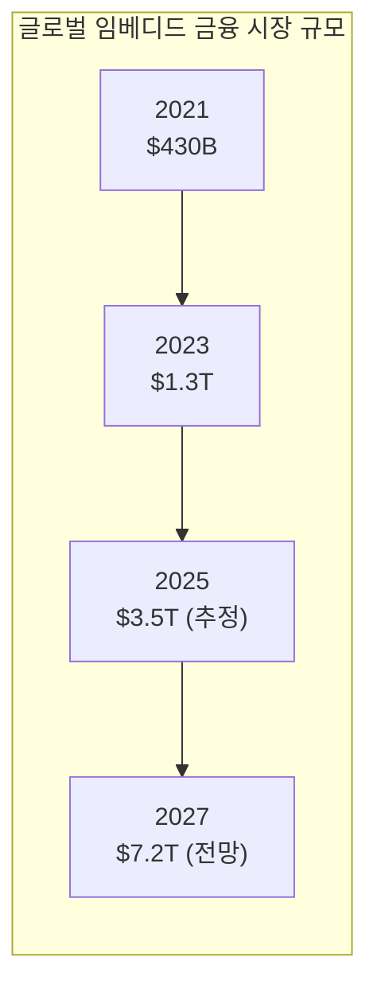
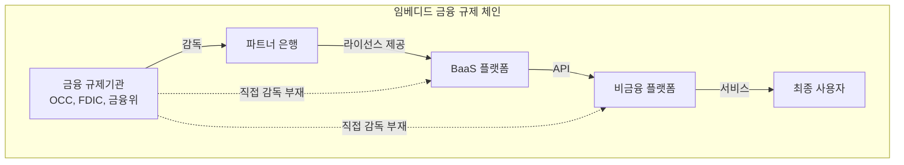

# 임베디드 금융 트렌드

## 시장 규모 성장

임베디드 금융은 핀테크 내에서 가장 빠르게 성장하는 세그먼트 중 하나이다.

!!! info "성장 동인"
    1. **BaaS 인프라 성숙**: Unit, Stripe Treasury 등 턴키 솔루션 보편화
    2. **API 경제 확산**: 금융 기능의 모듈화와 조립이 용이
    3. **플랫폼 기업의 수익 다변화 니즈**: SaaS 마진 압박, 금융 수익으로 보완
    4. **소비자 기대 변화**: "앱 안에서 모든 것이 해결되기를" 기대
    5. **규제 프레임워크 정비**: BaaS 규제 가이드라인 명확화

---

## 비금융 기업의 금융 진출

"모든 기업이 핀테크 기업이 된다"는 a16z의 테제가 현실화되고 있다.

| 기업 | 본업 | 임베디드 금융 |
|------|------|--------------|
| **Shopify** | 이커머스 플랫폼 | Balance (계좌), Capital (대출), Payments (결제) |
| **Uber** | 모빌리티 | 드라이버 즉시 정산, Uber Money 카드 |
| **Apple** | 하드웨어/소프트웨어 | Apple Card, Apple Pay Later, Savings Account |
| **Amazon** | 이커머스 | Amazon Lending, Amazon Pay |
| **Toast** | 레스토랑 SaaS | Toast Capital (대출), Toast Payroll |
| **토스** | 간편 송금 → 슈퍼앱 | 투자, 보험, 대출, 카드 전 영역 |

!!! warning "진출 시 핵심 과제"
    - **규제 준수**: 금융 라이선스, KYC/AML, 소비자 보호
    - **파트너 은행 리스크**: BaaS 중개자/파트너 은행의 안정성
    - **핵심 사업과의 균형**: 금융이 본업을 방해하지 않도록 관리
    - **리스크 관리**: 대출 연체, 사기 등 금융 고유의 리스크

---

## 규제 과제

2023~2024년 BaaS 업계의 구조조정은 임베디드 금융의 규제 과제를 선명하게 드러냈다.

핵심 규제 이슈:

1. **Rent-a-Charter 우려**: 비금융 기업이 은행 라이선스를 "빌려" 규제를 우회한다는 비판
2. **제3자 리스크 관리**: 은행이 BaaS 파트너를 적절히 감독하지 못하는 문제
3. **고객 자금 보호**: BaaS 플랫폼 파산 시 고객 자금의 안전성
4. **KYC/AML 책임**: 비금융 플랫폼의 고객 확인/자금세탁 방지 의무 범위
5. **데이터 프라이버시**: 금융 데이터와 비금융 데이터의 결합에 따른 프라이버시 이슈

!!! danger "Synapse 사례의 교훈"
    2024년 BaaS 미들웨어 기업 Synapse의 파산은 업계에 큰 충격을 주었다. 고객 자금 $85M+가 동결되었고, 어떤 은행이 얼마의 자금을 보유하고 있는지 파악조차 어려운 상황이 발생했다. 이는 BaaS 체인에서 자금 추적(Ledger Reconciliation)과 고객 자금 분리의 중요성을 극명하게 보여준다.

---

## AI 금융

임베디드 금융과 AI의 결합은 새로운 가능성을 열고 있다.

- **AI 신용평가**: 플랫폼 데이터 + 오픈뱅킹 데이터로 정교한 대출 심사
- **AI 재무 어드바이저**: 플랫폼 내 자동화된 재무 상담 (Shopify의 현금흐름 예측)
- **AI 사기 탐지**: 거래 패턴 실시간 분석으로 사기 차단
- **AI 고객 서비스**: 금융 관련 문의 자동 응대 (Klarna AI)
- **개인화**: 사용자 행동 기반 맞춤 금융 상품 추천

---

## 슈퍼앱

아시아에서 시작된 슈퍼앱 모델은 임베디드 금융의 극단적 형태이다.

| 슈퍼앱 | 시장 | 금융 서비스 범위 |
|--------|------|-----------------|
| **WeChat Pay** | 중국 | 결제, 투자, 보험, 대출, 신용점수 |
| **Alipay** | 중국 | 결제, 자산관리(Yu'e Bao), 보험, 신용(Sesame) |
| **Grab** | 동남아 | 결제, BNPL, 대출, 보험 |
| **토스** | 한국 | 송금, 결제, 투자, 보험, 대출, 카드 |
| **카카오페이** | 한국 | 송금, 결제, 투자, 보험, 후결제 |

슈퍼앱에서 금융은 "별도의 서비스"가 아니라 "플랫폼 경험의 자연스러운 일부"이다. 이것이 임베디드 금융의 궁극적 형태라고 볼 수 있다.

---

## 향후 전망

!!! tip "2025-2027 주요 전망"
    1. **BaaS 2.0 시대**: 규제 정상화 후 더 안전하고 투명한 BaaS 모델 부상
    2. **Vertical SaaS + 금융**: 산업 특화 SaaS(건설, 의료, 물류)에 금융 서비스 내장
    3. **AI 네이티브 금융**: AI가 금융 서비스의 설계, 운영, 고객 경험을 주도
    4. **글로벌 임베디드 금융**: 크로스보더 금융 서비스의 임베딩 확대
    5. **소비자 금융 건전성**: 규제 강화로 과도한 금융 접근보다 "적합한 금융" 강조

## 관련 문서

- [임베디드 금융 개요](index.md)
- [핵심 개념](concepts.md)
- [제품 비교](products/index.md)
- [오픈뱅킹 트렌드](../open-banking/trends.md) -- BaaS 시장 동향
- [BNPL 트렌드](../bnpl/trends.md) -- 임베디드 대출 형태
- [실시간 결제 트렌드](../realtime-payment/trends.md) -- 결제 인프라 연계
